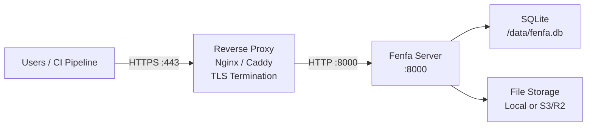

# النشر الإنتاجي

يغطي هذا الدليل كل ما يلزم لتشغيل Fenfa في بيئة إنتاجية: الوكيل العكسي مع TLS وإعداد الرمز الآمن واستراتيجية النسخ الاحتياطي والمراقبة.

## الهندسة المعمارية



## إعداد الوكيل العكسي

### Caddy (موصى به)

يحصل Caddy تلقائياً على شهادات TLS من Let's Encrypt ويجدّدها:

```
dist.example.com {
    reverse_proxy localhost:8000
}
```

هذا كل شيء. يتولى Caddy HTTPS وHTTP/2 وإدارة الشهادات تلقائياً.

### Nginx

```nginx
server {
    listen 443 ssl http2;
    server_name dist.example.com;

    ssl_certificate /etc/letsencrypt/live/dist.example.com/fullchain.pem;
    ssl_certificate_key /etc/letsencrypt/live/dist.example.com/privkey.pem;

    client_max_body_size 2G;

    location / {
        proxy_pass http://127.0.0.1:8000;
        proxy_set_header Host $host;
        proxy_set_header X-Real-IP $remote_addr;
        proxy_set_header X-Forwarded-For $proxy_add_x_forwarded_for;
        proxy_set_header X-Forwarded-Proto $scheme;

        # Large file uploads
        proxy_request_buffering off;
        proxy_read_timeout 600s;
    }
}

server {
    listen 80;
    server_name dist.example.com;
    return 301 https://$host$request_uri;
}
```

::: warning client_max_body_size
اضبط `client_max_body_size` بحجم كافٍ لأكبر بنيات لديك. يمكن أن تكون ملفات IPA وAPK مئات الميغابايتات. يسمح المثال أعلاه بما يصل إلى 2 غيغابايت.
:::

### الحصول على شهادة TLS

باستخدام Certbot مع Nginx:

```bash
sudo certbot --nginx -d dist.example.com
```

باستخدام Certbot المستقل:

```bash
sudo certbot certonly --standalone -d dist.example.com
```

## قائمة تدقيق الأمان

### 1. تغيير الرموز الافتراضية

أنشئ رموزاً عشوائية آمنة:

```bash
# إنشاء رمز عشوائي من 32 حرفاً
openssl rand -hex 16
```

اضبطها عبر متغيرات البيئة أو الإعداد:

```bash
FENFA_ADMIN_TOKEN=$(openssl rand -hex 16)
FENFA_UPLOAD_TOKEN=$(openssl rand -hex 16)
```

### 2. الربط بـ localhost

قدّم Fenfa فقط عبر الوكيل العكسي:

```yaml
ports:
  - "127.0.0.1:8000:8000"  # Not 0.0.0.0:8000
```

### 3. تعيين النطاق الأساسي

أعدّ النطاق العام الصحيح لـ manifests iOS والردود:

```bash
FENFA_PRIMARY_DOMAIN=https://dist.example.com
```

::: danger Manifests iOS
إذا كان `primary_domain` خاطئاً، سيفشل تثبيت iOS OTA. يحتوي ملف manifest plist على روابط تنزيل يستخدمها iOS لجلب ملف IPA. يجب أن تكون هذه الروابط قابلة للوصول من جهاز المستخدم.
:::

### 4. رموز رفع منفصلة

أصدر رموز رفع مختلفة لخطوط CI/CD أو أعضاء الفريق المختلفين:

```json
{
  "auth": {
    "upload_tokens": [
      "token-for-ios-pipeline",
      "token-for-android-pipeline",
      "token-for-desktop-pipeline"
    ],
    "admin_tokens": [
      "admin-token-for-ops-team"
    ]
  }
}
```

يتيح هذا إلغاء رموز فردية دون تعطيل خطوط أخرى.

## استراتيجية النسخ الاحتياطي

### ما يجب نسخه احتياطياً

| المكوّن | المسار | الحجم | التكرار |
|---------|--------|-------|---------|
| قاعدة بيانات SQLite | `/data/fenfa.db` | صغير (أقل من 100 ميغابايت عادةً) | يومي |
| الملفات المرفوعة | `/app/uploads/` | قد يكون كبيراً | بعد كل رفع (أو استخدم S3) |
| ملف الإعداد | `config.json` | صغير جداً | عند التغيير |

### نسخ SQLite احتياطياً

```bash
# نسخ ملف قاعدة البيانات (آمن أثناء تشغيل Fenfa -- SQLite يستخدم وضع WAL)
cp /data/fenfa.db /backups/fenfa-$(date +%Y%m%d).db
```

### سكريبت نسخ احتياطي آلي

```bash
#!/bin/bash
BACKUP_DIR="/backups/fenfa"
DATE=$(date +%Y%m%d-%H%M)

mkdir -p "$BACKUP_DIR"

# Database
cp /path/to/data/fenfa.db "$BACKUP_DIR/fenfa-$DATE.db"

# Uploads (if using local storage)
tar czf "$BACKUP_DIR/uploads-$DATE.tar.gz" /path/to/uploads/

# Cleanup old backups (keep 30 days)
find "$BACKUP_DIR" -name "*.db" -mtime +30 -delete
find "$BACKUP_DIR" -name "*.tar.gz" -mtime +30 -delete
```

::: tip تخزين S3
إذا كنت تستخدم تخزيناً متوافقاً مع S3 (R2 أو AWS S3 أو MinIO)، فالملفات المرفوعة موجودة بالفعل على وحدة تخزين خلفية متكررة. تحتاج فقط إلى نسخ قاعدة بيانات SQLite احتياطياً.
:::

## المراقبة

### فحص الصحة

راقب نقطة نهاية `/healthz`:

```bash
curl -sf http://localhost:8000/healthz || echo "Fenfa is down"
```

### مع مراقبة وقت التشغيل

وجّه خدمة مراقبة وقت التشغيل (UptimeRobot وHetrix إلخ.) إلى:

```
https://dist.example.com/healthz
```

الاستجابة المتوقعة: `{"ok": true}` مع HTTP 200.

### مراقبة السجلات

يُسجّل Fenfa على stdout. استخدم برنامج تشغيل السجل لوقت تشغيل حاويتك لإعادة توجيه السجلات إلى نظام التجميع:

```yaml
services:
  fenfa:
    logging:
      driver: "json-file"
      options:
        max-size: "10m"
        max-file: "3"
```

## Docker Compose الإنتاجي الكامل

```yaml
version: "3.8"

services:
  fenfa:
    image: fenfa/fenfa:latest
    container_name: fenfa
    restart: unless-stopped
    ports:
      - "127.0.0.1:8000:8000"
    environment:
      FENFA_ADMIN_TOKEN: ${FENFA_ADMIN_TOKEN}
      FENFA_UPLOAD_TOKEN: ${FENFA_UPLOAD_TOKEN}
      FENFA_PRIMARY_DOMAIN: https://dist.example.com
    volumes:
      - fenfa-data:/data
      - fenfa-uploads:/app/uploads
    healthcheck:
      test: ["CMD", "wget", "-q", "--spider", "http://localhost:8000/healthz"]
      interval: 30s
      timeout: 5s
      retries: 3
      start_period: 10s
    logging:
      driver: "json-file"
      options:
        max-size: "10m"
        max-file: "3"
    deploy:
      resources:
        limits:
          memory: 512M

volumes:
  fenfa-data:
  fenfa-uploads:
```

## الخطوات التالية

- [نشر Docker](./docker) -- أساسيات Docker والإعداد
- [مرجع الإعداد](../configuration/) -- جميع الإعدادات
- [استكشاف الأخطاء](../troubleshooting/) -- مشكلات الإنتاج الشائعة
