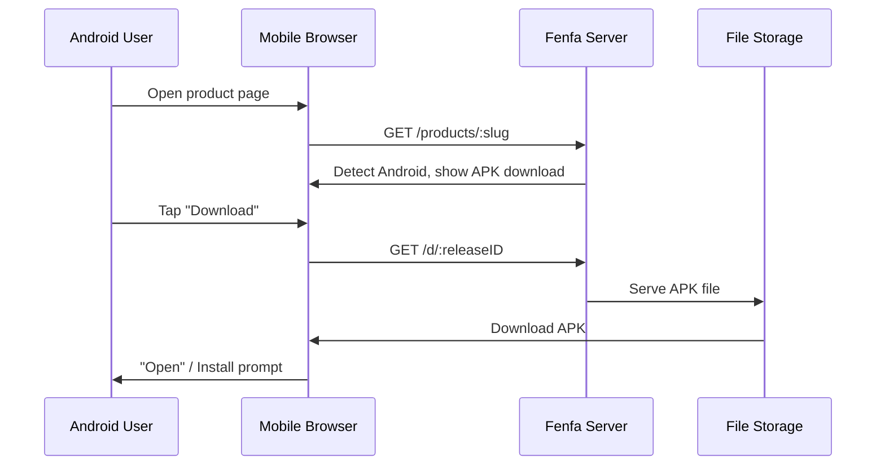

# توزيع Android

توزيع Android في Fenfa بسيط: ارفع ملف APK، ويُنزّله المستخدمون مباشرةً من صفحة المنتج. يكتشف Fenfa أجهزة Android تلقائياً ويعرض زر التنزيل المناسب.

## كيف يعمل



على عكس iOS، لا يتطلب Android بروتوكولاً خاصاً للتثبيت. يُنزَّل ملف APK مباشرةً عبر HTTP(S)، ويُثبّته المستخدم باستخدام مثبّت حزم النظام.

## إعداد متغير Android

أنشئ متغير Android لمنتجك:

```bash
curl -X POST http://localhost:8000/admin/api/products/prd_abc123/variants \
  -H "X-Auth-Token: YOUR_ADMIN_TOKEN" \
  -H "Content-Type: application/json" \
  -d '{
    "platform": "android",
    "display_name": "Android",
    "identifier": "com.example.myapp",
    "arch": "universal",
    "installer_type": "apk"
  }'
```

::: tip متغيرات المعمارية
إذا كنت تبني ملفات APK منفصلة لكل معمارية، أنشئ عدة متغيرات:
- `Android ARM64` (arch: `arm64-v8a`)
- `Android ARM` (arch: `armeabi-v7a`)
- `Android x86_64` (arch: `x86_64`)

إذا كنت ترسل APK عالمي أو AAB، يكفي متغير واحد بمعمارية `universal`.
:::

## رفع ملفات APK

### الرفع العادي

```bash
curl -X POST http://localhost:8000/upload \
  -H "X-Auth-Token: YOUR_UPLOAD_TOKEN" \
  -F "variant_id=var_android" \
  -F "app_file=@app-release.apk" \
  -F "version=2.1.0" \
  -F "build=210" \
  -F "changelog=Added dark mode support"
```

### الرفع الذكي

يستخرج الرفع الذكي البيانات الوصفية تلقائياً من ملفات APK:

```bash
curl -X POST http://localhost:8000/admin/api/smart-upload \
  -H "X-Auth-Token: YOUR_ADMIN_TOKEN" \
  -F "variant_id=var_android" \
  -F "app_file=@app-release.apk"
```

البيانات المستخرجة تشمل:
- اسم الحزمة (`com.example.myapp`)
- اسم الإصدار (`2.1.0`)
- رمز الإصدار (`210`)
- أيقونة التطبيق
- الحد الأدنى لإصدار SDK

## تثبيت المستخدم

عندما يزور المستخدم صفحة المنتج من جهاز Android:

1. تكتشف الصفحة منصة Android تلقائياً.
2. يضغط المستخدم على زر **تنزيل**.
3. يُنزّل المتصفح ملف APK.
4. يطلب Android من المستخدم تثبيت ملف APK.

::: warning المصادر غير المعروفة
يجب على المستخدمين تفعيل "التثبيت من مصادر مجهولة" (أو "تثبيت التطبيقات غير المعروفة" في إصدارات Android الأحدث) في إعدادات أجهزتهم قبل تثبيت ملفات APK من Fenfa. هذا متطلب Android قياسي للتطبيقات المُثبَّتة جانبياً.
:::

## رابط التنزيل المباشر

كل إصدار له رابط تنزيل مباشر يعمل مع أي عميل HTTP:

```bash
# التنزيل عبر curl
curl -LO http://localhost:8000/d/rel_xxx

# التنزيل عبر wget
wget http://localhost:8000/d/rel_xxx
```

يدعم هذا الرابط طلبات HTTP Range للتنزيلات القابلة للاستئناف عبر اتصالات بطيئة.

## الخطوات التالية

- [توزيع سطح المكتب](./desktop) -- macOS وWindows وLinux
- [إدارة الإصدارات](../products/releases) -- إصداراتك وإدارة APK
- [واجهة برمجة تطبيقات الرفع](../api/upload) -- أتمتة رفع APK من CI/CD
