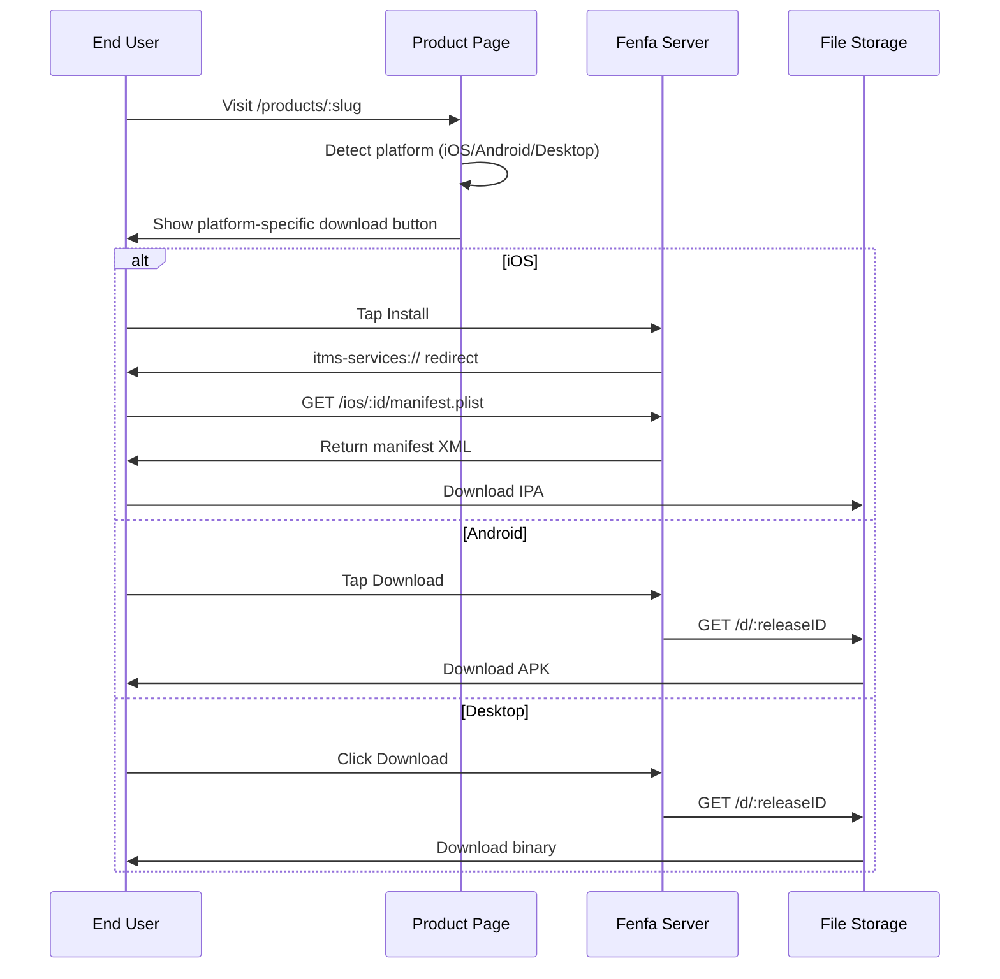

# نظرة عامة على التوزيع

يوفر Fenfa تجربة توزيع موحدة لجميع المنصات. كل منتج يحصل على صفحة تنزيل عامة تكشف تلقائياً منصة الزائر وتعرض زر التنزيل المناسب.

## كيف يعمل التوزيع



## صفحة تنزيل المنتج

كل منتج منشور له صفحة عامة على `/products/:slug`. تتضمن الصفحة:

- **أيقونة التطبيق واسمه** من إعداد المنتج
- **كشف المنصة** -- تستخدم الصفحة User-Agent للمتصفح لعرض زر التنزيل الصحيح أولاً
- **رمز QR** -- يُولَّد تلقائياً لسهولة المسح من الهاتف
- **تاريخ الإصدارات** -- جميع إصدارات المتغير المحدد، الأحدث أولاً
- **سجلات التغييرات** -- ملاحظات كل إصدار تُعرض بشكل مدمج
- **متغيرات متعددة** -- إذا كان المنتج يحتوي على متغيرات لمنصات متعددة، يمكن للمستخدمين التبديل بينها

## التوزيع الخاص بكل منصة

| المنصة | الطريقة | التفاصيل |
|--------|---------|---------|
| iOS | OTA عبر `itms-services://` | ملف manifest plist + تنزيل IPA مباشر. يتطلب HTTPS. |
| Android | تنزيل APK مباشر | المتصفح يُنزّل ملف APK. يُفعّل المستخدم "التثبيت من مصادر مجهولة". |
| macOS | تنزيل مباشر | ملفات DMG أو PKG أو ZIP تُنزَّل عبر المتصفح. |
| Windows | تنزيل مباشر | ملفات EXE أو MSI أو ZIP تُنزَّل عبر المتصفح. |
| Linux | تنزيل مباشر | ملفات DEB أو RPM أو AppImage أو tar.gz تُنزَّل عبر المتصفح. |

## روابط التنزيل المباشر

لكل إصدار رابط تنزيل مباشر:

```
https://your-domain.com/d/:releaseID
```

هذا الرابط:
- يُعيد الملف الثنائي مع رؤوس `Content-Type` و`Content-Disposition` الصحيحة
- يدعم طلبات HTTP Range للتنزيلات القابلة للاستئناف
- يزيد عداد التنزيل
- يعمل مع أي عميل HTTP (curl وwget والمتصفحات)

## تتبع الأحداث

يتتبع Fenfa ثلاثة أنواع من الأحداث:

| الحدث | المُشغِّل | البيانات المُتبعَة |
|-------|---------|------------------|
| `visit` | يفتح المستخدم صفحة المنتج | IP، User-Agent، المتغير |
| `click` | يضغط المستخدم على زر التنزيل | IP، User-Agent، معرف الإصدار |
| `download` | يُنزَّل الملف فعلياً | IP، User-Agent، معرف الإصدار |

يمكن عرض الأحداث في لوحة الإدارة أو تصديرها بصيغة CSV:

```bash
curl -o events.csv http://localhost:8000/admin/exports/events.csv \
  -H "X-Auth-Token: YOUR_ADMIN_TOKEN"
```

## متطلب HTTPS

::: warning iOS يتطلب HTTPS
يتطلب تثبيت iOS OTA عبر `itms-services://` أن يستخدم الخادم HTTPS مع شهادة TLS صالحة. للاختبار المحلي، يمكنك استخدام أدوات مثل `ngrok` أو `mkcert`. للإنتاج، استخدم وكيلاً عكسياً مع Let's Encrypt. راجع [النشر الإنتاجي](../deployment/production).
:::

## أدلة المنصات

- [توزيع iOS](./ios) -- التثبيت OTA وإنشاء manifest وربط UDID
- [توزيع Android](./android) -- توزيع APK والتثبيت
- [توزيع سطح المكتب](./desktop) -- macOS وWindows وLinux
