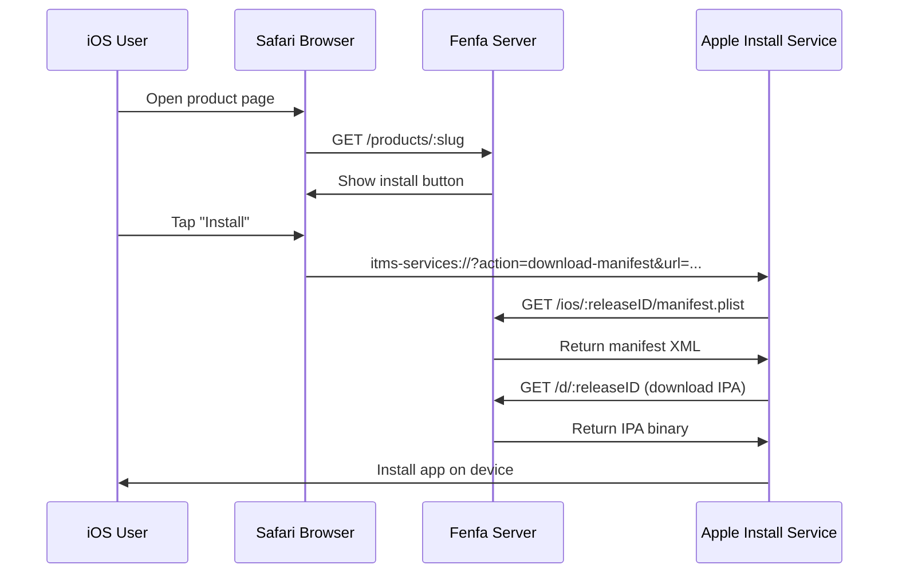
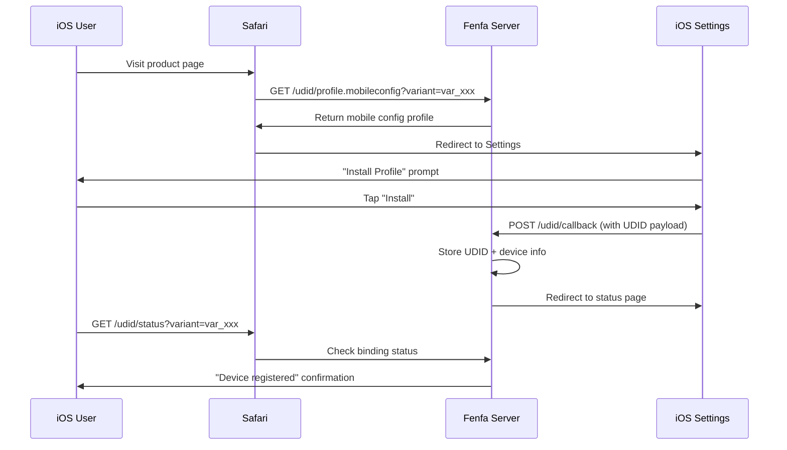

# توزيع iOS

يوفر Fenfa دعماً كاملاً لتوزيع iOS OTA (Over-The-Air)، بما في ذلك إنشاء manifest بـ `itms-services://` وربط أجهزة UDID للتوزيع ad-hoc والتكامل الاختياري مع Apple Developer API لتسجيل الأجهزة تلقائياً.

## كيف يعمل iOS OTA



يستخدم iOS بروتوكول `itms-services://` لتثبيت التطبيقات مباشرةً من صفحة ويب. عندما يضغط المستخدم على زر التثبيت، يُسلّم Safari العملية إلى مثبّت النظام الذي:

1. يجلب ملف manifest plist من Fenfa
2. يُنزّل ملف IPA
3. يُثبّت التطبيق على الجهاز

::: warning HTTPS مطلوب
يتطلب تثبيت iOS OTA HTTPS مع شهادة TLS صالحة. الشهادات الموقّعة ذاتياً لا تعمل. للاختبار المحلي، استخدم `ngrok` لإنشاء نفق HTTPS مؤقت.
:::

## إنشاء Manifest

يُنشئ Fenfa تلقائياً ملف `manifest.plist` لكل إصدار iOS. يُقدَّم manifest على:

```
GET /ios/:releaseID/manifest.plist
```

يحتوي manifest على:
- معرف الحزمة (من حقل identifier في المتغير)
- إصدار الحزمة (من إصدار الإصدار)
- رابط التنزيل (يشير إلى `/d/:releaseID`)
- عنوان التطبيق

رابط تثبيت `itms-services://` هو:

```
itms-services://?action=download-manifest&url=https://your-domain.com/ios/rel_xxx/manifest.plist
```

يُدرَج هذا الرابط تلقائياً في استجابة API الرفع ويُعرض في صفحة المنتج.

## ربط UDID

للتوزيع ad-hoc، يجب تسجيل أجهزة iOS في ملف التعريف (provisioning profile) للتطبيق. يوفر Fenfa سير عمل ربط UDID يجمع معرفات الأجهزة من المستخدمين.

### كيف يعمل ربط UDID



### نقاط نهاية UDID

| نقطة النهاية | الطريقة | الوصف |
|-------------|---------|-------|
| `/udid/profile.mobileconfig?variant=:variantID` | GET | تنزيل ملف تكوين الجهاز |
| `/udid/callback` | POST | رد من iOS بعد تثبيت الملف (يحتوي على UDID) |
| `/udid/status?variant=:variantID` | GET | التحقق من حالة ربط الجهاز الحالي |

### الأمان

يستخدم سير ربط UDID nonces لمرة واحدة للحماية من هجمات إعادة التشغيل:
- كل تنزيل لملف التعريف يُنشئ nonce فريداً
- يُضمَّن الـ nonce في رابط الرد
- بعد الاستخدام، لا يمكن إعادة استخدام الـ nonce
- تنتهي صلاحية الـ nonces بعد مهلة قابلة للتكوين

## تكامل Apple Developer API

يمكن لـ Fenfa تسجيل الأجهزة تلقائياً في حساب Apple Developer الخاص بك، مما يلغي الخطوة اليدوية لإضافة UDIDs في بوابة Apple Developer.

### الإعداد

1. اذهب إلى **لوحة الإدارة > الإعدادات > Apple Developer API**.
2. أدخل بيانات اعتماد App Store Connect API:

| الحقل | الوصف |
|-------|-------|
| Key ID | معرف مفتاح API (مثلاً "ABC123DEF4") |
| Issuer ID | معرف المُصدِر (بتنسيق UUID) |
| Private Key | محتوى المفتاح الخاص بتنسيق PEM |
| Team ID | معرف فريق Apple Developer |

::: tip إنشاء مفاتيح API
في [بوابة Apple Developer](https://developer.apple.com/account/resources/authkeys/list)، أنشئ مفتاح API بإذن "Devices". حمّل ملف `.p8` للمفتاح الخاص -- يمكن تنزيله مرة واحدة فقط.
:::

### تسجيل الأجهزة

بعد الإعداد، يمكنك تسجيل الأجهزة مع Apple من لوحة الإدارة:

**جهاز واحد:**

```bash
curl -X POST http://localhost:8000/admin/api/devices/DEVICE_ID/register-apple \
  -H "X-Auth-Token: YOUR_ADMIN_TOKEN"
```

**تسجيل دفعي:**

```bash
curl -X POST http://localhost:8000/admin/api/devices/register-apple \
  -H "X-Auth-Token: YOUR_ADMIN_TOKEN"
```

### التحقق من حالة Apple API

```bash
curl http://localhost:8000/admin/api/apple/status \
  -H "X-Auth-Token: YOUR_ADMIN_TOKEN"
```

### قائمة الأجهزة المسجّلة في Apple

```bash
curl http://localhost:8000/admin/api/apple/devices \
  -H "X-Auth-Token: YOUR_ADMIN_TOKEN"
```

## سير عمل توزيع Ad-Hoc

سير العمل الكامل لتوزيع iOS ad-hoc:

1. **المستخدم يربط جهازه** -- يزور صفحة المنتج، يُثبّت ملف تكوين الجهاز، يُسجَّل UDID.
2. **المسؤول يُسجّل الجهاز** -- في لوحة الإدارة، يُسجّل الجهاز مع Apple (أو يستخدم التسجيل الدفعي).
3. **المطوّر يُعيد توقيع IPA** -- يُحدّث ملف التعريف ليشمل الجهاز الجديد، يُعيد توقيع IPA.
4. **رفع البناء الجديد** -- يرفع IPA الموقّع حديثاً إلى Fenfa.
5. **المستخدم يُثبّت** -- يمكن للمستخدم الآن تثبيت التطبيق عبر صفحة المنتج.

::: info التوزيع المؤسسي
إذا كنت تمتلك حساب Apple Enterprise Developer، يمكنك تخطي ربط UDID بالكامل. تسمح ملفات تعريف Enterprise بالتثبيت على أي جهاز. اضبط المتغير وفقاً لذلك وارفع IPAs الموقّعة بشهادة Enterprise.
:::

## إدارة أجهزة iOS

عرض جميع الأجهزة المرتبطة في لوحة الإدارة أو عبر API:

```bash
curl http://localhost:8000/admin/api/ios_devices \
  -H "X-Auth-Token: YOUR_ADMIN_TOKEN"
```

تصدير الأجهزة بصيغة CSV:

```bash
curl -o devices.csv http://localhost:8000/admin/exports/ios_devices.csv \
  -H "X-Auth-Token: YOUR_ADMIN_TOKEN"
```

## الخطوات التالية

- [توزيع Android](./android) -- توزيع APK لـ Android
- [واجهة برمجة تطبيقات الرفع](../api/upload) -- أتمتة رفع iOS من CI/CD
- [النشر الإنتاجي](../deployment/production) -- إعداد HTTPS لـ iOS OTA
