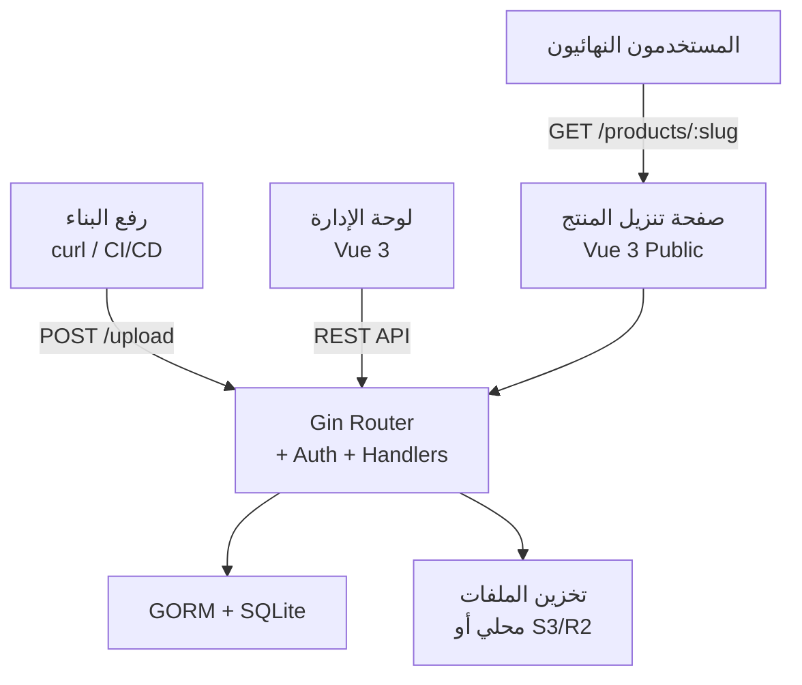
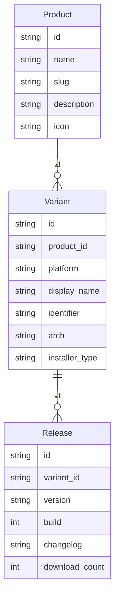

# Fenfa

Fenfa منصة توزيع تطبيقات ذاتية الاستضافة مبنية بـ Go تُمكّنك من توزيع تطبيقات iOS وAndroid وسطح المكتب لفريقك أو مستخدميك. حمّل ملفات IPA وAPK ومثبتات سطح المكتب، واحصل على صفحات تنزيل عامة قابلة للمشاركة مع رموز QR وكشف المنصة التلقائي وقوائم السجل التفصيلية.

## الهندسة المعمارية

## نموذج البيانات

## الميزات الرئيسية

- **رفع ذكي** -- يستخرج تلقائياً معرف الحزمة والإصدار ورقم البناء والأيقونة من ملفات IPA وAPK
- **صفحات المنتج** -- صفحات تنزيل عامة برموز QR وكشف المنصة ونظرة عامة على تاريخ الإصدارات
- **ربط UDID لـ iOS** -- يجمع UDIDs أجهزة iOS لتوزيع ad-hoc عبر تثبيت ملف التكوين
- **تخزين S3/R2** -- يدعم التخزين المحلي وClouflare R2 وAWS S3 وأي S3 متوافق
- **لوحة إدارة** -- واجهة Vue 3 مدمجة لإدارة المنتجات والمتغيرات والإصدارات
- **مصادقة بالرمز** -- نطاقات منفصلة لرمز التحميل (upload) ورمز الإدارة (admin)
- **تتبع الأحداث** -- يتتبع زيارات المنتج والنقرات والتنزيلات

## الوثائق

| القسم | الوصف |
|-------|-------|
| [التثبيت](./getting-started/installation) | تشغيل Fenfa بـ Docker أو البناء من المصدر |
| [البدء السريع](./getting-started/quickstart) | إنشاء أول منتج وتحميل بناء |
| [المنتجات](./products/) | إنشاء المنتجات وإدارتها |
| [المتغيرات](./products/variants) | إعداد متغيرات المنصة |
| [الإصدارات](./products/releases) | رفع الإصدارات وإدارتها |
| [التوزيع](./distribution/) | كيف يصل التطبيق إلى المستخدمين |
| [توزيع iOS](./distribution/ios) | التثبيت عبر الهواء وربط UDID |
| [توزيع Android](./distribution/android) | توزيع ملفات APK |
| [توزيع سطح المكتب](./distribution/desktop) | macOS وWindows وLinux |
| [واجهة برمجة التطبيقات](./api/) | مرجع REST API |
| [الإعداد](./configuration/) | إعداد الخادم وبيانات الاعتماد |
| [نشر Docker](./deployment/docker) | نشر الحاوية |
| [النشر الإنتاجي](./deployment/production) | وكيل عكسي وTLS والأمان |
| [استكشاف الأخطاء](./troubleshooting/) | حل المشكلات الشائعة |
