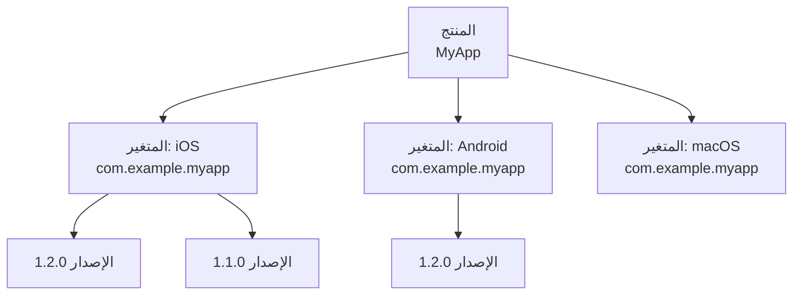

# إدارة المنتجات

المنتج هو الكيان العلوي في Fenfa. يمثل تطبيقاً ويحتوي على متغيرات المنصة (مثل iOS وAndroid وmacOS) وإصداراتها.

## التسلسل الهرمي



## إنشاء منتج

### عبر لوحة الإدارة

1. افتح لوحة الإدارة على `http://localhost:8000`
2. اذهب إلى **المنتجات > منتج جديد**
3. أدخل حقول المنتج:

| الحقل | مطلوب | الوصف |
|-------|-------|-------|
| `name` | نعم | اسم العرض للمنتج |
| `slug` | نعم | معرف URL (فريد، أحرف صغيرة وشرطات) |
| `description` | لا | وصف المنتج |
| `icon` | لا | أيقونة التطبيق (تُستخرج تلقائياً من IPA/APK) |

### عبر API

```bash
curl -X POST http://localhost:8000/admin/api/products \
  -H "X-Auth-Token: YOUR_ADMIN_TOKEN" \
  -H "Content-Type: application/json" \
  -d '{
    "name": "MyApp",
    "slug": "myapp",
    "description": "تطبيق متعدد المنصات"
  }'
```

**استجابة:**

```json
{
  "ok": true,
  "data": {
    "id": "prd_abc123",
    "name": "MyApp",
    "slug": "myapp",
    "description": "تطبيق متعدد المنصات",
    "published": false
  }
}
```

## قائمة المنتجات

```bash
curl http://localhost:8000/admin/api/products \
  -H "X-Auth-Token: YOUR_ADMIN_TOKEN"
```

## تحديث منتج

```bash
curl -X PUT http://localhost:8000/admin/api/products/prd_abc123 \
  -H "X-Auth-Token: YOUR_ADMIN_TOKEN" \
  -H "Content-Type: application/json" \
  -d '{"name": "MyApp 2.0", "description": "الإصدار المحدث"}'
```

## حذف منتج

```bash
curl -X DELETE http://localhost:8000/admin/api/products/prd_abc123 \
  -H "X-Auth-Token: YOUR_ADMIN_TOKEN"
```

::: danger حذف متتالٍ
يؤدي حذف منتج إلى حذف نهائي لجميع متغيراته وإصداراته والملفات المرفوعة. هذه العملية لا يمكن التراجع عنها.
:::

## نشر منتج وإلغاء نشره

تتحكم حالة النشر في ظهور المنتج في صفحة التنزيل العامة.

### النشر

```bash
curl -X PUT http://localhost:8000/admin/api/apps/app_xxx/publish \
  -H "X-Auth-Token: YOUR_ADMIN_TOKEN"
```

### إلغاء النشر

```bash
curl -X PUT http://localhost:8000/admin/api/apps/app_xxx/unpublish \
  -H "X-Auth-Token: YOUR_ADMIN_TOKEN"
```

## صفحة التنزيل العامة

كل منتج منشور له صفحة عامة على `/products/:slug` تتضمن:

- **الأيقونة والاسم** من إعداد المنتج
- **كشف المنصة** -- تستخدم الصفحة User-Agent للمتصفح لعرض زر التنزيل المناسب أولاً
- **رمز QR** -- يُولَّد تلقائياً لسهولة المسح من الهاتف
- **تاريخ الإصدارات** -- جميع إصدارات المتغير المحدد، الأحدث أولاً
- **سجلات التغييرات** -- ملاحظات كل إصدار تُعرض بشكل مدمج
- **متغيرات متعددة** -- إذا كان المنتج يحتوي على متغيرات لمنصات متعددة، يمكن للمستخدمين التبديل بينها

## تنسيق المعرف

معرفات المنتجات تستخدم البادئة `prd_` متبوعة بسلسلة عشوائية (مثلاً `prd_abc123`).

## الخطوات التالية

- [المتغيرات](./variants) -- إضافة متغيرات المنصة إلى منتجك
- [الإصدارات](./releases) -- رفع إصدارات التطبيق وإدارتها
- [نظرة عامة على التوزيع](../distribution/) -- كيف يصل المستخدمون إلى منتجك
