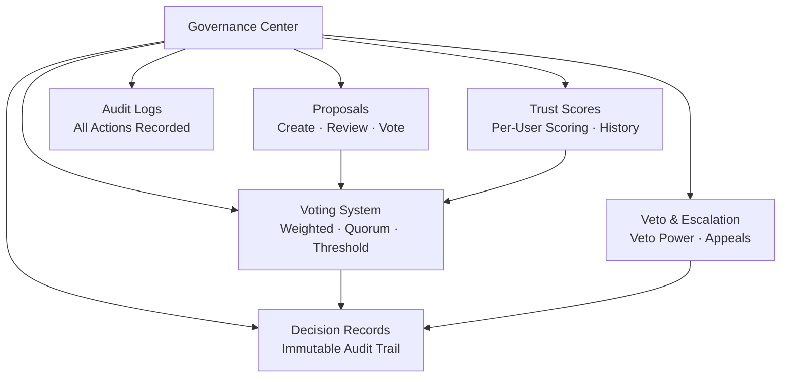

# مركز الحوكمة

مركز الحوكمة وحدة أساسية في OpenPR تجلب اتخاذ القرارات المنظمة الشفافة لإدارة المشاريع. يوفر مقترحات وتصويت وسجلات قرارات ودرجات ثقة وآليات نقض وسجلات تدقيق شاملة.

## لماذا الحوكمة؟

أدوات إدارة المشاريع التقليدية تركز على تتبع المهام لكنها تترك اتخاذ القرارات غير منظم. يضمن مركز حوكمة OpenPR أن:

- **القرارات موثقة.** كل مقترح وتصويت وقرار يُسجَّل مع سجلات تدقيق كاملة.
- **العمليات شفافة.** عتبات التصويت وقواعد النصاب ودرجات الثقة مرئية لجميع الأعضاء.
- **السلطة موزعة.** آليات النقض ومسارات التصعيد تمنع القرارات الأحادية.
- **التاريخ محفوظ.** سجلات القرارات تُنشئ سجلاً غير قابل للتغيير لما قُرِّر ومن قرره ولماذا.

## وحدات الحوكمة

| الوحدة | الوصف |
|--------|-------|
| [المقترحات](./proposals) | إنشاء المقترحات ومراجعتها والتصويت عليها |
| [التصويت والقرارات](./voting) | تصويت موزون بقواعد نصاب وعتبات |
| [درجات الثقة](./trust-scores) | تسجيل سمعة لكل مستخدم مع السجل |
| النقض والتصعيد | حق النقض مع التصويت التصعيدي والاستئنافات |
| نطاقات القرار | تصنيف القرارات حسب النطاق |
| مراجعات التأثير | تقييم تأثير المقترحات بالمقاييس |
| سجلات التدقيق | سجل كامل لجميع إجراءات الحوكمة |

## مخطط قاعدة البيانات

تستخدم وحدة الحوكمة 20 جدولاً مخصصاً:

| الجدول | الغرض |
|--------|-------|
| `proposals` | سجلات المقترحات |
| `proposal_templates` | قوالب المقترحات القابلة لإعادة الاستخدام |
| `proposal_comments` | النقاش حول المقترحات |
| `proposal_issue_links` | ربط المقترحات بالمهام ذات الصلة |
| `votes` | سجلات التصويت الفردية |
| `decisions` | سجلات القرارات النهائية |
| `decision_domains` | نطاقات تصنيف القرارات |
| `decision_audit_reports` | تقارير تدقيق القرارات |
| `governance_configs` | إعدادات حوكمة مساحة العمل |
| `governance_audit_logs` | سجلات جميع إجراءات الحوكمة |
| `vetoers` | المستخدمون ذوو حق النقض |
| `veto_events` | سجلات إجراءات النقض |
| `appeals` | الاستئنافات ضد القرارات أو حق النقض |
| `trust_scores` | درجات الثقة الحالية لكل مستخدم |
| `trust_score_logs` | سجل تغييرات درجات الثقة |
| `impact_reviews` | تقييمات تأثير المقترحات |
| `impact_metrics` | مقاييس التأثير الكمية |
| `review_participants` | سجلات تكليف المراجعين |
| `feedback_loop_links` | روابط حلقات التغذية الراجعة |

## نقاط نهاية API

| الفئة | المسار الأساسي | العمليات |
|-------|--------------|---------|
| المقترحات | `/api/proposals/*` | إنشاء، تصويت، تقديم، أرشفة |
| الحوكمة | `/api/governance/*` | الإعداد، سجلات التدقيق |
| القرارات | `/api/decisions/*` | سجلات القرارات |
| درجات الثقة | `/api/trust-scores/*` | الدرجات، السجل، الاستئنافات |
| النقض | `/api/veto/*` | النقض، التصعيد، التصويت |

## أدوات MCP

| الأداة | المعاملات | الوصف |
|--------|----------|-------|
| `proposals.list` | `project_id` | سرد المقترحات مع تصفية اختيارية بالحالة |
| `proposals.get` | `proposal_id` | الحصول على تفاصيل مقترح |
| `proposals.create` | `project_id`, `title`, `description` | إنشاء مقترح حوكمة |

## الخطوات التالية

- [المقترحات](./proposals) -- إنشاء وإدارة مقترحات الحوكمة
- [التصويت والقرارات](./voting) -- إعداد قواعد التصويت وعرض القرارات
- [درجات الثقة](./trust-scores) -- فهم آلية تسجيل الثقة
