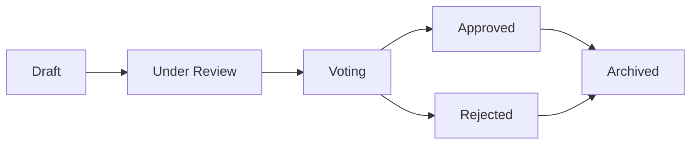

# المقترحات

المقترحات هي نقطة الدخول لقرارات الحوكمة في OpenPR. يصف المقترح تغييراً أو تحسيناً أو قراراً يحتاج إلى مساهمة الفريق، ويتبع دورة حياة منظمة من الإنشاء عبر التصويت إلى قرار نهائي.

## دورة حياة المقترح



1. **Draft** -- يُنشئ المؤلف المقترح بالعنوان والوصف والسياق.
2. **Under Review** -- يناقش أعضاء الفريق ويقدمون ملاحظاتهم من خلال التعليقات.
3. **Voting** -- تُفتح فترة التصويت. يُصوِّت الأعضاء بناءً على قواعد الحوكمة.
4. **Approved/Rejected** -- يُغلق التصويت. تُحدَّد النتيجة بالعتبة والنصاب.
5. **Archived** -- يُسجَّل القرار ويُؤرشَف المقترح.

## إنشاء مقترح

### عبر واجهة الويب

1. انتقل إلى مشروعك.
2. انتقل إلى **Governance** > **Proposals**.
3. انقر **New Proposal**.
4. أدخل العنوان والوصف وأي مهام مرتبطة.
5. انقر **Create**.

### عبر API

```bash
curl -X POST http://localhost:8080/api/proposals \
  -H "Content-Type: application/json" \
  -H "Authorization: Bearer <token>" \
  -d '{
    "project_id": "<project_uuid>",
    "title": "Adopt TypeScript for frontend modules",
    "description": "Proposal to migrate frontend modules from JavaScript to TypeScript for better type safety."
  }'
```

### عبر MCP

```json
{
  "method": "tools/call",
  "params": {
    "name": "proposals.create",
    "arguments": {
      "project_id": "<project_uuid>",
      "title": "Adopt TypeScript for frontend modules",
      "description": "Proposal to migrate frontend modules from JavaScript to TypeScript."
    }
  }
}
```

## قوالب المقترحات

يمكن لمسؤولي مساحة العمل إنشاء قوالب مقترحات لتوحيد صيغة المقترح. القوالب تعرّف:

- نمط العنوان
- الأقسام المطلوبة في الوصف
- معاملات التصويت الافتراضية

تُدار القوالب في **Workspace Settings** > **Governance** > **Templates**.

## ربط المقترحات بالمهام

يمكن ربط المقترحات بالمهام ذات الصلة من خلال جدول `proposal_issue_links`. يُنشئ هذا مرجعاً ثنائي الاتجاه:

- من المقترح، يمكنك رؤية المهام المتأثرة.
- من المهمة، يمكنك رؤية المقترحات التي تشير إليها.

## تعليقات المقترح

لكل مقترح خيط نقاش خاص به، منفصل عن تعليقات المهمة. تعليقات المقترح تدعم تنسيق markdown وهي مرئية لجميع أعضاء مساحة العمل.

## أدوات MCP

| الأداة | المعاملات | الوصف |
|--------|----------|-------|
| `proposals.list` | `project_id` | سرد المقترحات، تصفية اختيارية بـ `status` |
| `proposals.get` | `proposal_id` | الحصول على تفاصيل مقترح كاملة |
| `proposals.create` | `project_id`, `title`, `description` | إنشاء مقترح جديد |

## الخطوات التالية

- [التصويت والقرارات](./voting) -- كيفية الإدلاء بالأصوات واتخاذ القرارات
- [درجات الثقة](./trust-scores) -- كيف تؤثر درجات الثقة على وزن التصويت
- [نظرة عامة على الحوكمة](./index) -- مرجع وحدة الحوكمة الكامل
