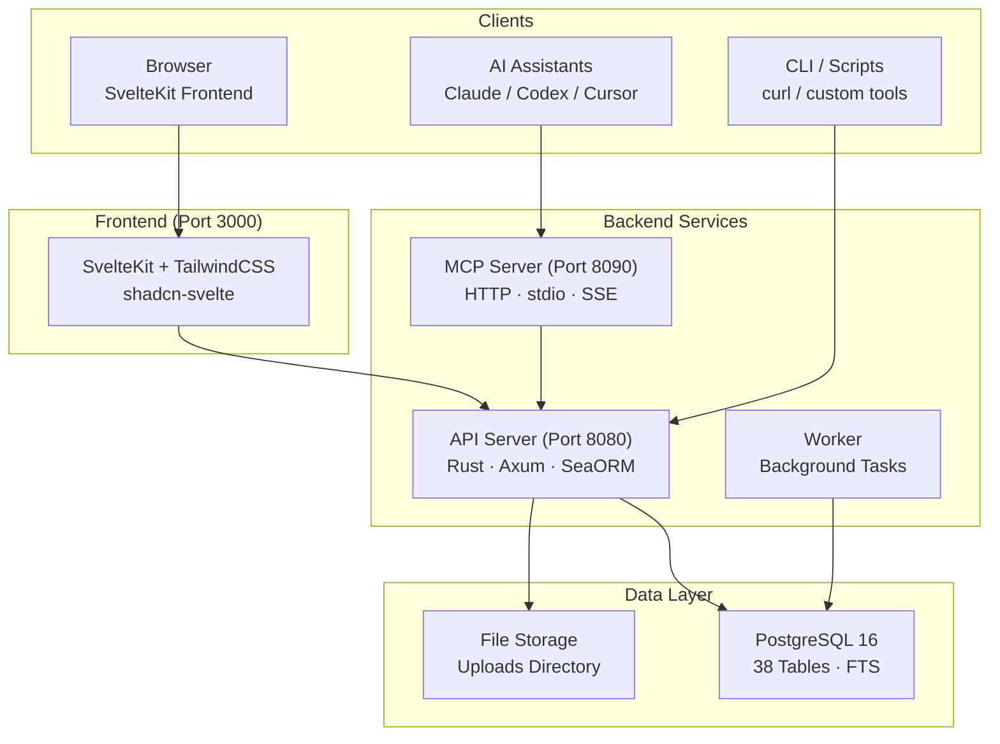

# OpenPR

**OpenPR** منصة إدارة مشاريع مفتوحة المصدر مصممة للفرق التي تحتاج إلى حوكمة شفافة وسير عمل مدعوم بالذكاء الاصطناعي والتحكم الكامل في بيانات مشاريعها. تجمع بين تتبع المهام وتخطيط السبرينت ولوحات الكانبان ومركز حوكمة متكامل — مقترحات، تصويت، درجات ثقة، آليات حق نقض — في منصة واحدة مستضافة ذاتياً.

OpenPR مبني بـ **Rust** (Axum + SeaORM) في الخلفية و**SvelteKit** في الواجهة الأمامية، ويعتمد على **PostgreSQL**. يوفر REST API وخادم MCP مدمج بـ 34 أداة عبر ثلاثة بروتوكولات نقل، مما يجعله مزودًا أوليًا للأدوات لمساعدي الذكاء الاصطناعي كـ Claude وCodex وغيرها من العملاء المتوافقة مع MCP.

## لماذا OpenPR؟

معظم أدوات إدارة المشاريع إما منصات SaaS مغلقة المصدر بتخصيص محدود، أو بدائل مفتوحة المصدر تفتقر إلى ميزات الحوكمة. يتبع OpenPR نهجاً مختلفاً:

- **مستضاف ذاتياً وقابل للتدقيق.** تبقى بيانات مشروعك على بنيتك التحتية. كل ميزة، كل سجل قرار، كل سجل تدقيق تحت سيطرتك.
- **حوكمة مدمجة.** المقترحات والتصويت ودرجات الثقة وحق النقض والتصعيد ليست إضافات — بل هي وحدات أساسية مع دعم API كامل.
- **أصيل للذكاء الاصطناعي.** خادم MCP مدمج يحوّل OpenPR إلى مزود أدوات لوكلاء الذكاء الاصطناعي. رموز البوت وتكليف المهام للذكاء الاصطناعي واستدعاءات webhook تتيح سير عمل آلي بالكامل.
- **أداء Rust.** تتعامل الخلفية مع آلاف الطلبات المتزامنة باستخدام موارد ضئيلة. يقدم PostgreSQL بحثاً نصياً كاملاً فورياً عبر جميع الكيانات.

## الميزات الرئيسية

| الفئة | الميزات |
|-------|---------|
| **إدارة المشاريع** | مساحات العمل، المشاريع، المهام، لوحة الكانبان، السبرينت، الوسوم، التعليقات، مرفقات الملفات، خلاصة النشاط، الإشعارات، البحث النصي الكامل |
| **مركز الحوكمة** | المقترحات، التصويت بالنصاب، سجلات القرارات، النقض والتصعيد، درجات الثقة مع السجل والاستئنافات، قوالب المقترحات، مراجعات التأثير، سجلات التدقيق |
| **تكامل الذكاء الاصطناعي** | رموز البوت (بادئة `opr_`)، تسجيل وكيل الذكاء الاصطناعي، تكليف المهام للذكاء الاصطناعي مع تتبع التقدم، مراجعة الذكاء الاصطناعي على المقترحات، خادم MCP (34 أداة، 3 بروتوكولات نقل)، استدعاءات webhook |
| **المصادقة** | JWT (رموز وصول + تحديث)، مصادقة رمز البوت، التحكم في الوصول المستند إلى الدور (admin/user)، أذونات نطاق مساحة العمل (owner/admin/member) |
| **النشر** | Docker Compose، Podman، وكيل عكسي Caddy/Nginx، PostgreSQL 15+ |

## البنية المعمارية



## مكدس التقنيات

| الطبقة | التقنية |
|--------|---------|
| **الخلفية** | Rust, Axum, SeaORM, PostgreSQL |
| **الواجهة الأمامية** | SvelteKit, TailwindCSS, shadcn-svelte |
| **MCP** | JSON-RPC 2.0 (HTTP + stdio + SSE) |
| **المصادقة** | JWT (وصول + تحديث) + رموز البوت (`opr_`) |
| **النشر** | Docker Compose, Podman, Caddy, Nginx |

## البدء السريع

```bash
git clone https://github.com/openprx/openpr.git
cd openpr
cp .env.example .env
docker-compose up -d
```

تبدأ الخدمات على:
- **الواجهة الأمامية**: http://localhost:3000
- **API**: http://localhost:8080
- **خادم MCP**: http://localhost:8090

أول مستخدم يسجل يصبح مسؤولاً تلقائياً.

راجع [دليل التثبيت](./getting-started/installation) لجميع طرق النشر، أو [البدء السريع](./getting-started/quickstart) للتشغيل في 5 دقائق.

## أقسام التوثيق

| القسم | الوصف |
|-------|-------|
| [التثبيت](./getting-started/installation) | Docker Compose، البناء من المصدر، وخيارات النشر |
| [البدء السريع](./getting-started/quickstart) | تشغيل OpenPR في 5 دقائق |
| [إدارة مساحة العمل](./workspace/) | مساحات العمل، المشاريع، وأدوار الأعضاء |
| [المهام والتتبع](./issues/) | المهام، حالات سير العمل، السبرينت، والوسوم |
| [مركز الحوكمة](./governance/) | المقترحات، التصويت، القرارات، ودرجات الثقة |
| [REST API](./api/) | المصادقة، نقاط النهاية، وتنسيقات الاستجابة |
| [خادم MCP](./mcp-server/) | تكامل الذكاء الاصطناعي بـ 34 أداة و3 بروتوكولات نقل |
| [الإعداد](./configuration/) | متغيرات البيئة والإعدادات |
| [النشر](./deployment/docker) | أدلة نشر Docker والإنتاج |
| [استكشاف الأخطاء](./troubleshooting/) | المشكلات الشائعة والحلول |

## المشاريع ذات الصلة

| المستودع | الوصف |
|----------|-------|
| [openpr](https://github.com/openprx/openpr) | المنصة الأساسية (هذا المشروع) |
| [openpr-webhook](https://github.com/openprx/openpr-webhook) | مستقبل webhook للتكاملات الخارجية |
| [prx](https://github.com/openprx/prx) | إطار عمل مساعد الذكاء الاصطناعي مع MCP مدمج لـ OpenPR |
| [prx-memory](https://github.com/openprx/prx-memory) | ذاكرة MCP محلية أولاً لوكلاء البرمجة |

## معلومات المشروع

- **الرخصة:** MIT OR Apache-2.0
- **اللغة:** Rust (إصدار 2024)
- **المستودع:** [github.com/openprx/openpr](https://github.com/openprx/openpr)
- **الحد الأدنى لـ Rust:** 1.75.0
- **الواجهة الأمامية:** SvelteKit
