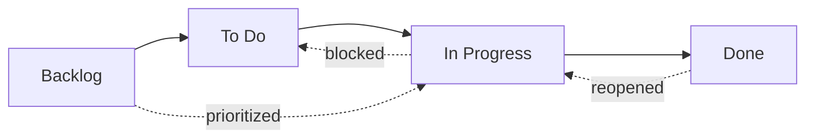
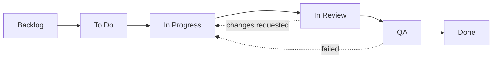

# حالات سير العمل

كل مهمة في OpenPR لها **حالة** تمثل موضعها في سير العمل. أعمدة لوحة الكانبان تخرط مباشرة مع هذه الحالات.

يأتي OpenPR مع أربع حالات افتراضية، لكنه يدعم **حالات سير عمل مخصصة بالكامل** من خلال نظام دقة ثلاثي المستويات. يمكنك تعريف سير عمل مختلفة لكل مشروع أو مساحة عمل أو الاعتماد على الحالات الافتراضية للنظام.

## الحالات الافتراضية



| الحالة | القيمة | الوصف |
|--------|-------|-------|
| **Backlog** | `backlog` | الأفكار والعمل المستقبلي والعناصر غير المخططة. لم تُجدوَل بعد. |
| **To Do** | `todo` | مخطط ومُرتَّب حسب الأولوية. جاهز للاستلام. |
| **In Progress** | `in_progress` | يُعمَل عليه بفاعلية من قِبل مُكلَّف. |
| **Done** | `done` | مكتمل ومُتحقق منه. |

هذه هي الحالات المدمجة التي تبدأ بها كل مساحة عمل جديدة. يمكنك تخصيصها أو إضافة حالات إضافية كما هو موضح في [سير العمل المخصص](#custom-workflows) أدناه.

## انتقالات الحالات

يتيح OpenPR انتقالات حالات مرنة. لا توجد قيود مفروضة -- يمكن لأي حالة الانتقال إلى أي حالة أخرى. الأنماط الشائعة تشمل:

| الانتقال | المحفز | مثال |
|---------|--------|------|
| Backlog -> To Do | تخطيط السبرينت، تحديد الأولوية | مهمة مُسحَبة إلى السبرينت القادم |
| To Do -> In Progress | يبدأ المطور العمل | المُكلَّف يبدأ التنفيذ |
| In Progress -> Done | اكتمال العمل | دُمِج طلب السحب |
| In Progress -> To Do | عمل محظور أو موقوف | انتظار اعتماد خارجي |
| Done -> In Progress | إعادة فتح المهمة | اكتشاف تراجع في خطأ |
| Backlog -> In Progress | إصلاح عاجل | مشكلة إنتاج حرجة |

## سير العمل المخصص

يدعم OpenPR حالات سير العمل المخصصة من خلال نظام **دقة ثلاثي المستويات**. عند تحقق API من حالة لعنصر عمل، يحل سير العمل الفعّال بفحص ثلاثة مستويات بالترتيب:

```
Project workflow  >  Workspace workflow  >  System defaults
```

إذا عرّف مشروع سير عمل خاص به، فإنه يأخذ الأولوية. وإلا يُستخدم سير العمل على مستوى مساحة العمل. إذا لم يكن أي منهما موجوداً، تُطبَّق الحالات الافتراضية الأربع للنظام.

### مخطط قاعدة البيانات

تُخزَّن سير العمل المخصصة في جدولين (مُقدَّمان في الترحيل `0024_workflow_config.sql`):

- **`workflows`** -- يعرّف سير عمل مُسمى مرتبطاً بمشروع أو مساحة عمل.
- **`workflow_states`** -- الحالات الفردية داخل سير العمل.

كل حالة لها الخصائص التالية:

| الحقل | النوع | الوصف |
|-------|-------|-------|
| `key` | string | معرف مقروء بالآلة (مثل `in_review`) |
| `display_name` | string | اسم مقروء للإنسان (مثل "In Review") |
| `category` | string | فئة التجميع للحالة |
| `position` | integer | ترتيب العرض على لوحة الكانبان |
| `color` | string | رمز لون hex لشارة الحالة |
| `is_initial` | boolean | ما إذا كانت هذه الحالة الافتراضية للمهام الجديدة |
| `is_terminal` | boolean | ما إذا كانت هذه الحالة تمثل الإكمال |

### إنشاء سير عمل مخصص عبر API

**الخطوة الأولى -- إنشاء سير عمل لمشروع:**

```bash
curl -X POST http://localhost:8080/api/workflows \
  -H "Content-Type: application/json" \
  -H "Authorization: Bearer <token>" \
  -d '{
    "name": "Engineering Flow",
    "project_id": "<project_uuid>"
  }'
```

**الخطوة الثانية -- إضافة حالات لسير العمل:**

```bash
curl -X POST http://localhost:8080/api/workflows/<workflow_id>/states \
  -H "Content-Type: application/json" \
  -H "Authorization: Bearer <token>" \
  -d '{
    "key": "in_review",
    "display_name": "In Review",
    "category": "active",
    "position": 3,
    "color": "#f59e0b",
    "is_initial": false,
    "is_terminal": false
  }'
```

### مثال: سير عمل هندسي بـ 6 حالات



| الحالة | المفتاح | الفئة | أولية | نهائية |
|--------|--------|-------|-------|--------|
| Backlog | `backlog` | backlog | نعم | لا |
| To Do | `todo` | planned | لا | لا |
| In Progress | `in_progress` | active | لا | لا |
| In Review | `in_review` | active | لا | لا |
| QA | `qa` | active | لا | لا |
| Done | `done` | completed | لا | نعم |

### التحقق الديناميكي

عند تحديث حالة عنصر عمل، يتحقق API من الحالة الجديدة مقابل **سير العمل الفعّال** لذلك المشروع. إذا ضبطت مفتاح حالة غير موجود في سير العمل المحلول، يُعيد API خطأ `422 Unprocessable Entity`. الحالات ليست مُرمَّزة بشكل صلب -- تُبحث ديناميكياً في وقت الطلب.

## لوحة الكانبان

يعرض عرض اللوحة المهام كبطاقات في أعمدة مقابلة لحالات سير العمل. اسحب وأسقط بطاقة بين الأعمدة لتغيير حالتها. عند تفعيل سير العمل المخصص، تعكس اللوحة تلقائياً الحالات المخصصة وترتيبها المُعيَّن.

كل بطاقة تُظهر:
- معرف المهمة (مثل `API-42`)
- العنوان
- مؤشر الأولوية
- صورة المُكلَّف الرمزية
- شارات الوسوم

## تحديث الحالة عبر API

```bash
# Move issue to "in_progress"
curl -X PATCH http://localhost:8080/api/issues/<issue_id> \
  -H "Content-Type: application/json" \
  -H "Authorization: Bearer <token>" \
  -d '{"state": "in_progress"}'
```

## تحديث الحالة عبر MCP

```json
{
  "method": "tools/call",
  "params": {
    "name": "work_items.update",
    "arguments": {
      "work_item_id": "<issue_uuid>",
      "state": "in_progress"
    }
  }
}
```

## مستويات الأولوية

بالإضافة إلى الحالات، يمكن لكل مهمة أن يكون لها مستوى أولوية:

| الأولوية | القيمة | الوصف |
|---------|-------|-------|
| منخفضة | `low` | جيد أن يتوفر، بدون ضغط وقت |
| متوسطة | `medium` | أولوية قياسية، عمل مخطط |
| عالية | `high` | مهم، يجب معالجته قريباً |
| عاجلة | `urgent` | حرجة، تحتاج اهتماماً فورياً |

## تتبع النشاط

كل تغيير في الحالة يُسجَّل في خلاصة نشاط المهمة مع الفاعل والطابع الزمني والقيم القديمة/الجديدة. هذا يوفر سجل تدقيق كاملاً.

## الخطوات التالية

- [تخطيط السبرينت](./sprints) -- تنظيم المهام في تكرارات محدودة الوقت
- [الوسوم](./labels) -- إضافة التصنيف للمهام
- [نظرة عامة على المهام](./index) -- مرجع حقول المهام الكاملة
