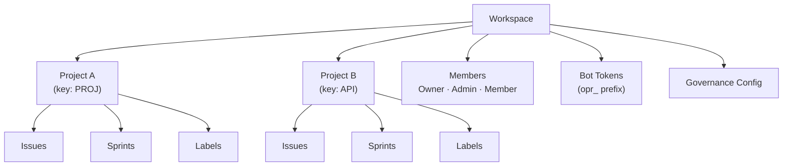

# إدارة مساحة العمل

**مساحة العمل** هي الوحدة التنظيمية العليا في OpenPR. توفر عزلاً متعدد المستأجرين -- لكل مساحة عمل مشاريعها وأعضاؤها ووسومها ورموز البوت وإعدادات الحوكمة الخاصة بها. يمكن للمستخدمين الانتماء إلى مساحات عمل متعددة.

## إنشاء مساحة عمل

بعد تسجيل الدخول، انقر **Create Workspace** على لوحة التحكم أو انتقل إلى **Settings** > **Workspaces** > **New**.

قدِّم:

| الحقل | مطلوب | الوصف |
|-------|-------|-------|
| الاسم | نعم | اسم العرض (مثل "Engineering Team") |
| السبيكة | نعم | معرف صديق للرابط (مثل "engineering") |

يُكلَّف المستخدم المنشئ تلقائياً بدور **Owner**.

## هيكل مساحة العمل



## إعدادات مساحة العمل

ادخل إلى إعدادات مساحة العمل من أيقونة الترس أو **Settings** في الشريط الجانبي:

- **General** -- تحديث اسم مساحة العمل والسبيكة والوصف.
- **Members** -- دعوة المستخدمين وتغيير الأدوار وإزالة الأعضاء. راجع [الأعضاء](./members).
- **Bot Tokens** -- إنشاء وإدارة رموز بوت MCP.
- **Governance** -- إعداد عتبات التصويت وقوالب المقترحات وقواعد درجات الثقة. راجع [الحوكمة](../governance/).
- **Webhooks** -- إعداد نقاط نهاية webhook للتكاملات الخارجية.

## الوصول عبر API

```bash
# List workspaces
curl -H "Authorization: Bearer <token>" \
  http://localhost:8080/api/workspaces

# Get workspace details
curl -H "Authorization: Bearer <token>" \
  http://localhost:8080/api/workspaces/<workspace_id>
```

## الوصول عبر MCP

من خلال خادم MCP، تعمل مساعدات الذكاء الاصطناعي ضمن مساحة العمل المحددة بمتغير البيئة `OPENPR_WORKSPACE_ID`. تقيّد جميع أدوات MCP العمليات تلقائياً لتلك مساحة العمل.

## الخطوات التالية

- [المشاريع](./projects) -- إنشاء وإدارة المشاريع داخل مساحة عمل
- [الأعضاء والصلاحيات](./members) -- دعوة المستخدمين وإعداد الأدوار
