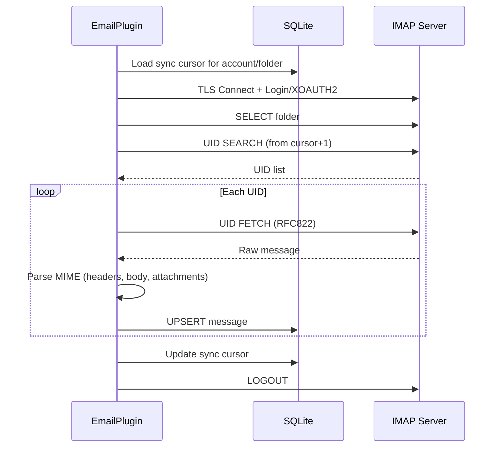

# إعداد IMAP

يتصل PRX-Email بخوادم IMAP عبر TLS باستخدام مكتبة `rustls`. يدعم مصادقة كلمة المرور وXOAUTH2 لـ Gmail وOutlook. مزامنة صندوق الوارد قائمة على UID وتدريجية، مع استمرارية المؤشر في قاعدة بيانات SQLite.

## الإعداد الأساسي لـ IMAP

```rust
use prx_email::plugin::{ImapConfig, AuthConfig};

let imap = ImapConfig {
    host: "imap.example.com".to_string(),
    port: 993,
    user: "you@example.com".to_string(),
    auth: AuthConfig {
        password: Some("your-app-password".to_string()),
        oauth_token: None,
    },
};
```

### حقول الإعداد

| الحقل | النوع | مطلوب | الوصف |
|-------|------|-------|-------|
| `host` | `String` | نعم | اسم مضيف خادم IMAP (يجب ألا يكون فارغاً) |
| `port` | `u16` | نعم | منفذ خادم IMAP (عادةً 993 لـ TLS) |
| `user` | `String` | نعم | اسم مستخدم IMAP (عادةً عنوان البريد الإلكتروني) |
| `auth.password` | `Option<String>` | أحدهما | كلمة مرور التطبيق لتسجيل دخول IMAP |
| `auth.oauth_token` | `Option<String>` | أحدهما | رمز وصول OAuth لـ XOAUTH2 |

::: warning المصادقة
يجب ضبط واحد بالضبط من `password` أو `oauth_token`. ضبط كليهما أو عدم ضبط أي منهما سيؤدي إلى خطأ تحقق.
:::

## إعدادات المزودين الشائعة

| المزوّد | المضيف | المنفذ | طريقة المصادقة |
|---------|------|------|--------------|
| Gmail | `imap.gmail.com` | 993 | كلمة مرور التطبيق أو XOAUTH2 |
| Outlook / Office 365 | `outlook.office365.com` | 993 | XOAUTH2 (موصى به) |
| Yahoo | `imap.mail.yahoo.com` | 993 | كلمة مرور التطبيق |
| Fastmail | `imap.fastmail.com` | 993 | كلمة مرور التطبيق |
| ProtonMail Bridge | `127.0.0.1` | 1143 | كلمة مرور الجسر |

## مزامنة صندوق الوارد

تتصل طريقة `sync` بخادم IMAP وتختار مجلداً وتجلب الرسائل الجديدة بـ UID وتخزّنها في SQLite:

```rust
use prx_email::plugin::SyncRequest;

plugin.sync(SyncRequest {
    account_id: 1,
    folder: Some("INBOX".to_string()),
    cursor: None,        // Resume from last saved cursor
    now_ts: now,
    max_messages: 100,   // Fetch at most 100 messages per sync
})?;
```

### تدفق المزامنة



### المزامنة التدريجية

يستخدم PRX-Email مؤشرات قائمة على UID لتجنب إعادة جلب الرسائل. بعد كل مزامنة:

1. يُحفظ أعلى UID تم رؤيته كمؤشر
2. تبدأ المزامنة التالية من `cursor + 1`
3. تُحدَّث الرسائل ذات أزواج `(account_id, message_id)` الموجودة (UPSERT)

يُخزَّن المؤشر في جدول `sync_state` بالمفتاح المركب `(account_id, folder_id)`.

## مزامنة متعددة المجلدات

مزامنة مجلدات متعددة لنفس الحساب:

```rust
for folder in &["INBOX", "Sent", "Drafts", "Archive"] {
    plugin.sync(SyncRequest {
        account_id,
        folder: Some(folder.to_string()),
        cursor: None,
        now_ts: now,
        max_messages: 100,
    })?;
}
```

## جدولة المزامنة

للمزامنة الدورية، استخدم منشئ المزامنة المدمج:

```rust
use prx_email::plugin::{SyncJob, SyncRunnerConfig};

let jobs = vec![
    SyncJob { account_id: 1, folder: "INBOX".into(), max_messages: 100 },
    SyncJob { account_id: 1, folder: "Sent".into(), max_messages: 50 },
    SyncJob { account_id: 2, folder: "INBOX".into(), max_messages: 100 },
];

let config = SyncRunnerConfig {
    max_concurrency: 4,         // Max jobs per runner tick
    base_backoff_seconds: 10,   // Initial backoff on failure
    max_backoff_seconds: 300,   // Maximum backoff (5 minutes)
};

let report = plugin.run_sync_runner(&jobs, now, &config);
println!(
    "Run {}: attempted={}, succeeded={}, failed={}",
    report.run_id, report.attempted, report.succeeded, report.failed
);
```

### سلوك الجدول الزمني

- **حد التزامن**: يعمل ما يصل إلى `max_concurrency` مهمة لكل دورة
- **تراجع الفشل**: تراجع أسي بصيغة `base * 2^failures`، محدود بـ `max_backoff_seconds`
- **فحص الاستحقاق**: تُتخطى المهام إذا لم تنقضِ نافذة التراجع الخاصة بها
- **تتبع الحالة**: لكل مفتاح `account::folder`، يتبع `(next_allowed_at, failure_count)`

## تحليل الرسائل

تُحلَّل الرسائل الواردة باستخدام حزمة `mail-parser` مع الاستخراج التالي:

| الحقل | المصدر | ملاحظات |
|-------|--------|---------|
| `message_id` | رأس `Message-ID` | يعود إلى SHA-256 للبايتات الخام |
| `subject` | رأس `Subject` | |
| `sender` | أول عنوان من رأس `From` | |
| `recipients` | جميع العناوين من رأس `To` | مفصولة بفاصلة |
| `body_text` | أول جزء `text/plain` | |
| `body_html` | أول جزء `text/html` | احتياطي: استخراج القسم الخام |
| `snippet` | أول 120 حرف من body_text أو body_html | |
| `references_header` | رأس `References` | للتخيط |
| `attachments` | أجزاء مرفقات MIME | بيانات وصفية متسلسلة بـ JSON |

## TLS

جميع اتصالات IMAP تستخدم TLS عبر `rustls` مع حزمة شهادات `webpki-roots`. لا يوجد خيار لتعطيل TLS أو استخدام STARTTLS -- الاتصالات مشفرة دائماً من البداية.

## الخطوات التالية

- [إعداد SMTP](./smtp) -- إعداد إرسال البريد الإلكتروني
- [مصادقة OAuth](./oauth) -- إعداد XOAUTH2 لـ Gmail وOutlook
- [تخزين SQLite](../storage/) -- فهم مخطط قاعدة البيانات
