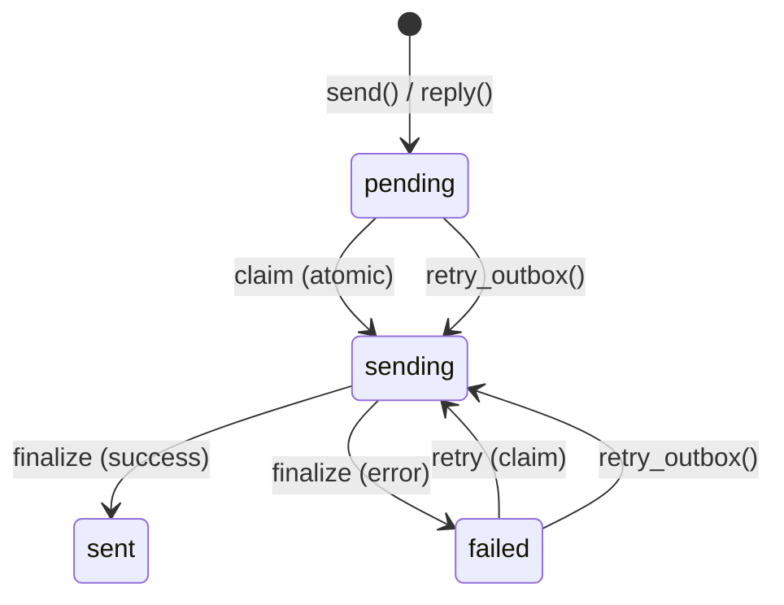

# إعداد SMTP

يرسل PRX-Email البريد الإلكتروني عبر SMTP باستخدام حزمة `lettre` مع TLS `rustls`. يستخدم خط أنابيب صندوق الصادر سير عمل المطالبة-الإرسال-الإنهاء الذري لمنع الإرسال المكرر، مع إعادة محاولة بتراجع أسي ومفاتيح أدوات Message-ID حتمية.

## الإعداد الأساسي لـ SMTP

```rust
use prx_email::plugin::{SmtpConfig, AuthConfig};

let smtp = SmtpConfig {
    host: "smtp.example.com".to_string(),
    port: 465,
    user: "you@example.com".to_string(),
    auth: AuthConfig {
        password: Some("your-app-password".to_string()),
        oauth_token: None,
    },
};
```

### حقول الإعداد

| الحقل | النوع | مطلوب | الوصف |
|-------|------|-------|-------|
| `host` | `String` | نعم | اسم مضيف خادم SMTP (يجب ألا يكون فارغاً) |
| `port` | `u16` | نعم | منفذ خادم SMTP (465 لـ TLS الضمني، 587 لـ STARTTLS) |
| `user` | `String` | نعم | اسم مستخدم SMTP (عادةً عنوان البريد الإلكتروني) |
| `auth.password` | `Option<String>` | أحدهما | كلمة المرور لـ SMTP AUTH PLAIN/LOGIN |
| `auth.oauth_token` | `Option<String>` | أحدهما | رمز وصول OAuth لـ XOAUTH2 |

## إعدادات المزودين الشائعة

| المزوّد | المضيف | المنفذ | طريقة المصادقة |
|---------|------|------|--------------|
| Gmail | `smtp.gmail.com` | 465 | كلمة مرور التطبيق أو XOAUTH2 |
| Outlook / Office 365 | `smtp.office365.com` | 587 | XOAUTH2 |
| Yahoo | `smtp.mail.yahoo.com` | 465 | كلمة مرور التطبيق |
| Fastmail | `smtp.fastmail.com` | 465 | كلمة مرور التطبيق |

## إرسال البريد الإلكتروني

### الإرسال الأساسي

```rust
use prx_email::plugin::SendEmailRequest;

let response = plugin.send(SendEmailRequest {
    account_id: 1,
    to: "recipient@example.com".to_string(),
    subject: "Hello".to_string(),
    body_text: "Message body here.".to_string(),
    now_ts: now,
    attachment: None,
    failure_mode: None,
});
```

### الرد على رسالة

```rust
use prx_email::plugin::ReplyEmailRequest;

let response = plugin.reply(ReplyEmailRequest {
    account_id: 1,
    in_reply_to_message_id: "<original-msg-id@example.com>".to_string(),
    body_text: "Thanks for your message!".to_string(),
    now_ts: now,
    attachment: None,
    failure_mode: None,
});
```

تضبط الردود تلقائياً:
- رأس `In-Reply-To`
- بناء سلسلة `References` من الرسالة الأصل
- اشتقاق المستلم من مرسل الرسالة الأصل
- إضافة بادئة `Re:` للموضوع

## خط أنابيب صندوق الصادر

يضمن خط أنابيب صندوق الصادر تسليماً موثوقاً للبريد الإلكتروني من خلال آلة حالة ذرية:



### قواعد آلة الحالة

| الانتقال | الشرط | الحارس |
|---------|-------|--------|
| `pending` -> `sending` | `claim_outbox_for_send()` | `status IN ('pending','failed') AND next_attempt_at <= now` |
| `sending` -> `sent` | قبل المزوّد | `update_outbox_status_if_current(status='sending')` |
| `sending` -> `failed` | رفض المزوّد أو خطأ الشبكة | `update_outbox_status_if_current(status='sending')` |
| `failed` -> `sending` | `retry_outbox()` | `status IN ('pending','failed') AND next_attempt_at <= now` |

### الأدوات

كل رسالة صندوق صادر تحصل على Message-ID حتمي:

```
<outbox-{id}-{retries}@prx-email.local>
```

هذا يضمن أن إعادة المحاولات قابلة للتمييز عن الإرسال الأصلي، والمزودون الذين يزيلون التكرار بـ Message-ID سيقبلون كل إعادة محاولة.

### تراجع إعادة المحاولة

تستخدم الإرسالات الفاشلة تراجعاً أسياً:

```
next_attempt_at = now + base_backoff * 2^retries
```

مع تراجع أساسي مقداره 5 ثوانٍ:

| إعادة المحاولة | التراجع |
|------------|--------|
| 1 | 10 ث |
| 2 | 20 ث |
| 3 | 40 ث |
| 4 | 80 ث |
| 5 | 160 ث |
| 6 | 320 ث |
| 7 | 640 ث |
| 10 | 5,120 ث (~85 دقيقة) |

### إعادة المحاولة اليدوية

```rust
use prx_email::plugin::RetryOutboxRequest;

let response = plugin.retry_outbox(RetryOutboxRequest {
    outbox_id: 42,
    now_ts: now,
    failure_mode: None,
});
```

تُرفض إعادة المحاولة إذا:
- كانت حالة صندوق الصادر `sent` أو `sending` (غير قابلة لإعادة المحاولة)
- لم يصل `next_attempt_at` بعد (`retry_not_due`)

## المرفقات

### الإرسال مع مرفق

```rust
use prx_email::plugin::{SendEmailRequest, AttachmentInput};

let response = plugin.send(SendEmailRequest {
    account_id: 1,
    to: "recipient@example.com".to_string(),
    subject: "Report attached".to_string(),
    body_text: "Please find the report attached.".to_string(),
    now_ts: now,
    attachment: Some(AttachmentInput {
        filename: "report.pdf".to_string(),
        content_type: "application/pdf".to_string(),
        base64: Some(base64_encoded_content),
        path: None,
    }),
    failure_mode: None,
});
```

### سياسة المرفقات

تُنفّذ `AttachmentPolicy` قيود الحجم ونوع MIME:

```rust
use prx_email::plugin::AttachmentPolicy;

let policy = AttachmentPolicy {
    max_size_bytes: 25 * 1024 * 1024,  // 25 MiB
    allowed_content_types: [
        "application/pdf",
        "image/jpeg",
        "image/png",
        "text/plain",
        "application/zip",
    ].into_iter().map(String::from).collect(),
};
```

| القاعدة | السلوك |
|--------|--------|
| الحجم يتجاوز `max_size_bytes` | مرفوض بـ `attachment exceeds size limit` |
| نوع MIME غير موجود في `allowed_content_types` | مرفوض بـ `attachment content type is not allowed` |
| مرفق قائم على المسار بدون `attachment_store` | مرفوض بـ `attachment store not configured` |
| المسار يتجاوز جذر التخزين (اجتياز `../`) | مرفوض بـ `attachment path escapes storage root` |

### المرفقات القائمة على المسار

للمرفقات المخزّنة على القرص، اضبط مخزن المرفقات:

```rust
use prx_email::plugin::AttachmentStoreConfig;

let store = AttachmentStoreConfig {
    enabled: true,
    dir: "/var/lib/prx-email/attachments".to_string(),
};
```

يتضمن تحليل المسار حراسات اجتياز الدليل -- أي مسار يُحلّ خارج جذر التخزين المُعيَّن مرفوض، بما فيها الهروب القائم على الروابط الرمزية.

## تنسيق استجابة API

جميع عمليات الإرسال تعيد `ApiResponse<SendResult>`:

```rust
pub struct SendResult {
    pub outbox_id: i64,
    pub status: String,          // "sent" or "failed"
    pub retries: i64,
    pub provider_message_id: Option<String>,
    pub next_attempt_at: i64,
}
```

## الخطوات التالية

- [مصادقة OAuth](./oauth) -- إعداد XOAUTH2 للمزودين الذين يتطلبونها
- [مرجع الإعداد](../configuration/) -- جميع الإعدادات ومتغيرات البيئة
- [استكشاف الأخطاء](../troubleshooting/) -- مشكلات SMTP الشائعة وحلولها
