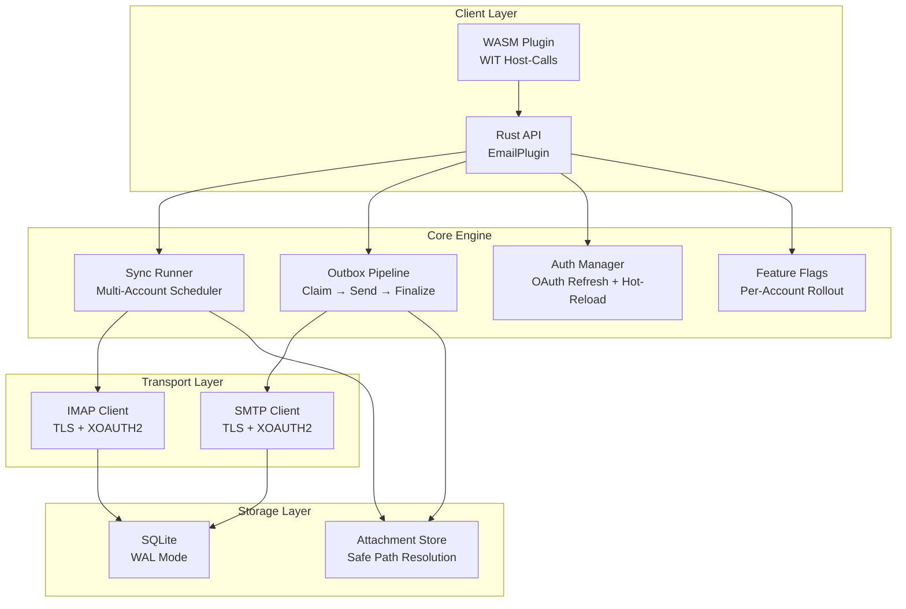

# PRX-Email

**PRX-Email** هو مكوّن إضافي لعميل بريد إلكتروني مستضاف ذاتياً مكتوب بـ Rust مع استمرارية SQLite وبدائيات محكومة للإنتاج. يوفر مزامنة صندوق الوارد عبر IMAP وإرسال SMTP مع خط أنابيب صندوق صادر ذري والمصادقة OAuth 2.0 لـ Gmail وOutlook وحوكمة المرفقات وواجهة مكوّن WASM للتكامل في النظام البيئي PRX.

صُمِّم PRX-Email للمطورين والفرق الذين يحتاجون إلى واجهة خلفية للبريد الإلكتروني موثوقة وقابلة للتضمين -- واجهة تتعامل مع جدولة مزامنة متعددة الحسابات وتسليم آمن لصندوق الصادر مع إعادة المحاولة والتراجع وإدارة دورة حياة رموز OAuth ونشر علامات الميزات -- كل ذلك دون الاعتماد على واجهات برمجة SaaS للبريد الإلكتروني من أطراف ثالثة.

## لماذا PRX-Email؟

تعتمد معظم تكاملات البريد الإلكتروني على واجهات برمجة خاصة بالمورّد أو غلافات IMAP/SMTP هشة تتجاهل مخاوف الإنتاج مثل الإرسال المكرر وانتهاء صلاحية الرمز وسلامة المرفقات. يتبع PRX-Email نهجاً مختلفاً:

- **صندوق صادر محكوم للإنتاج.** آلة حالة ذرية من المطالبة والإنهاء تمنع الإرسال المكرر. التراجع الأسي ومفاتيح الأدوات المحددة بشكل حتمي لـ Message-ID تضمن إعادة المحاولة الآمنة.
- **مصادقة OAuth أولاً.** دعم XOAUTH2 أصلي لكل من IMAP وSMTP مع تتبع انتهاء صلاحية الرمز ومزودي التحديث القابلين للتوصيل وإعادة التحميل الساخن من متغيرات البيئة.
- **تخزين SQLite أصلي.** وضع WAL والتنقيط المحدود والاستعلامات ذات المعاملات توفر استمرارية محلية سريعة وموثوقة دون اعتماديات قاعدة بيانات خارجية.
- **قابل للتوسيع عبر WASM.** يُترجم المكوّن إلى WebAssembly ويعرض عمليات البريد الإلكتروني من خلال استدعاءات WIT للمضيف، مع مفتاح أمان شبكي يعطل IMAP/SMTP الحقيقي بشكل افتراضي.

## الميزات الرئيسية

<div class="vp-features">

- **مزامنة صندوق الوارد IMAP** -- الاتصال بأي خادم IMAP مع TLS. مزامنة حسابات ومجلدات متعددة مع الجلب التدريجي القائم على UID وثبات المؤشر.

- **خط أنابيب صندوق الصادر SMTP** -- سير عمل المطالبة-الإرسال-الإنهاء الذري يمنع الإرسال المكرر. الرسائل الفاشلة تعيد المحاولة مع تراجع أسي وحدود قابلة للتكوين.

- **مصادقة OAuth 2.0** -- XOAUTH2 لـ Gmail وOutlook. تتبع انتهاء صلاحية الرمز ومزودو التحديث القابلون للتوصيل وإعادة التحميل الساخن القائم على البيئة دون إعادة تشغيل.

- **جدولة مزامنة متعددة الحسابات** -- استطلاع دوري حسب الحساب والمجلد مع تزامن قابل للتكوين وتراجع الفشل وحدود صارمة لكل تشغيل.

- **استمرارية SQLite** -- وضع WAL ومزامنة NORMAL ومهلة انشغال 5 ثوانٍ. مخطط كامل مع الحسابات والمجلدات والرسائل وصندوق الصادر وحالة المزامنة وعلامات الميزات.

- **حوكمة المرفقات** -- حدود الحجم القصوى وإنفاذ قائمة MIME البيضاء وحراسات اجتياز الدليل تحمي من المرفقات الكبيرة أو الخبيثة.

- **نشر علامات الميزات** -- علامات ميزات لكل حساب مع نشر قائم على النسبة المئوية. التحكم في قراءة صندوق الوارد والبحث والإرسال والرد وقدرات إعادة المحاولة بشكل مستقل.

- **واجهة مكوّن WASM** -- التترجم إلى WebAssembly للتنفيذ في بيئة آمنة داخل وقت تشغيل PRX. توفر استدعاءات المضيف عمليات email.sync وlist وget وsearch وsend وreply.

- **المراقبة** -- مقاييس وقت التشغيل في الذاكرة (محاولات/نجاح/فشل المزامنة، فشل الإرسال، عدد إعادة المحاولة) وحمولات سجل منظمة مع الحساب والمجلد وmessage_id وrun_id وerror_code.

</div>

## الهندسة المعمارية



## التثبيت السريع

استنسخ المستودع وابنه:

```bash
git clone https://github.com/openprx/prx_email.git
cd prx_email
cargo build --release
```

أو أضفه كاعتمادية في `Cargo.toml`:

```toml
[dependencies]
prx_email = { git = "https://github.com/openprx/prx_email.git" }
```

راجع [دليل التثبيت](./getting-started/installation) لتعليمات الإعداد الكاملة بما فيها تترجمة مكوّن WASM.

## أقسام التوثيق

| القسم | الوصف |
|-------|-------|
| [التثبيت](./getting-started/installation) | تثبيت PRX-Email وإعداد الاعتماديات وبناء مكوّن WASM |
| [البدء السريع](./getting-started/quickstart) | إعداد أول حساب وإرسال بريد إلكتروني في 5 دقائق |
| [إدارة الحسابات](./accounts/) | إضافة وإعداد وإدارة حسابات البريد الإلكتروني |
| [إعداد IMAP](./accounts/imap) | إعدادات خادم IMAP وTLS ومزامنة المجلدات |
| [إعداد SMTP](./accounts/smtp) | إعدادات خادم SMTP وTLS وخط أنابيب الإرسال |
| [مصادقة OAuth](./accounts/oauth) | إعداد OAuth 2.0 لـ Gmail وOutlook |
| [تخزين SQLite](./storage/) | مخطط قاعدة البيانات ووضع WAL وضبط الأداء والصيانة |
| [مكوّنات WASM](./plugins/) | بناء ونشر مكوّن WASM مع استدعاءات WIT للمضيف |
| [مرجع الإعداد](./configuration/) | جميع متغيرات البيئة وإعدادات وقت التشغيل وخيارات السياسة |
| [استكشاف الأخطاء](./troubleshooting/) | المشكلات الشائعة والحلول |

## معلومات المشروع

- **الرخصة:** MIT OR Apache-2.0
- **اللغة:** Rust (إصدار 2024)
- **المستودع:** [github.com/openprx/prx_email](https://github.com/openprx/prx_email)
- **التخزين:** SQLite (rusqlite مع ميزة مدمجة)
- **IMAP:** حزمة `imap` مع TLS rustls
- **SMTP:** حزمة `lettre` مع TLS rustls
