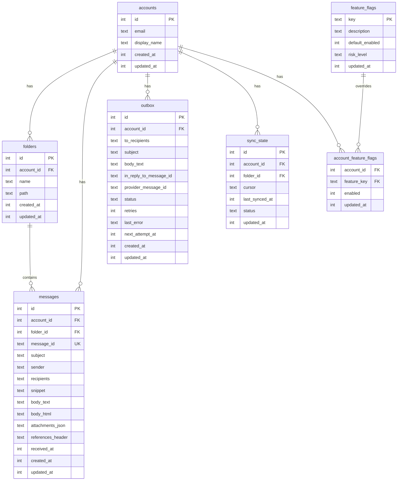

# تخزين SQLite

يستخدم PRX-Email SQLite كواجهة التخزين الوحيدة، يُوصَل إليها من خلال حزمة `rusqlite` مع تترجمة SQLite المدمجة. تعمل قاعدة البيانات في وضع WAL مع تفعيل المفاتيح الخارجية، مما يوفر قراءات متزامنة سريعة وعزلاً موثوقاً للكتابة.

## إعداد قاعدة البيانات

### الإعدادات الافتراضية

| الإعداد | القيمة | الوصف |
|---------|-------|-------|
| `journal_mode` | WAL | تسجيل الكتابة المسبقة للقراءات المتزامنة |
| `synchronous` | NORMAL | توازن بين المتانة والأداء |
| `foreign_keys` | ON | إنفاذ التكامل المرجعي |
| `busy_timeout` | 5000 مللي ثانية | وقت الانتظار لقاعدة البيانات المقفلة |
| `wal_autocheckpoint` | 1000 صفحة | عتبة نقطة التحقق التلقائية لـ WAL |

### الإعداد المخصص

```rust
use prx_email::db::{EmailStore, StoreConfig, SynchronousMode};

let config = StoreConfig {
    enable_wal: true,
    busy_timeout_ms: 5_000,
    wal_autocheckpoint_pages: 1_000,
    synchronous: SynchronousMode::Normal,
};

let store = EmailStore::open_with_config("./email.db", &config)?;
```

### أوضاع المزامنة

| الوضع | المتانة | الأداء | حالة الاستخدام |
|-------|---------|--------|--------------|
| `Full` | أقصى | أبطأ الكتابات | أعباء عمل مالية أو امتثال |
| `Normal` | جيدة (افتراضي) | متوازن | الاستخدام الإنتاجي العام |
| `Off` | دنيا | أسرع الكتابات | التطوير والاختبار فقط |

### قاعدة بيانات في الذاكرة

للاختبار، استخدم قاعدة بيانات في الذاكرة:

```rust
let store = EmailStore::open_in_memory()?;
store.migrate()?;
```

## المخطط

يُطبَّق مخطط قاعدة البيانات من خلال ترحيلات تدريجية. تشغيل `store.migrate()` يطبق جميع الترحيلات المعلقة.

### الجداول



### الفهارس

| الجدول | الفهرس | الغرض |
|--------|--------|-------|
| `messages` | `(account_id)` | تصفية الرسائل حسب الحساب |
| `messages` | `(folder_id)` | تصفية الرسائل حسب المجلد |
| `messages` | `(subject)` | بحث LIKE في الموضوعات |
| `messages` | `(account_id, message_id)` | قيد فريد لـ UPSERT |
| `outbox` | `(account_id)` | تصفية صندوق الصادر حسب الحساب |
| `outbox` | `(status, next_attempt_at)` | المطالبة بسجلات صندوق الصادر المؤهلة |
| `sync_state` | `(account_id, folder_id)` | قيد فريد لـ UPSERT |
| `account_feature_flags` | `(account_id)` | بحث علامات الميزات |

## الترحيلات

الترحيلات مدمجة في الثنائي وتُطبَّق بالترتيب:

| الترحيل | الوصف |
|---------|-------|
| `0001_init.sql` | جداول الحسابات والمجلدات والرسائل وحالة المزامنة |
| `0002_outbox.sql` | جدول صندوق الصادر لخط أنابيب الإرسال |
| `0003_rollout.sql` | علامات الميزات وعلامات ميزات الحسابات |
| `0005_m41.sql` | تحسينات مخطط M4.1 |
| `0006_m42_perf.sql` | فهارس أداء M4.2 |

تُضاف أعمدة إضافية (`body_html` و`attachments_json` و`references_header`) عبر `ALTER TABLE` إذا لم تكن موجودة.

## ضبط الأداء

### أعباء العمل الكثيفة القراءة

للتطبيقات التي تقرأ أكثر بكثير مما تكتب (عملاء البريد الإلكتروني النموذجيون):

```rust
let config = StoreConfig {
    enable_wal: true,              // Concurrent reads
    busy_timeout_ms: 10_000,       // Higher timeout for contention
    wal_autocheckpoint_pages: 2_000, // Less frequent checkpoints
    synchronous: SynchronousMode::Normal,
};
```

### أعباء العمل الكثيفة الكتابة

لعمليات مزامنة عالية الحجم:

```rust
let config = StoreConfig {
    enable_wal: true,
    busy_timeout_ms: 5_000,
    wal_autocheckpoint_pages: 500, // More frequent checkpoints
    synchronous: SynchronousMode::Normal,
};
```

### تحليل خطة الاستعلام

تحقق من الاستعلامات البطيئة بـ `EXPLAIN QUERY PLAN`:

```sql
EXPLAIN QUERY PLAN
SELECT * FROM messages
WHERE account_id = 1 AND subject LIKE '%invoice%'
ORDER BY received_at DESC LIMIT 50;
```

## تخطيط السعة

### محركات النمو

| الجدول | نمط النمو | استراتيجية الاحتجاز |
|--------|---------|-----------------|
| `messages` | الجدول المهيمن؛ ينمو مع كل مزامنة | تطهير الرسائل القديمة دورياً |
| `outbox` | يتراكم تاريخ الإرسال + الفشل | حذف السجلات المرسلة القديمة |
| ملف WAL | يرتفع خلال فورات الكتابة | نقطة تحقق تلقائية |

### عتبات المراقبة

- تتبع حجم ملف DB وحجم WAL بشكل مستقل
- تنبيه عندما يبقى WAL كبيراً عبر نقاط تحقق متعددة
- تنبيه عندما تتجاوز قائمة فشل صندوق الصادر SLO التشغيلية

## صيانة البيانات

### مساعدات التنظيف

```rust
// Delete sent outbox records older than 30 days
let cutoff = now - 30 * 86400;
let deleted = repo.delete_sent_outbox_before(cutoff)?;
println!("Deleted {} old sent records", deleted);

// Delete messages older than 90 days
let cutoff = now - 90 * 86400;
let deleted = repo.delete_old_messages_before(cutoff)?;
println!("Deleted {} old messages", deleted);
```

### SQL الصيانة

فحص توزيع حالة صندوق الصادر:

```sql
SELECT status, COUNT(*) FROM outbox GROUP BY status;
```

توزيع عمر الرسائل:

```sql
SELECT
  CASE
    WHEN received_at >= strftime('%s','now') - 86400 THEN 'lt_1d'
    WHEN received_at >= strftime('%s','now') - 604800 THEN 'lt_7d'
    ELSE 'ge_7d'
  END AS age_bucket,
  COUNT(*)
FROM messages
GROUP BY age_bucket;
```

نقطة تحقق WAL والضغط:

```sql
PRAGMA wal_checkpoint(TRUNCATE);
VACUUM;
```

::: warning VACUUM
يُعيد `VACUUM` بناء ملف قاعدة البيانات بأكمله ويتطلب مساحة قرص حرة تساوي حجم قاعدة البيانات. شغّله في نافذة صيانة بعد عمليات الحذف الكبيرة.
:::

## أمان SQL

جميع استعلامات قاعدة البيانات تستخدم عبارات مُعاملَة لمنع حقن SQL:

```rust
// Safe: parameterized query
conn.execute(
    "SELECT * FROM messages WHERE account_id = ?1 AND message_id = ?2",
    params![account_id, message_id],
)?;
```

تُتحقق المعرّفات الديناميكية (أسماء الجداول وأسماء الأعمدة) بالنمط `^[a-zA-Z_][a-zA-Z0-9_]{0,62}$` قبل الاستخدام في سلاسل SQL.

## الخطوات التالية

- [مرجع الإعداد](../configuration/) -- جميع إعدادات وقت التشغيل
- [استكشاف الأخطاء](../troubleshooting/) -- مشكلات متعلقة بقاعدة البيانات
- [إعداد IMAP](../accounts/imap) -- فهم تدفق بيانات المزامنة
