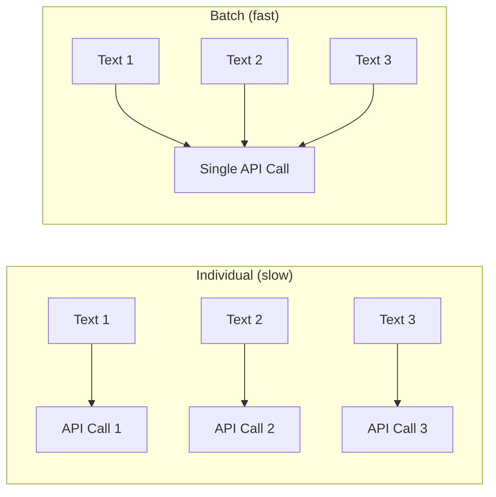

# معالجة الدفعات

عند العمل مع مجموعات ذاكرة كبيرة، يكون تضمين نص واحد في كل مرة غير فعّال. يدعم PRX-Memory التضمين المجمع لتقليل رحلات API الذهاب والإياب وتحسين الإنتاجية.

## كيف يعمل التضمين المجمع

بدلاً من إجراء طلبات API فردية لكل ذاكرة، تجمع معالجة الدفعات نصوصاً متعددة في طلب واحد. تدعم معظم مزودي التضمين أحجام دفعة من 100 إلى 2048 نصاً لكل طلب.



## حالات الاستخدام

### الاستيراد الأولي

عند استيراد مجموعة كبيرة من المعرفة الموجودة، استخدم `memory_import` لتحميل الذكريات وتشغيل التضمين المجمع:

```json
{
  "jsonrpc": "2.0",
  "id": 1,
  "method": "tools/call",
  "params": {
    "name": "memory_import",
    "arguments": {
      "data": "... exported memory JSON ..."
    }
  }
}
```

### إعادة التضمين بعد تغيير النموذج

عند التبديل إلى نموذج تضمين جديد، تعالج أداة `memory_reembed` جميع الذكريات المخزّنة في دفعات:

```json
{
  "jsonrpc": "2.0",
  "id": 1,
  "method": "tools/call",
  "params": {
    "name": "memory_reembed",
    "arguments": {}
  }
}
```

### ضغط التخزين

تحسّن أداة `memory_compact` التخزين ويمكنها تشغيل إعادة التضمين للإدخالات ذات المتجهات القديمة أو المفقودة:

```json
{
  "jsonrpc": "2.0",
  "id": 1,
  "method": "tools/call",
  "params": {
    "name": "memory_compact",
    "arguments": {}
  }
}
```

## نصائح الأداء

| النصيحة | الوصف |
|---------|-------|
| استخدام مزودين يدعمون الدفعات | تدعم نقاط نهاية Jina وOpenAI-compatible أحجام دفعة كبيرة |
| الجدولة خلال انخفاض الاستخدام | تتنافس عمليات الدفعة على حصة API ذاتها مع الاستعلامات الآنية |
| المراقبة عبر المقاييس | استخدم نقطة نهاية `/metrics` لتتبع عدد طلبات التضمين وفترات الكمون |
| اختيار نماذج فعّالة | تضمين النماذج الأصغر (768 بُعداً) أسرع من الأكبر (3072 بُعداً) |

## تحديد المعدل

تفرض معظم مزودي التضمين حدوداً للمعدل. يتعامل PRX-Memory مع استجابات تحديد المعدل (HTTP 429) بتراجع تلقائي. إذا واجهت تحديداً مستمراً للمعدل:

- قلّل حجم الدفعة بمعالجة ذكريات أقل في كل مرة.
- استخدم مزوّداً بحدود معدل أعلى.
- وزّع عمليات الدفعة على نافذة زمنية أطول.

::: tip
لعمليات إعادة التضمين الضخمة، فكّر في استخدام خادم استنتاج محلي لتجنب تحديد المعدل كلياً. اضبط `PRX_EMBED_PROVIDER=openai-compatible` ووجّه `PRX_EMBED_BASE_URL` إلى خادمك المحلي.
:::

## الخطوات التالية

- [النماذج المدعومة](./models) -- اختيار نموذج التضمين المناسب
- [واجهات التخزين](../storage/) -- أين تُخزَّن المتجهات
- [مرجع الإعداد](../configuration/) -- جميع متغيرات البيئة
