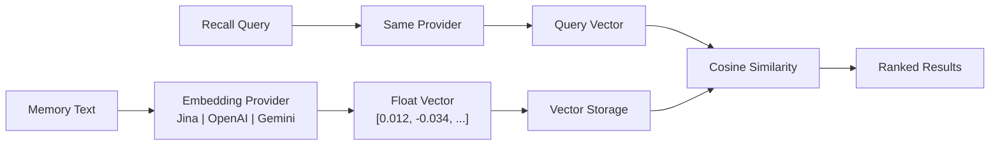

# محرك التضمين

محرك التضمين هو أساس قدرة الاسترجاع الدلالي في PRX-Memory. يحوّل ذكريات النصوص إلى متجهات عالية الأبعاد تلتقط المعنى، مما يتيح البحث القائم على التشابه الذي يتجاوز مطابقة الكلمات المفتاحية.

## كيف يعمل

عند تخزين ذاكرة مع تفعيل التضمين، يقوم PRX-Memory بما يلي:

1. يرسل نص الذاكرة إلى مزوّد التضمين المُعيَّن.
2. يستقبل تمثيلاً متجهياً (عادةً 768--3072 بُعداً).
3. يخزّن المتجه جنباً إلى جنب مع بيانات الذاكرة الوصفية.
4. يستخدم المتجه لبحث تشابه جيب التمام أثناء الاسترجاع.



## هندسة المزوّد

تُعرّف حزمة `prx-memory-embed` سمة مزوّد تنفّذها جميع واجهات التضمين. يتيح هذا التصميم تبديل المزودين دون تغيير كود التطبيق.

المزودون المدعومون:

| المزوّد | مفتاح البيئة | الوصف |
|---------|-------------|-------|
| متوافق مع OpenAI | `PRX_EMBED_PROVIDER=openai-compatible` | أي واجهة برمجة متوافقة مع OpenAI (OpenAI، Azure، خوادم محلية) |
| Jina | `PRX_EMBED_PROVIDER=jina` | نماذج التضمين من Jina AI |
| Gemini | `PRX_EMBED_PROVIDER=gemini` | نماذج التضمين من Google Gemini |

## الإعداد

اضبط المزوّد والبيانات الاعتمادية عبر متغيرات البيئة:

```bash
PRX_EMBED_PROVIDER=jina
PRX_EMBED_API_KEY=your_api_key
PRX_EMBED_MODEL=jina-embeddings-v3
PRX_EMBED_BASE_URL=https://api.jina.ai  # optional, for custom endpoints
```

::: tip مفاتيح احتياطية للمزوّد
إذا لم يكن `PRX_EMBED_API_KEY` مضبوطاً، يعود النظام إلى المفاتيح الخاصة بالمزوّد:
- Jina: `JINA_API_KEY`
- Gemini: `GEMINI_API_KEY`
:::

## متى تُفعّل التضمين

| السيناريو | هل التضمين مطلوب؟ |
|---------|------------------|
| مجموعة ذاكرة صغيرة (<100 إدخال) | اختياري -- قد يكفي البحث المعجمي |
| مجموعة ذاكرة كبيرة (+1000 إدخال) | موصى به -- التشابه المتجهي يحسن الاسترجاع بشكل كبير |
| استعلامات باللغة الطبيعية | موصى به -- يلتقط المعنى الدلالي |
| تصفية دقيقة بالوسوم/النطاق | غير مطلوب -- البحث المعجمي يتعامل مع هذا |
| استرجاع متعدد اللغات | موصى به -- النماذج متعددة اللغات تعمل عبر اللغات |

## خصائص الأداء

- **الكمون:** 50--200 مللي ثانية لكل طلب تضمين حسب المزوّد والنموذج.
- **وضع الدفعة:** تجميع نصوص متعددة في طلب API واحد لتقليل الرحلات الذهاب والإياب.
- **التخزين المؤقت المحلي:** تُخزَّن المتجهات محلياً وتُعاد استخدامها؛ فقط الذكريات الجديدة أو المتغيرة تتطلب طلبات تضمين.
- **معيار 100 ألف:** استرجاع p95 أقل من 123 مللي ثانية للاسترجاع المعجمي+الأهمية+الحداثة على 100,000 إدخال (دون طلبات شبكة).

## الخطوات التالية

- [النماذج المدعومة](./models) -- مقارنة مفصلة للنماذج
- [معالجة الدفعات](./batch-processing) -- التضمين المجمع الفعّال
- [إعادة الترتيب](../reranking/) -- إعادة الترتيب في المرحلة الثانية لدقة أفضل
