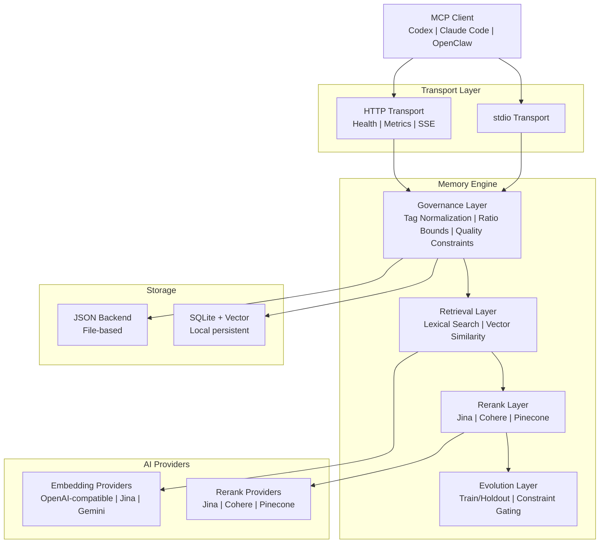

# PRX-Memory

**PRX-Memory** هو محرك ذاكرة دلالية محلي أولاً، مصمم لوكلاء الترميز. يجمع بين الاسترجاع القائم على التضمين وإعادة الترتيب وضوابط الحوكمة والتطور القابل للقياس في مكوّن واحد متوافق مع MCP. يأتي PRX-Memory كخادم مستقل (`prx-memoryd`) يتواصل عبر stdio أو HTTP، مما يجعله متوافقاً مع Codex وClaude Code وOpenClaw وOpenPRX وأي عميل MCP آخر.

يركز PRX-Memory على **المعرفة الهندسية القابلة لإعادة الاستخدام**، وليس السجلات الخام. يخزّن النظام الذكريات المنظمة مع وسوم ونطاقات ودرجات أهمية، ثم يستردها باستخدام مزيج من البحث المعجمي والتشابه المتجهي وإعادة الترتيب الاختيارية -- كل ذلك خاضع لقيود الجودة والأمان.

## لماذا PRX-Memory؟

معظم وكلاء الترميز تعامل الذاكرة كأمر ثانوي -- ملفات مسطحة، سجلات غير منظمة، أو خدمات سحابية مقيدة بالمورّد. يتبع PRX-Memory نهجاً مختلفاً:

- **محلي أولاً.** تبقى جميع البيانات على جهازك. لا اعتمادية على السحابة، لا بيانات تشخيصية، لا بيانات تغادر شبكتك.
- **منظم ومحكوم.** كل إدخال ذاكرة يتبع تنسيقاً موحداً مع وسوم ونطاقات وفئات وقيود جودة. تطبيع الوسوم وحدود النسب يمنع الانجراف.
- **استرجاع دلالي.** يجمع بين المطابقة المعجمية والتشابه المتجهي وإعادة الترتيب الاختيارية للعثور على الذكريات الأكثر صلة بسياق معين.
- **تطور قابل للقياس.** تستخدم أداة `memory_evolve` تقسيمات التدريب/الاحتجاز وبوابات القيود لقبول أو رفض التحسينات المرشحة -- لا تخمين.
- **MCP أصلي.** دعم من الدرجة الأولى لبروتوكول Model Context Protocol عبر نقلَي stdio وHTTP، مع قوالب موارد ومانيفستات مهارات وجلسات بث.

## الميزات الرئيسية

<div class="vp-features">

- **تضمين متعدد المزودين** -- يدعم مزودي التضمين المتوافقين مع OpenAI وJina وGemini من خلال واجهة محوّل موحدة. غيّر المزوّد بتغيير متغير بيئة.

- **خط أنابيب إعادة الترتيب** -- إعادة ترتيب اختيارية في المرحلة الثانية باستخدام معيدي ترتيب Jina وCohere وPinecone لتحسين دقة الاسترجاع بما يتجاوز التشابه المتجهي الخام.

- **ضوابط الحوكمة** -- تنسيق منظم للذاكرة مع تطبيع الوسوم وحدود النسب والصيانة الدورية وقيود الجودة لضمان بقاء جودة الذاكرة عالية بمرور الوقت.

- **تطور الذاكرة** -- تقيّم أداة `memory_evolve` التغييرات المرشحة باستخدام اختبار القبول بالتدريب/الاحتجاز وبوابات القيود، مما يوفر ضمانات تحسين قابلة للقياس.

- **خادم MCP بنقل مزدوج** -- شغّل كخادم stdio للتكامل المباشر أو كخادم HTTP مع فحوصات صحة ومقاييس Prometheus وجلسات بث.

- **توزيع المهارات** -- حزم مهارات الحوكمة المدمجة قابلة للاكتشاف عبر بروتوكولَي موارد وأدوات MCP، مع قوالب حمولة لعمليات الذاكرة الموحدة.

- **المراقبة** -- نقطة نهاية مقاييس Prometheus وقوالب لوحة تحكم Grafana وعتبات تنبيه قابلة للتكوين وضوابط الكثافة العددية للنشر الإنتاجي.

</div>

## الهندسة المعمارية



## البدء السريع

بناء وتشغيل خادم الذاكرة:

```bash
cargo build -p prx-memory-mcp --bin prx-memoryd

PRX_MEMORYD_TRANSPORT=stdio \
PRX_MEMORY_DB=./data/memory-db.json \
./target/debug/prx-memoryd
```

أو التثبيت عبر Cargo:

```bash
cargo install prx-memory-mcp
```

راجع [دليل التثبيت](./getting-started/installation) لجميع الطرق وخيارات الإعداد.

## حزم مساحة العمل

| الحزمة | الوصف |
|--------|-------|
| `prx-memory-core` | البدائيات الجوهرية للنطاق: التقييم والتطور وتمثيل الذاكرة |
| `prx-memory-embed` | تجريد مزوّد التضمين والمحوّلات |
| `prx-memory-rerank` | تجريد مزوّد إعادة الترتيب والمحوّلات |
| `prx-memory-ai` | تجريد مزوّد موحد للتضمين وإعادة الترتيب |
| `prx-memory-skill` | حمولات مهارات الحوكمة المدمجة |
| `prx-memory-storage` | محرك التخزين المستمر المحلي (JSON، SQLite، LanceDB) |
| `prx-memory-mcp` | سطح خادم MCP مع نقلَي stdio وHTTP |

## أقسام التوثيق

| القسم | الوصف |
|-------|-------|
| [التثبيت](./getting-started/installation) | البناء من المصدر أو التثبيت عبر Cargo |
| [البدء السريع](./getting-started/quickstart) | تشغيل PRX-Memory في 5 دقائق |
| [محرك التضمين](./embedding/) | مزودو التضمين ومعالجة الدفعات |
| [النماذج المدعومة](./embedding/models) | نماذج متوافقة مع OpenAI وJina وGemini |
| [محرك إعادة الترتيب](./reranking/) | خط أنابيب إعادة الترتيب في المرحلة الثانية |
| [واجهات التخزين](./storage/) | JSON وSQLite والبحث المتجهي |
| [تكامل MCP](./mcp/) | بروتوكول MCP والأدوات والموارد والقوالب |
| [مرجع Rust API](./api/) | واجهة برمجة المكتبة لتضمين PRX-Memory في مشاريع Rust |
| [الإعداد](./configuration/) | جميع متغيرات البيئة والملفات الشخصية |
| [استكشاف الأخطاء](./troubleshooting/) | المشكلات الشائعة والحلول |

## معلومات المشروع

- **الرخصة:** MIT OR Apache-2.0
- **اللغة:** Rust (إصدار 2024)
- **المستودع:** [github.com/openprx/prx-memory](https://github.com/openprx/prx-memory)
- **الحد الأدنى من Rust:** سلسلة أدوات مستقرة
- **وسائل النقل:** stdio، HTTP
