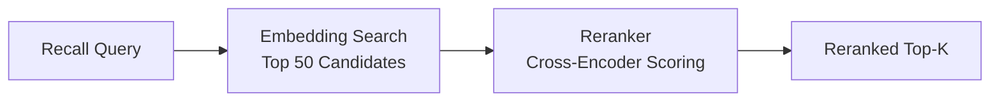

# محرك إعادة الترتيب

إعادة الترتيب هي خطوة استرجاع اختيارية في المرحلة الثانية تعيد ترتيب النتائج المرشحة باستخدام نموذج ترميز متقاطع مخصص. بينما يكون الاسترجاع القائم على التضمين سريعاً، إلا أنه يعمل على متجهات محسوبة مسبقاً قد لا تلتقط الصلة الدقيقة. تطبق إعادة الترتيب نموذجاً أكثر قوة على مجموعة أصغر من المرشحين، مما يحسن الدقة بشكل ملحوظ.

## كيف تعمل

1. **المرحلة الأولى (الاسترجاع):** يُعيد بحث التشابه المتجهي مجموعة واسعة من المرشحين (مثلاً أفضل 50).
2. **المرحلة الثانية (إعادة الترتيب):** يقيّم نموذج الترميز المتقاطع كل مرشح مقابل الاستعلام، منتجاً ترتيباً مُنقّحاً.
3. **النتيجة النهائية:** يُعاد أفضل K نتيجة بعد إعادة الترتيب إلى المستدعي.



## لماذا تهم إعادة الترتيب

| المقياس | بدون إعادة الترتيب | مع إعادة الترتيب |
|---------|-----------------|----------------|
| تغطية الاستدعاء | عالية (استرجاع واسع) | نفسها (غير متغيرة) |
| الدقة في أفضل 5 | متوسطة | محسّنة بشكل ملحوظ |
| الكمون | أقل (~50 مللي ثانية) | أعلى (~150 مللي ثانية إضافية) |
| تكلفة API | التضمين فقط | التضمين + إعادة الترتيب |

إعادة الترتيب أكثر قيمة عندما:

- قاعدة بيانات الذاكرة كبيرة (+1000 إدخال).
- الاستعلامات غامضة أو بلغة طبيعية.
- الدقة في أعلى قائمة النتائج أهم من الكمون.

## المزودون المدعومون

| المزوّد | قيمة الإعداد | الوصف |
|---------|------------|-------|
| Jina | `PRX_RERANK_PROVIDER=jina` | نماذج معيد ترتيب Jina AI |
| Cohere | `PRX_RERANK_PROVIDER=cohere` | واجهة إعادة ترتيب Cohere |
| Pinecone | `PRX_RERANK_PROVIDER=pinecone` | خدمة إعادة ترتيب Pinecone |
| متوافق مع Pinecone | `PRX_RERANK_PROVIDER=pinecone-compatible` | نقاط نهاية مخصصة متوافقة مع Pinecone |
| لا شيء | `PRX_RERANK_PROVIDER=none` | تعطيل إعادة الترتيب |

## الإعداد

```bash
PRX_RERANK_PROVIDER=cohere
PRX_RERANK_API_KEY=your_cohere_key
PRX_RERANK_MODEL=rerank-v3.5
```

::: tip مفاتيح احتياطية للمزوّد
إذا لم يكن `PRX_RERANK_API_KEY` مضبوطاً، يعود النظام إلى المفاتيح الخاصة بالمزوّد:
- Jina: `JINA_API_KEY`
- Cohere: `COHERE_API_KEY`
- Pinecone: `PINECONE_API_KEY`
:::

## تعطيل إعادة الترتيب

للتشغيل بدون إعادة الترتيب، إما أحذف متغير `PRX_RERANK_PROVIDER` أو اضبطه صراحةً:

```bash
PRX_RERANK_PROVIDER=none
```

لا يزال الاسترجاع يعمل باستخدام المطابقة المعجمية والتشابه المتجهي بدون مرحلة إعادة الترتيب.

## الخطوات التالية

- [نماذج إعادة الترتيب](./models) -- مقارنة مفصلة للنماذج
- [محرك التضمين](../embedding/) -- الاسترجاع في المرحلة الأولى
- [مرجع الإعداد](../configuration/) -- جميع متغيرات البيئة
