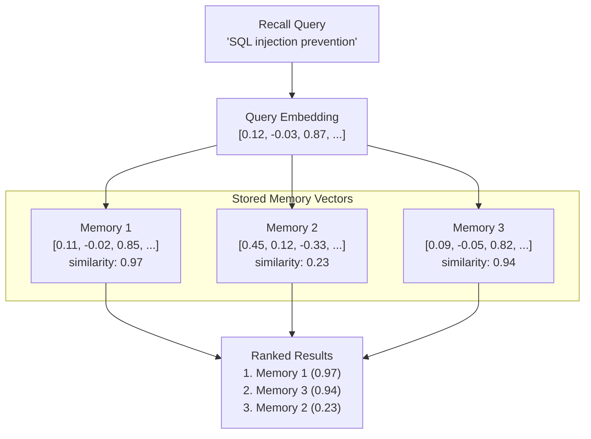

# البحث المتجهي

البحث المتجهي هو الآلية الجوهرية التي تتيح استرجاع الذاكرة الدلالي في PRX-Memory. بدلاً من مطابقة الكلمات المفتاحية، يقارن البحث المتجهي التشابه الرياضي بين استعلام المتجه وذكريات المتجهات للعثور على نتائج مترابطة مفاهيمياً.

## كيف يعمل

1. **تضمين الاستعلام:** يُرسَل استعلام الاسترجاع إلى مزوّد التضمين المُعيَّن، منتجاً متجهاً.
2. **حساب التشابه:** يُقارَن المتجه الاستعلامي بجميع متجهات الذاكرة المخزّنة باستخدام تشابه جيب التمام.
3. **التقييم:** تحصل كل ذاكرة على درجة تشابه بين -1.0 و1.0 (الأعلى هو الأكثر تشابهاً).
4. **الترتيب:** تُرتَّب النتائج حسب الدرجة وتُدمَج مع إشارات أخرى (المطابقة المعجمية، الأهمية، الحداثة).



## تشابه جيب التمام

يستخدم PRX-Memory تشابه جيب التمام كمقياس للمسافة. يقيس تشابه جيب التمام الزاوية بين متجهين، متجاهلاً الحجم:

```
similarity(A, B) = (A . B) / (|A| * |B|)
```

| الدرجة | المعنى |
|--------|--------|
| 0.95--1.0 | معنى متطابق تقريباً |
| 0.80--0.95 | مترابط بدرجة عالية |
| 0.60--0.80 | مترابط نوعاً ما |
| < 0.60 | على الأرجح غير مترابط |

## الترتيب المدمج

تشابه المتجهات هو إشارة واحدة في الترتيب متعدد الإشارات في PRX-Memory. الدرجة النهائية تجمع:

| الإشارة | الوزن | الوصف |
|---------|-------|-------|
| تشابه المتجهات | عالٍ | الصلة الدلالية من مقارنة التضمين |
| المطابقة المعجمية | متوسط | تداخل الكلمات المفتاحية بين الاستعلام ونص الذاكرة |
| درجة الأهمية | متوسط | الأهمية المعيّنة من المستخدم أو المحسوبة من النظام |
| الحداثة | منخفض | الذكريات الأحدث تحصل على دفعة صغيرة |

يعتمد الوزن الدقيق على إعداد الاسترجاع وما إذا كانت التضمينات وإعادة الترتيب مفعّلتَين.

## الأداء

يُظهر معيار 100,000 إدخال:

| المقياس | القيمة |
|---------|-------|
| حجم مجموعة البيانات | 100,000 إدخال |
| كمون p95 | 122.683 مللي ثانية |
| العتبة | < 300 مللي ثانية |
| الطريقة | معجمي + أهمية + حداثة (بدون طلبات شبكة) |

::: info
يقيس هذا المعيار مسار ترتيب الاسترجاع فقط، بدون طلبات تضمين أو إعادة ترتيب عبر الشبكة. يعتمد الكمون الشامل على أوقات استجابة المزوّد.
:::

## اعتبارات التوسع

| حجم مجموعة البيانات | النهج الموصى به |
|-----------------|---------------|
| < 10,000 | تشابه جيب التمام بالقوة الغاشمة (واجهة JSON أو SQLite) |
| 10,000--100,000 | SQLite مع فحص متجهي في الذاكرة |
| > 100,000 | LanceDB مع فهرسة ANN |

لمجموعات البيانات التي تتجاوز 100,000 إدخال، فعّل واجهة LanceDB للبحث التقريبي عن الجار الأقرب (ANN)، الذي يوفر وقت استعلام دون خطي.

## الخطوات التالية

- [محرك التضمين](../embedding/) -- كيف تُولَّد المتجهات
- [إعادة الترتيب](../reranking/) -- تحسين الدقة في المرحلة الثانية
- [واجهات التخزين](./index) -- اختيار واجهة التخزين المناسبة
