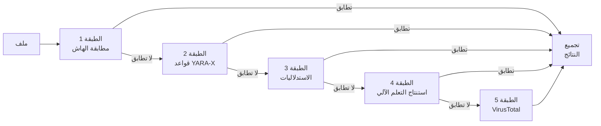

# محرك الكشف

يستخدم PRX-SD خط أنابيب كشف متعدد الطبقات لتحديد البرامج الضارة. تستخدم كل طبقة تقنية مختلفة، وتنفذ بالتسلسل من الأسرع إلى الأكثر شمولاً. يضمن هذا النهج متعدد الدفاعات أنه حتى إذا أخطأت طبقة واحدة في رصد تهديد، يمكن للطبقات اللاحقة التقاطه.

## نظرة عامة على خط الأنابيب

يعالج خط أنابيب الكشف كل ملف من خلال ما يصل إلى خمس طبقات:



## ملخص الطبقات

| الطبقة | المحرك | السرعة | التغطية | مطلوبة |
|-------|--------|-------|----------|----------|
| **الطبقة 1** | مطابقة هاش LMDB | ~1 ميكروثانية/ملف | البرامج الضارة المعروفة (تطابق دقيق) | نعم (افتراضي) |
| **الطبقة 2** | فحص قواعد YARA-X | ~0.3 مللي ثانية/ملف | مستند إلى الأنماط (أكثر من 38,800 قاعدة) | نعم (افتراضي) |
| **الطبقة 3** | التحليل الاكتشافي | ~1-5 مللي ثانية/ملف | مؤشرات سلوكية حسب نوع الملف | نعم (افتراضي) |
| **الطبقة 4** | استنتاج ONNX للتعلم الآلي | ~10-50 مللي ثانية/ملف | البرامج الضارة المتطورة/متعددة الأشكال | اختياري (`--features ml`) |
| **الطبقة 5** | VirusTotal API | ~200-500 مللي ثانية/ملف | إجماع أكثر من 70 مورداً | اختياري (`--features virustotal`) |

## الطبقة 1: مطابقة الهاش

أسرع الطبقات. يحسب PRX-SD هاش SHA-256 لكل ملف ويبحث عنه في قاعدة بيانات LMDB التي تحتوي على هاشات معروفة للبرامج الضارة. يوفر LMDB وقت بحث O(1) مع إدخال/إخراج بتخصيص الذاكرة، مما يجعل هذه الطبقة مجانية فعلياً من حيث الأداء.

**مصادر البيانات:**
- abuse.ch MalwareBazaar (آخر 48 ساعة، يُحدَّث كل 5 دقائق)
- abuse.ch URLhaus (تحديثات كل ساعة)
- abuse.ch Feodo Tracker (Emotet/Dridex/TrickBot، كل 5 دقائق)
- abuse.ch ThreatFox (منصة مشاركة IOC)
- VirusShare (أكثر من 20 مليون هاش MD5، تحديث `--full` اختياري)
- قائمة حظر مدمجة (EICAR وWannaCry وNotPetya وEmotey وغيرها)

تطابق الهاش يُنتج حكم `MALICIOUS` فوري. يُتجاوز الطبقات المتبقية لذلك الملف.

انظر [مطابقة الهاش](./hash-matching) للتفاصيل.

## الطبقة 2: قواعد YARA-X

إذا لم يُعثر على تطابق هاش، يُفحص الملف مقابل أكثر من 38,800 قاعدة YARA باستخدام محرك YARA-X (إعادة الكتابة من الجيل التالي بلغة Rust للـ YARA). تكشف القواعد البرامج الضارة عن طريق مطابقة أنماط البايت والسلاسل النصية والشروط الهيكلية داخل محتويات الملفات.

**مصادر القواعد:**
- 64 قاعدة مدمجة (برامج الفدية وأحصنة طروادة والباب الخلفي وrootkit وعمال المنجم والـ webshells)
- Yara-Rules/rules (يُصانه المجتمع، GitHub)
- Neo23x0/signature-base (قواعد عالية الجودة لـ APT والبرامج الضارة الشائعة)
- ReversingLabs YARA (قواعد مفتوحة المصدر بمستوى تجاري)
- ESET IOC (تتبع التهديدات المتقدمة المستمرة)
- InQuest (برامج ضارة في المستندات: OLE وDDE والماكرو الخبيث)

تطابق قاعدة YARA يُنتج حكم `MALICIOUS` مع اسم القاعدة في التقرير.

انظر [قواعد YARA](./yara-rules) للتفاصيل.

## الطبقة 3: التحليل الاكتشافي

تُحلَّل الملفات التي تجتاز فحوصات الهاش وYARA باستخدام استدلاليات مدركة لنوع الملف. يحدد PRX-SD نوع الملف عبر كشف الرقم السحري ويطبق فحوصات مستهدفة:

| نوع الملف | الفحوصات الاستدلالية |
|-----------|-----------------|
| PE (ويندوز) | إنتروبيا القسم، واردات API المشبوهة، كشف التغليف، شذوذات الطابع الزمني |
| ELF (لينكس) | إنتروبيا القسم، مراجع LD_PRELOAD، استمرارية cron/systemd، أنماط الباب الخلفي SSH |
| Mach-O (ماك أو إس) | إنتروبيا القسم، حقن dylib، استمرارية LaunchAgent، الوصول إلى Keychain |
| Office (docx/xlsx) | ماكرو VBA، حقول DDE، روابط القالب الخارجية، محغّلات التشغيل التلقائي |
| PDF | JavaScript مُضمَّن، إجراءات Launch، إجراءات URI، تدفقات مخفية |

تساهم كل فحصة في نتيجة تراكمية:

| النتيجة | الحكم |
|-------|---------|
| 0 - 29 | **نظيف** |
| 30 - 59 | **مشبوه** -- يُوصى بمراجعة يدوية |
| 60 - 100 | **خطير** -- تهديد عالي الثقة |

انظر [التحليل الاكتشافي](./heuristics) للتفاصيل.

## الطبقة 4: استنتاج التعلم الآلي (اختياري)

عند الترجمة بميزة `ml`، يمكن لـ PRX-SD تشغيل الملفات من خلال نموذج تعلم آلي ONNX مُدرَّب على ملايين عينات البرامج الضارة. هذه الطبقة فعّالة بشكل خاص في الكشف عن البرامج الضارة المتطورة ومتعددة الأشكال التي تتهرب من الكشف المستند إلى التوقيعات.

```bash
# البناء مع دعم التعلم الآلي
cargo build --release --features ml
```

يعمل نموذج التعلم الآلي محلياً باستخدام ONNX Runtime. لا يلزم اتصال بالسحابة.

::: tip متى تستخدم التعلم الآلي
يضيف استنتاج التعلم الآلي زمن استجابة (~10-50 مللي ثانية لكل ملف). قم بتمكينه للفحوصات المستهدفة للملفات أو الأدلة المشبوهة، بدلاً من فحوصات القرص الكامل حيث توفر الطبقات الثلاث الأولى تغطية كافية.
:::

## الطبقة 5: VirusTotal (اختياري)

عند الترجمة بميزة `virustotal` وتهيئتها بمفتاح API، يمكن لـ PRX-SD إرسال هاشات الملفات إلى VirusTotal للحصول على إجماع من أكثر من 70 مورداً لمكافحة الفيروسات.

```bash
# البناء مع دعم VirusTotal
cargo build --release --features virustotal

# تهيئة مفتاح API
sd config set virustotal.api_key "YOUR_API_KEY"
```

::: warning حدود المعدل
تسمح VirusTotal API المجانية بـ 4 طلبات في الدقيقة و500 في اليوم. يحترم PRX-SD هذه الحدود تلقائياً. هذه الطبقة الأفضل استخدامها كخطوة تأكيد نهائية، وليس للفحص الجماعي.
:::

## تجميع النتائج

عند فحص ملف من خلال طبقات متعددة، يُحدَّد الحكم النهائي بأعلى مستوى خطورة يُعثر عليه عبر جميع الطبقات:

```
خطير > مشبوه > نظيف
```

إذا أعادت الطبقة 1 `MALICIOUS`، يُبلَّغ الملف بوصفه خطيراً بغض النظر عما قد تقوله الطبقات الأخرى. إذا أعادت الطبقة 3 `SUSPICIOUS` ولم تُعد أي طبقة أخرى `MALICIOUS`، يُبلَّغ الملف بوصفه مشبوهاً.

يتضمن تقرير الفحص تفاصيل من كل طبقة أنتجت نتيجة، مما يعطي المحلل السياق الكامل.

## تعطيل الطبقات

لحالات الاستخدام المتخصصة، يمكن تعطيل الطبقات الفردية:

```bash
# فحص الهاش فقط (الأسرع، التهديدات المعروفة فقط)
sd scan /path --no-yara --no-heuristics

# تخطي الاستدلاليات (الهاش + YARA فقط)
sd scan /path --no-heuristics
```

## الخطوات التالية

- [مطابقة الهاش](./hash-matching) -- تعمق في قاعدة بيانات هاش LMDB
- [قواعد YARA](./yara-rules) -- مصادر القواعد وإدارة القواعد المخصصة
- [التحليل الاكتشافي](./heuristics) -- الفحوصات السلوكية المدركة لنوع الملف
- [أنواع الملفات المدعومة](./file-types) -- مصفوفة تنسيق الملفات وكشف الرقم السحري
