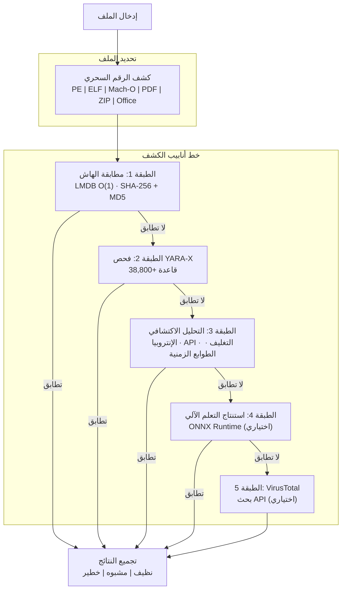

# PRX-SD

**PRX-SD** محرك مفتوح المصدر لمكافحة الفيروسات عالي الأداء مكتوب بلغة Rust. يجمع بين مطابقة التوقيعات المستندة إلى الهاش وأكثر من 38,800 قاعدة YARA والتحليل الاكتشافي المدرك لنوع الملف واستنتاج التعلم الآلي الاختياري في خط أنابيب كشف متعدد الطبقات. يأتي PRX-SD كأداة سطر أوامر (`sd`) ووحدة خدمة للحماية في الوقت الفعلي وواجهة رسومية سطح مكتب بتقنية Tauri + Vue 3.

صُمِّم PRX-SD لمهندسي الأمن ومسؤولي النظام والمستجيبين للحوادث الذين يحتاجون إلى محرك كشف برامج ضارة سريع وشفاف وقابل للتوسعة -- محرك قادر على فحص ملايين الملفات ومراقبة الأدلة في الوقت الفعلي وكشف برامج rootkit والتكامل مع موارد استخبارات التهديدات الخارجية -- كل ذلك دون الاعتماد على صناديق سوداء تجارية غامضة.

## لماذا PRX-SD؟

المنتجات التقليدية لمكافحة الفيروسات مغلقة المصدر وتستهلك موارد كبيرة ويصعب تخصيصها. يتبع PRX-SD نهجاً مختلفاً:

- **مفتوح وقابل للتدقيق.** كل قاعدة كشف وكل فحص اكتشافي وكل عتبة تسجيل مرئية في الكود المصدري. لا تتبع خفي، ولا اعتماد على السحابة مطلوب.
- **دفاع متعدد الطبقات.** خمس طبقات كشف مستقلة تضمن أنه إذا أخطأت إحدى الطرق في رصد تهديد، تلتقطه الطبقة التالية.
- **أداء Rust أولاً.** إدخال/إخراج بدون نسخ وبحث هاش LMDB بوقت O(1) والفحص المتوازي يوفر معدل نقل يضاهي المحركات التجارية على أجهزة عادية.
- **قابل للتوسعة بالتصميم.** إضافات WASM وقواعد YARA المخصصة والبنية المعيارية تجعل تكييف PRX-SD للبيئات المتخصصة أمراً سهلاً.

## الميزات الرئيسية

<div class="vp-features">

- **خط أنابيب كشف متعدد الطبقات** -- تعمل مطابقة الهاش وقواعد YARA-X والتحليل الاكتشافي واستنتاج التعلم الآلي الاختياري وتكامل VirusTotal الاختياري بالتسلسل لتحقيق أقصى معدلات كشف.

- **حماية في الوقت الفعلي** -- يراقب وحيد الخدمة `sd monitor` الأدلة باستخدام inotify (لينكس) / FSEvents (ماك أو إس) ويفحص الملفات الجديدة أو المعدلة فوراً.

- **دفاع ضد برامج الفدية** -- تكشف قواعد YARA المخصصة والتحليل الاكتشافي عائلات برامج الفدية بما فيها WannaCry وLockBit وConti وREvil وBlackCat وغيرها.

- **أكثر من 38,800 قاعدة YARA** -- مجمَّعة من 8 مصادر مجتمعية وتجارية: Yara-Rules وNeo23x0 signature-base وReversingLabs وESET IOC وInQuest و64 قاعدة مدمجة.

- **قاعدة بيانات هاش LMDB** -- هاشات SHA-256 وMD5 من abuse.ch MalwareBazaar وURLhaus وFeodo Tracker وThreatFox وVirusShare (20M+) وقائمة حظر مدمجة، مخزنة في LMDB لبحث O(1).

- **متعدد المنصات** -- لينكس (x86_64، aarch64) وماك أو إس (Apple Silicon، Intel) وويندوز (WSL2). كشف نوع ملف أصلي لـ PE وELF وMach-O وPDF وOffice وتنسيقات الأرشيف.

- **نظام إضافات WASM** -- توسيع منطق الكشف وإضافة ماسحات مخصصة أو التكامل مع موارد تهديدات خاصة من خلال إضافات WebAssembly.

</div>

## البنية المعمارية



## التثبيت السريع

```bash
curl -fsSL https://openprx.dev/install-sd.sh | bash
```

أو التثبيت عبر Cargo:

```bash
cargo install prx-sd
```

ثم تحديث قاعدة بيانات التوقيعات:

```bash
sd update
```

انظر [دليل التثبيت](./getting-started/installation) لجميع الطرق بما فيها Docker والبناء من المصدر.

## أقسام التوثيق

| القسم | الوصف |
|---------|-------------|
| [التثبيت](./getting-started/installation) | تثبيت PRX-SD على لينكس أو ماك أو إس أو ويندوز WSL2 |
| [البداية السريعة](./getting-started/quickstart) | تشغيل PRX-SD للفحص في 5 دقائق |
| [فحص الملفات والأدلة](./scanning/file-scan) | مرجع كامل لأمر `sd scan` |
| [فحص الذاكرة](./scanning/memory-scan) | فحص ذاكرة العمليات الجارية بحثاً عن التهديدات |
| [كشف Rootkit](./scanning/rootkit) | كشف rootkit على مستوى النواة ومستوى المستخدم |
| [فحص USB](./scanning/usb-scan) | فحص الوسائط القابلة للإزالة تلقائياً |
| [محرك الكشف](./detection/) | كيف يعمل خط الأنابيب متعدد الطبقات |
| [مطابقة الهاش](./detection/hash-matching) | قاعدة بيانات هاش LMDB ومصادر البيانات |
| [قواعد YARA](./detection/yara-rules) | أكثر من 38,800 قاعدة من 8 مصادر |
| [التحليل الاكتشافي](./detection/heuristics) | التحليل السلوكي المدرك لنوع الملف |
| [أنواع الملفات المدعومة](./detection/file-types) | مصفوفة تنسيق الملفات وكشف الرقم السحري |

## معلومات المشروع

- **الرخصة:** MIT OR Apache-2.0
- **اللغة:** Rust (إصدار 2024)
- **المستودع:** [github.com/openprx/prx-sd](https://github.com/openprx/prx-sd)
- **الحد الأدنى من Rust:** 1.85.0
- **واجهة المستخدم الرسومية:** Tauri 2 + Vue 3
