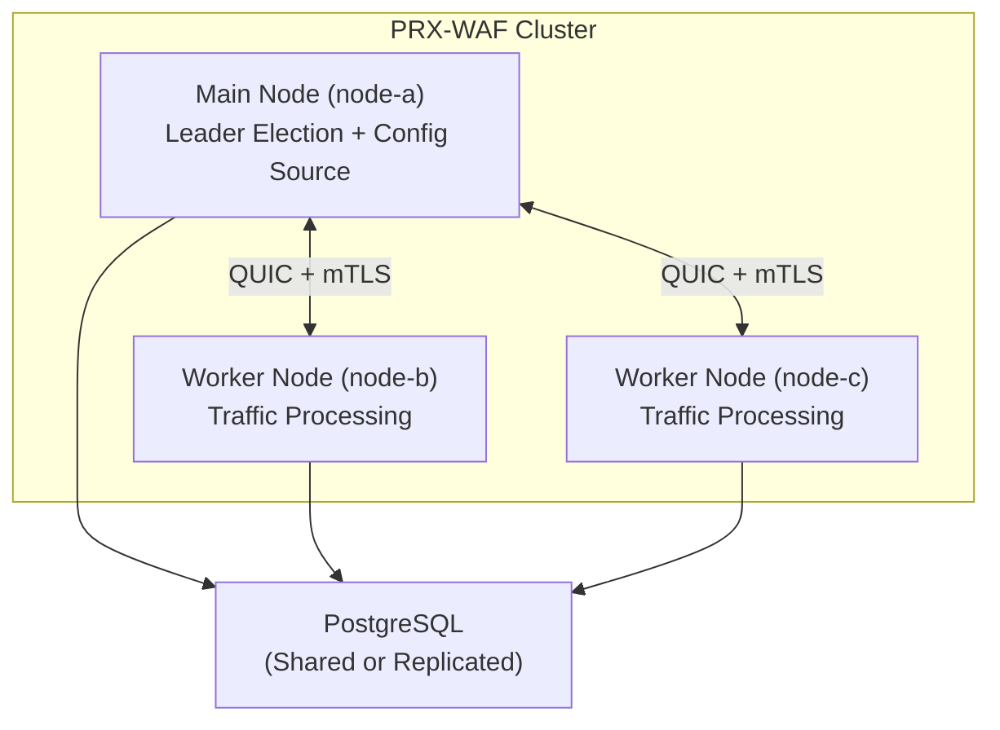

# وضع الكتلة

يدعم PRX-WAF نشرات كتلة متعددة العقد للتوسع الأفقي والتوافر العالي. يستخدم وضع الكتلة اتصالاً بين العقد مستنداً إلى QUIC وانتخاب قائد مستوحى من Raft ومزامنة تلقائية للقواعد والإعداد وأحداث الأمن عبر جميع العقد.

::: info
وضع الكتلة اختياري بالكامل. افتراضياً، يعمل PRX-WAF في وضع مستقل بدون أي حمل للكتلة. فعِّله بإضافة قسم `[cluster]` إلى إعدادك.
:::

## البنية المعمارية

تتكون كتلة PRX-WAF من عقدة **رئيسية** واحدة وعقدة **عاملة** واحدة أو أكثر:



### أدوار العقد

| الدور | الوصف |
|------|-------------|
| `main` | يحتوي على الإعداد الموثوق ومجموعة القواعد. يدفع التحديثات إلى العمال. يشارك في انتخاب القائد. |
| `worker` | يُعالج الحركة ويطبِّق خط أنابيب WAF. يستقبل تحديثات الإعداد والقواعد من العقدة الرئيسية. يدفع أحداث الأمن إلى الرئيسية. |
| `auto` | يشارك في انتخاب القائد المستوحى من Raft. يمكن لأي عقدة أن تصبح الرئيسية. |

## ما يُزامَن

| البيانات | الاتجاه | الفترة |
|------|-----------|----------|
| القواعد | الرئيسية إلى العمال | كل 10 ثوانٍ (قابل للتهيئة) |
| الإعداد | الرئيسية إلى العمال | كل 30 ثانية (قابل للتهيئة) |
| أحداث الأمن | العمال إلى الرئيسية | كل 5 ثوانٍ أو 100 حدث (أيهما أسرع) |
| الإحصاءات | العمال إلى الرئيسية | كل 10 ثوانٍ |

## الاتصال بين العقد

تستخدم جميع اتصالات الكتلة QUIC (عبر Quinn) عبر UDP مع TLS المتبادل (mTLS):

- **المنفذ:** `16851` (الافتراضي)
- **التشفير:** mTLS مع شهادات مُنشأة تلقائياً أو مُهيَّأة مسبقاً
- **البروتوكول:** بروتوكول ثنائي مخصص عبر تدفقات QUIC
- **الاتصال:** دائم مع إعادة الاتصال التلقائي

## انتخاب القائد

عند إعداد `role = "auto"`، تستخدم العقد بروتوكول انتخاب مستوحى من Raft:

| المعامل | الافتراضي | الوصف |
|-----------|---------|-------------|
| `timeout_min_ms` | `150` | الحد الأدنى لمهلة الانتخاب (نطاق عشوائي) |
| `timeout_max_ms` | `300` | الحد الأقصى لمهلة الانتخاب (نطاق عشوائي) |
| `heartbeat_interval_ms` | `50` | فترة نبضة القلب من الرئيسية إلى العمال |
| `phi_suspect` | `8.0` | عتبة الشك لكاشف فشل phi accrual |
| `phi_dead` | `12.0` | عتبة الموت لكاشف فشل phi accrual |

عندما تصبح العقدة الرئيسية غير متاحة، ينتظر العمال مهلة عشوائية ضمن النطاق المُهيَّأ قبل بدء الانتخاب. أول عقدة تحصل على أغلبية الأصوات تصبح الرئيسية الجديدة.

## مراقبة الصحة

يعمل فاحص صحة الكتلة على كل عقدة ويراقب الاتصال بالنظراء:

```toml
[cluster.health]
check_interval_secs   = 5    # Health check frequency
max_missed_heartbeats = 3    # Mark peer as unhealthy after N misses
```

تُستبعَد العقد غير الصحية من الكتلة حتى تتعافى وتُعيد المزامنة.

## إدارة الشهادات

تُصادق عقد الكتلة على بعضها باستخدام شهادات mTLS:

- **وضع الإنشاء التلقائي:** تُنشئ العقدة الرئيسية شهادة CA وتوقِّع شهادات العقد تلقائياً عند أول تشغيل. تستقبل العقد العاملة شهاداتها خلال عملية الانضمام.
- **الوضع المُهيَّأ مسبقاً:** تُنشأ الشهادات بدون اتصال وتُوزَّع على كل عقدة قبل التشغيل.

```toml
[cluster.crypto]
ca_cert        = "/certs/cluster-ca.pem"
node_cert      = "/certs/node-a.pem"
node_key       = "/certs/node-a.key"
auto_generate  = true
ca_validity_days    = 3650   # 10 years
node_validity_days  = 365    # 1 year
renewal_before_days = 7      # Auto-renew 7 days before expiry
```

## الخطوات التالية

- [نشر الكتلة](./deployment) -- دليل إعداد متعدد العقد خطوة بخطوة
- [مرجع الإعداد](../configuration/reference) -- جميع مفاتيح إعداد الكتلة
- [استكشاف الأخطاء](../troubleshooting/) -- مشكلات الكتلة الشائعة
