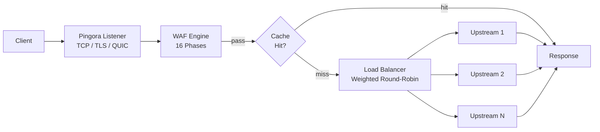

# البوابة

يُبنى PRX-WAF على [Pingora](https://github.com/cloudflare/pingora)، مكتبة وكيل HTTP من Cloudflare بـ Rust. تتعامل البوابة مع جميع الحركة الواردة وتوجِّه الطلبات إلى الخوادم الخلفية وتطبِّق خط أنابيب كشف WAF قبل الإعادة إلى الخادم الخلفي.

## دعم البروتوكولات

| البروتوكول | الحالة | ملاحظات |
|----------|--------|-------|
| HTTP/1.1 | مدعوم | الافتراضي |
| HTTP/2 | مدعوم | ترقية تلقائية عبر ALPN |
| HTTP/3 (QUIC) | اختياري | عبر مكتبة Quinn، يتطلب إعداد `[http3]` |
| WebSocket | مدعوم | وكالة ثنائية الاتجاه كاملة |

## الميزات الرئيسية

### موازنة الحمل

يوزِّع PRX-WAF الحركة عبر الخوادم الخلفية باستخدام موازنة حمل round-robin مرجحة. يمكن لكل إدخال مضيف تحديد خوادم خلفية متعددة بأوزان نسبية:

```toml
[[hosts]]
host        = "example.com"
port        = 80
remote_host = "10.0.0.1"
remote_port = 8080
guard_status = true
```

يمكن أيضاً إدارة المضيفين عبر واجهة المستخدم الإدارية أو REST API على `/api/hosts`.

### التخزين المؤقت للاستجابات

تتضمن البوابة ذاكرة تخزين مؤقت LRU في الذاكرة مستندة إلى moka لتقليل الحمل على الخوادم الخلفية:

```toml
[cache]
enabled          = true
max_size_mb      = 256       # Maximum cache size
default_ttl_secs = 60        # Default TTL for cached responses
max_ttl_secs     = 3600      # Maximum TTL cap
```

تحترم ذاكرة التخزين المؤقت رؤوس HTTP القياسية (`Cache-Control` و`Expires` و`ETag` و`Last-Modified`) وتدعم إبطال التخزين المؤقت عبر API الإدارة.

### الأنفاق العكسية

يمكن لـ PRX-WAF إنشاء أنفاق عكسية مستندة إلى WebSocket (مشابهة لـ Cloudflare Tunnels) لكشف الخدمات الداخلية دون فتح منافذ جدار الحماية الواردة:

```bash
# سرد الأنفاق النشطة
curl -H "Authorization: Bearer $TOKEN" http://localhost:9527/api/tunnels

# إنشاء نفق
curl -X POST -H "Authorization: Bearer $TOKEN" \
  -H "Content-Type: application/json" \
  -d '{"name":"internal-api","target":"http://192.168.1.10:3000"}' \
  http://localhost:9527/api/tunnels
```

### منع الارتباط الساخن

تدعم البوابة حماية الارتباط الساخن المستندة إلى Referer لكل مضيف. عند التفعيل، تُحجب الطلبات التي لا تحتوي على رأس Referer صالح من النطاق المُهيَّأ. يُهيَّأ هذا لكل مضيف في واجهة المستخدم الإدارية أو عبر API.

## البنية المعمارية



## الخطوات التالية

- [الوكيل العكسي](./reverse-proxy) -- إعداد توجيه الخادم الخلفي وموازنة الحمل بالتفصيل
- [SSL/TLS](./ssl-tls) -- إعداد HTTPS وLet's Encrypt وHTTP/3
- [مرجع الإعداد](../configuration/reference) -- جميع مفاتيح إعداد البوابة
