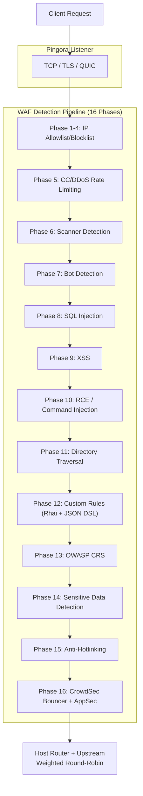

# PRX-WAF

**PRX-WAF** هو وكيل جدار حماية تطبيقات ويب جاهز للإنتاج مبني على [Pingora](https://github.com/cloudflare/pingora) (مكتبة وكيل HTTP من Cloudflare بـ Rust). يجمع خط أنابيب كشف من 16 مرحلة ومحرك نصوص Rhai ودعم OWASP CRS واستيراد قواعد ModSecurity وتكامل CrowdSec وإضافات WASM وواجهة مستخدم إدارية بـ Vue 3 في ملف ثنائي واحد قابل للنشر.

تم تصميم PRX-WAF لمهندسي DevOps وفرق الأمن ومشغلي المنصات الذين يحتاجون إلى WAF سريع وشفاف وقابل للتوسع -- يمكنه توجيه الملايين من الطلبات وكشف هجمات OWASP Top 10 وتجديد شهادات TLS تلقائياً والتوسع أفقياً مع وضع الكتلة والتكامل مع خلاصات استخبارات التهديدات الخارجية -- كل ذلك دون الاعتماد على خدمات WAF السحابية المملوكة.

## لماذا PRX-WAF؟

المنتجات التقليدية لـ WAF مملوكة ومكلفة وصعبة التخصيص. يتبع PRX-WAF نهجاً مختلفاً:

- **مفتوح وقابل للتدقيق.** كل قاعدة كشف وعتبة وآلية تسجيل مرئية في الكود المصدري. لا جمع بيانات خفي، لا قفل على بائع.
- **دفاع متعدد المراحل.** 16 مرحلة كشف متسلسلة تضمن أنه إذا فات فحصٌ هجوماً، تلتقطه المراحل اللاحقة.
- **أداء Rust أولاً.** مبني على Pingora، يحقق PRX-WAF معدل نقل قريب من معدل الخط مع حد أدنى من التأخير على الأجهزة التجارية.
- **قابل للتوسع بطبيعته.** تجعل قواعد YAML ونصوص Rhai وإضافات WASM واستيراد قواعد ModSecurity من السهل تكييف PRX-WAF مع أي مكدس تطبيقات.

## الميزات الرئيسية

<div class="vp-features">

- **وكيل عكسي Pingora** -- HTTP/1.1 وHTTP/2 وHTTP/3 عبر QUIC (Quinn). موازنة حمل round-robin مرجحة عبر الخوادم الخلفية.

- **خط أنابيب كشف من 16 مرحلة** -- قائمة السماح/الحظر بالـ IP وتحديد معدل CC/DDoS وكشف الماسحات وكشف الروبوتات وحقن SQL وXSS وتنفيذ الأوامر عن بُعد وتجاوز الدليل والقواعد المخصصة وOWASP CRS وكشف البيانات الحساسة ومنع الارتباط الساخن وتكامل CrowdSec.

- **محرك قواعد YAML** -- قواعد YAML تصريحية مع 11 عاملاً و12 حقلاً للطلب ومستويات ذعر من 1 إلى 4 وإعادة تحميل ساخنة دون توقف.

- **دعم OWASP CRS** -- أكثر من 310 قاعدة مُحوَّلة من مجموعة القواعد الأساسية لـ OWASP ModSecurity الإصدار 4، تغطي حقن SQL وXSS وتنفيذ الأوامر عن بُعد وتضمين الملفات المحلية والبعيدة وكشف الماسحات والمزيد.

- **تكامل CrowdSec** -- وضع Bouncer (ذاكرة تخزين مؤقت للقرارات من LAPI) ووضع AppSec (فحص HTTP عن بُعد) وناقل السجل لاستخبارات التهديدات المجتمعية.

- **وضع الكتلة** -- اتصال بين العقد مبني على QUIC وانتخاب قائد مستوحى من Raft ومزامنة تلقائية للقواعد والإعداد والأحداث وإدارة شهادات mTLS.

- **واجهة مستخدم إدارية بـ Vue 3** -- مصادقة JWT + TOTP ومراقبة في الوقت الفعلي عبر WebSocket وإدارة المضيفين وإدارة القواعد ولوحات تحكم أحداث الأمن.

- **أتمتة SSL/TLS** -- Let's Encrypt عبر ACME v2 (instant-acme) وتجديد تلقائي للشهادات ودعم HTTP/3 QUIC.

</div>

## البنية المعمارية

يتنظم PRX-WAF كمساحة عمل Cargo من 7 صناديق:

| الصندوق | الدور |
|-------|------|
| `prx-waf` | الملف الثنائي: نقطة دخول CLI وبدء تشغيل الخادم |
| `gateway` | وكيل Pingora وHTTP/3 وأتمتة SSL والتخزين المؤقت والأنفاق |
| `waf-engine` | خط أنابيب الكشف ومحرك القواعد والفحوصات والإضافات وCrowdSec |
| `waf-storage` | طبقة PostgreSQL (sqlx) والترحيلات والنماذج |
| `waf-api` | واجهة برمجة REST بـ Axum ومصادقة JWT/TOTP وWebSocket وواجهة المستخدم الثابتة |
| `waf-common` | الأنواع المشتركة: RequestCtx وWafDecision وHostConfig والإعداد |
| `waf-cluster` | توافق الكتلة ونقل QUIC ومزامنة القواعد وإدارة الشهادات |

### تدفق الطلب



## التثبيت السريع

```bash
git clone https://github.com/openprx/prx-waf
cd prx-waf
docker compose up -d
```

واجهة المستخدم الإدارية: `http://localhost:9527` (بيانات الاعتماد الافتراضية: `admin` / `admin`)

راجع [دليل التثبيت](./getting-started/installation) لجميع الطرق بما فيها تثبيت Cargo والبناء من المصدر.

## أقسام التوثيق

| القسم | الوصف |
|---------|-------------|
| [التثبيت](./getting-started/installation) | تثبيت PRX-WAF عبر Docker أو Cargo أو البناء من المصدر |
| [البدء السريع](./getting-started/quickstart) | حماية تطبيقك بـ PRX-WAF في 5 دقائق |
| [محرك القواعد](./rules/) | كيفية عمل محرك قواعد YAML |
| [بنية YAML](./rules/yaml-syntax) | مرجع مخطط قاعدة YAML الكامل |
| [القواعد المدمجة](./rules/builtin-rules) | OWASP CRS وModSecurity وتصحيحات CVE |
| [القواعد المخصصة](./rules/custom-rules) | كتابة قواعد الكشف الخاصة بك |
| [البوابة](./gateway/) | نظرة عامة على الوكيل العكسي Pingora |
| [الوكيل العكسي](./gateway/reverse-proxy) | توجيه الخادم الخلفي وموازنة الحمل |
| [SSL/TLS](./gateway/ssl-tls) | HTTPS وLet's Encrypt وHTTP/3 |
| [وضع الكتلة](./cluster/) | نظرة عامة على النشر متعدد العقد |
| [نشر الكتلة](./cluster/deployment) | إعداد الكتلة خطوة بخطوة |
| [واجهة المستخدم الإدارية](./admin-ui/) | لوحة إدارة Vue 3 |
| [الإعداد](./configuration/) | نظرة عامة على الإعداد |
| [مرجع الإعداد](./configuration/reference) | توثيق كل مفتاح TOML |
| [مرجع CLI](./cli/) | جميع أوامر CLI والأوامر الفرعية |
| [استكشاف الأخطاء](./troubleshooting/) | المشكلات الشائعة وحلولها |

## معلومات المشروع

- **الرخصة:** MIT OR Apache-2.0
- **اللغة:** Rust (إصدار 2024)
- **المستودع:** [github.com/openprx/prx-waf](https://github.com/openprx/prx-waf)
- **الحد الأدنى من Rust:** 1.82.0
- **واجهة المستخدم الإدارية:** Vue 3 + Tailwind CSS
- **قاعدة البيانات:** PostgreSQL 16+
