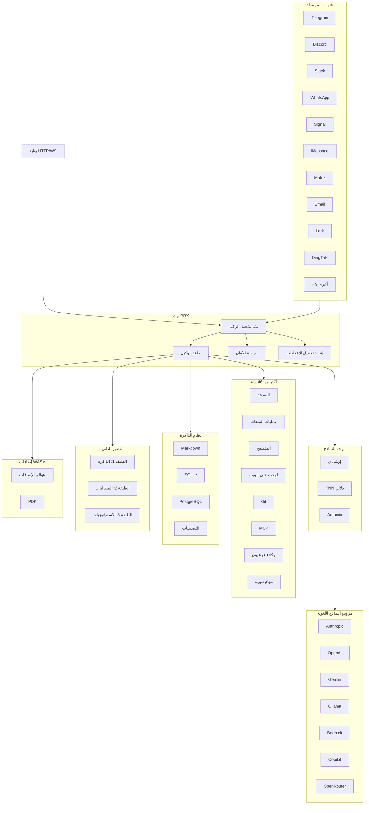

# PRX

**PRX** هو بيئة تشغيل وكيل ذكاء اصطناعي عالية الأداء وذاتية التطور، مكتوبة بلغة Rust. يربط النماذج اللغوية الكبيرة بـ 19 منصة مراسلة، ويوفر أكثر من 46 أداة مدمجة، ويدعم إضافات WASM القابلة للتوسيع، ويحسّن سلوكه بشكل مستقل من خلال نظام تطور ذاتي من 3 طبقات.

صُمم PRX للمطورين والفرق الذين يحتاجون إلى وكيل موحد يعمل عبر جميع منصات المراسلة التي يستخدمونها -- من Telegram وDiscord إلى Slack وWhatsApp وSignal وiMessage وDingTalk وLark والمزيد -- مع الحفاظ على مستوى إنتاجي من الأمان والمراقبة والموثوقية.

## لماذا PRX؟

تركز معظم أطر عمل وكلاء الذكاء الاصطناعي على نقطة تكامل واحدة أو تتطلب كودًا وسيطًا مكثفًا لربط الخدمات المختلفة. يتبع PRX نهجًا مختلفًا:

- **ملف تنفيذي واحد، جميع القنوات.** ملف `prx` واحد يتصل بجميع منصات المراسلة الـ 19 في آن واحد. لا حاجة لبوتات منفصلة ولا تشتت في الخدمات المصغرة.
- **ذاتي التطور.** يحسّن PRX بشكل مستقل ذاكرته ومطالباته واستراتيجياته بناءً على ملاحظات التفاعل -- مع إمكانية التراجع الآمن في كل طبقة.
- **أداء Rust أولاً.** 177 ألف سطر من كود Rust تقدم زمن استجابة منخفضًا وبصمة ذاكرة ضئيلة وصفر توقفات لجمع القمامة. يعمل الخادم بسلاسة حتى على Raspberry Pi.
- **قابل للتوسيع بالتصميم.** إضافات WASM وتكامل أدوات MCP وبنية قائمة على السمات (traits) تجعل توسيع PRX سهلاً دون الحاجة لعمل fork.

## الميزات الرئيسية

<div class="vp-features">

- **19 قناة مراسلة** -- Telegram، Discord، Slack، WhatsApp، Signal، iMessage، Matrix، Email، Lark، DingTalk، QQ، IRC، Mattermost، Nextcloud Talk، LINQ، CLI، والمزيد.

- **9 مزودي نماذج لغوية كبيرة** -- Anthropic Claude، OpenAI، Google Gemini، GitHub Copilot، Ollama، AWS Bedrock، GLM (Zhipu)، OpenAI Codex، OpenRouter، بالإضافة إلى أي نقطة نهاية متوافقة مع OpenAI.

- **أكثر من 46 أداة مدمجة** -- تنفيذ أوامر الصدفة، عمليات الملفات، أتمتة المتصفح، البحث على الويب، طلبات HTTP، عمليات git، إدارة الذاكرة، جدولة المهام الدورية، تكامل MCP، الوكلاء الفرعيون، والمزيد.

- **نظام تطور ذاتي من 3 طبقات** -- الطبقة الأولى: تطور الذاكرة، الطبقة الثانية: تطور المطالبات، الطبقة الثالثة: تطور الاستراتيجيات -- كل منها مع حدود أمان وتراجع تلقائي.

- **نظام إضافات WASM** -- وسّع PRX باستخدام مكونات WebAssembly عبر 6 عوالم إضافية: أداة، وسيط، خطاف، مهمة دورية، مزود، وتخزين. مجموعة تطوير كاملة (PDK) مع 47 دالة مضيفة.

- **موجه النماذج اللغوية الكبيرة** -- اختيار ذكي للنموذج عبر التسجيل الإرشادي (القدرة، تصنيف Elo، التكلفة، زمن الاستجابة)، التوجيه الدلالي KNN، والتصعيد القائم على الثقة Automix.

- **أمان على مستوى الإنتاج** -- تحكم بالاستقلالية من 4 مستويات، محرك السياسات، عزل صندوق الرمل (Docker/Firejail/Bubblewrap/Landlock)، مخزن أسرار ChaCha20، مصادقة الاقتران.

- **المراقبة** -- تتبع OpenTelemetry، مقاييس Prometheus، تسجيل منظم، ووحدة تحكم ويب مدمجة.

</div>

## البنية المعمارية



## التثبيت السريع

```bash
curl -fsSL https://openprx.dev/install.sh | bash
```

أو التثبيت عبر Cargo:

```bash
cargo install openprx
```

ثم شغّل معالج الإعداد الأولي:

```bash
prx onboard
```

راجع [دليل التثبيت](./getting-started/installation) لجميع الطرق بما في ذلك Docker والبناء من المصدر.

## أقسام التوثيق

| القسم | الوصف |
|-------|-------|
| [التثبيت](./getting-started/installation) | تثبيت PRX على Linux أو macOS أو Windows WSL2 |
| [البدء السريع](./getting-started/quickstart) | تشغيل PRX في 5 دقائق |
| [معالج الإعداد الأولي](./getting-started/onboarding) | إعداد مزود النماذج اللغوية والإعدادات الأولية |
| [القنوات](./channels/) | الاتصال بـ Telegram وDiscord وSlack و16 منصة أخرى |
| [المزودون](./providers/) | إعداد Anthropic وOpenAI وGemini وOllama والمزيد |
| [الأدوات](./tools/) | أكثر من 46 أداة مدمجة للصدفة والمتصفح وgit والذاكرة والمزيد |
| [التطور الذاتي](./self-evolution/) | نظام التحسين المستقل L1/L2/L3 |
| [الإضافات (WASM)](./plugins/) | توسيع PRX بمكونات WebAssembly |
| [الإعدادات](./config/) | مرجع الإعدادات الكامل وإعادة التحميل الفوري |
| [الأمان](./security/) | محرك السياسات، صندوق الرمل، الأسرار، نموذج التهديد |
| [مرجع سطر الأوامر](./cli/) | مرجع الأوامر الكامل لملف `prx` التنفيذي |

## معلومات المشروع

- **الترخيص:** MIT OR Apache-2.0
- **اللغة:** Rust (إصدار 2024)
- **المستودع:** [github.com/openprx/prx](https://github.com/openprx/prx)
- **الحد الأدنى من Rust:** 1.92.0
