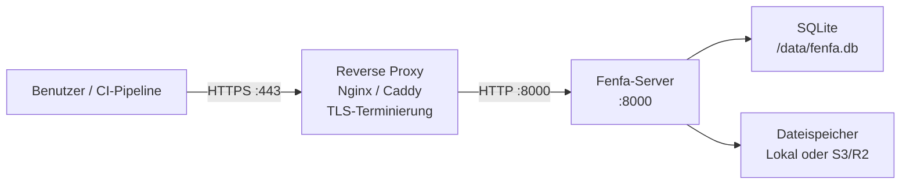

# Produktions-Deployment

Diese Anleitung behandelt alles, was für den Betrieb von Fenfa in einer Produktionsumgebung benötigt wird: Reverse Proxy mit TLS, sichere Token-Konfiguration, Backup-Strategie und Monitoring.

## Architektur



## Reverse-Proxy-Setup

### Caddy (Empfohlen)

Caddy erhält und erneuert automatisch TLS-Zertifikate von Let's Encrypt:

```
dist.example.com {
    reverse_proxy localhost:8000
}
```

Das war's. Caddy verarbeitet HTTPS, HTTP/2 und Zertifikatsverwaltung automatisch.

### Nginx

```nginx
server {
    listen 443 ssl http2;
    server_name dist.example.com;

    ssl_certificate /etc/letsencrypt/live/dist.example.com/fullchain.pem;
    ssl_certificate_key /etc/letsencrypt/live/dist.example.com/privkey.pem;

    client_max_body_size 2G;

    location / {
        proxy_pass http://127.0.0.1:8000;
        proxy_set_header Host $host;
        proxy_set_header X-Real-IP $remote_addr;
        proxy_set_header X-Forwarded-For $proxy_add_x_forwarded_for;
        proxy_set_header X-Forwarded-Proto $scheme;

        # Große Datei-Uploads
        proxy_request_buffering off;
        proxy_read_timeout 600s;
    }
}

server {
    listen 80;
    server_name dist.example.com;
    return 301 https://$host$request_uri;
}
```

::: warning client_max_body_size
`client_max_body_size` groß genug für die größten Builds setzen. IPA- und APK-Dateien können Hunderte von Megabytes groß sein. Das obige Beispiel erlaubt bis zu 2 GB.
:::

### TLS-Zertifikat beziehen

Mit Certbot und Nginx:

```bash
sudo certbot --nginx -d dist.example.com
```

Mit Certbot standalone:

```bash
sudo certbot certonly --standalone -d dist.example.com
```

## Sicherheits-Checkliste

### 1. Standard-Token ändern

Sichere zufällige Token generieren:

```bash
# Zufälligen 32-Zeichen-Token generieren
openssl rand -hex 16
```

Über Umgebungsvariablen oder Konfiguration setzen:

```bash
FENFA_ADMIN_TOKEN=$(openssl rand -hex 16)
FENFA_UPLOAD_TOKEN=$(openssl rand -hex 16)
```

### 2. An Localhost binden

Fenfa nur über den Reverse Proxy zugänglich machen:

```yaml
ports:
  - "127.0.0.1:8000:8000"  # Nicht 0.0.0.0:8000
```

### 3. Primary Domain setzen

Die korrekte öffentliche Domain für iOS-Manifeste und Callbacks konfigurieren:

```bash
FENFA_PRIMARY_DOMAIN=https://dist.example.com
```

::: danger iOS-Manifeste
Wenn `primary_domain` falsch ist, schlägt iOS OTA-Installation fehl. Das Manifest-Plist enthält Download-URLs, die iOS zum Abrufen der IPA-Datei verwendet. Diese URLs müssen vom Gerät des Benutzers erreichbar sein.
:::

### 4. Separate Upload-Token

Verschiedene Upload-Token für verschiedene CI/CD-Pipelines oder Teammitglieder ausgeben:

```json
{
  "auth": {
    "upload_tokens": [
      "token-for-ios-pipeline",
      "token-for-android-pipeline",
      "token-for-desktop-pipeline"
    ],
    "admin_tokens": [
      "admin-token-for-ops-team"
    ]
  }
}
```

Dies ermöglicht das Widerrufen einzelner Token, ohne andere Pipelines zu stören.

## Backup-Strategie

### Was zu sichern ist

| Komponente | Pfad | Größe | Häufigkeit |
|-----------|------|-------|-----------|
| SQLite-Datenbank | `/data/fenfa.db` | Klein (typischerweise < 100 MB) | Täglich |
| Hochgeladene Dateien | `/app/uploads/` | Kann groß sein | Nach jedem Upload (oder S3 verwenden) |
| Konfigurationsdatei | `config.json` | Winzig | Bei Änderung |

### SQLite-Backup

```bash
# Datenbankdatei kopieren (sicher während Fenfa läuft -- SQLite verwendet WAL-Modus)
cp /data/fenfa.db /backups/fenfa-$(date +%Y%m%d).db
```

### Automatisches Backup-Skript

```bash
#!/bin/bash
BACKUP_DIR="/backups/fenfa"
DATE=$(date +%Y%m%d-%H%M)

mkdir -p "$BACKUP_DIR"

# Datenbank
cp /path/to/data/fenfa.db "$BACKUP_DIR/fenfa-$DATE.db"

# Uploads (bei lokalem Speicher)
tar czf "$BACKUP_DIR/uploads-$DATE.tar.gz" /path/to/uploads/

# Alte Backups bereinigen (30 Tage aufbewahren)
find "$BACKUP_DIR" -name "*.db" -mtime +30 -delete
find "$BACKUP_DIR" -name "*.tar.gz" -mtime +30 -delete
```

::: tip S3-Speicher
Bei S3-kompatiblem Speicher (R2, AWS S3, MinIO) befinden sich hochgeladene Dateien bereits auf einem redundanten Speicher-Backend. Es muss nur die SQLite-Datenbank lokal gesichert werden.
:::

## Monitoring

### Health Check

Den `/healthz`-Endpunkt überwachen:

```bash
curl -sf http://localhost:8000/healthz || echo "Fenfa is down"
```

### Mit Uptime-Monitoring

Den Uptime-Monitoring-Dienst (UptimeRobot, Hetrix, etc.) auf folgendes zeigen:

```
https://dist.example.com/healthz
```

Erwartete Antwort: `{"ok": true}` mit HTTP 200.

### Log-Monitoring

Fenfa protokolliert nach stdout. Den Log-Treiber der Container-Runtime verwenden, um Logs an das Aggregationssystem weiterzuleiten:

```yaml
services:
  fenfa:
    logging:
      driver: "json-file"
      options:
        max-size: "10m"
        max-file: "3"
```

## Vollständiges Produktions-Docker-Compose

```yaml
version: "3.8"

services:
  fenfa:
    image: fenfa/fenfa:latest
    container_name: fenfa
    restart: unless-stopped
    ports:
      - "127.0.0.1:8000:8000"
    environment:
      FENFA_ADMIN_TOKEN: ${FENFA_ADMIN_TOKEN}
      FENFA_UPLOAD_TOKEN: ${FENFA_UPLOAD_TOKEN}
      FENFA_PRIMARY_DOMAIN: https://dist.example.com
    volumes:
      - fenfa-data:/data
      - fenfa-uploads:/app/uploads
    healthcheck:
      test: ["CMD", "wget", "-q", "--spider", "http://localhost:8000/healthz"]
      interval: 30s
      timeout: 5s
      retries: 3
      start_period: 10s
    logging:
      driver: "json-file"
      options:
        max-size: "10m"
        max-file: "3"
    deploy:
      resources:
        limits:
          memory: 512M

volumes:
  fenfa-data:
  fenfa-uploads:
```

## Nächste Schritte

- [Docker-Deployment](./docker) -- Docker-Grundlagen und Konfiguration
- [Konfigurationsreferenz](../configuration/) -- Alle Einstellungen
- [Fehlerbehebung](../troubleshooting/) -- Häufige Produktionsprobleme
