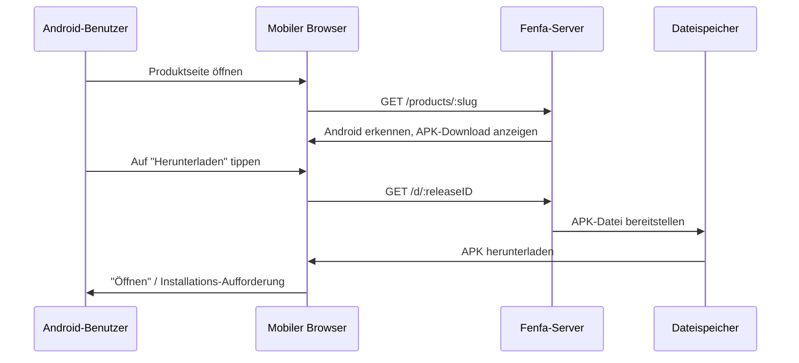

# Android-Distribution

Android-Distribution in Fenfa ist unkompliziert: Eine APK-Datei hochladen, und Benutzer laden sie direkt von der Produktseite herunter. Fenfa erkennt Android-Geräte automatisch und zeigt den passenden Download-Button an.

## Funktionsweise



Im Gegensatz zu iOS erfordert Android kein spezielles Protokoll für die Installation. Die APK-Datei wird direkt über HTTP(S) heruntergeladen, und der Benutzer installiert sie mit dem System-Paket-Installer.

## Android-Variante einrichten

Eine Android-Variante für das Produkt erstellen:

```bash
curl -X POST http://localhost:8000/admin/api/products/prd_abc123/variants \
  -H "X-Auth-Token: YOUR_ADMIN_TOKEN" \
  -H "Content-Type: application/json" \
  -d '{
    "platform": "android",
    "display_name": "Android",
    "identifier": "com.example.myapp",
    "arch": "universal",
    "installer_type": "apk"
  }'
```

::: tip Architektur-Varianten
Wenn separate APKs pro Architektur gebaut werden, mehrere Varianten erstellen:
- `Android ARM64` (arch: `arm64-v8a`)
- `Android ARM` (arch: `armeabi-v7a`)
- `Android x86_64` (arch: `x86_64`)

Bei einem universellen APK oder AAB reicht eine einzelne Variante mit `universal`-Architektur.
:::

## APK-Dateien hochladen

### Standard-Upload

```bash
curl -X POST http://localhost:8000/upload \
  -H "X-Auth-Token: YOUR_UPLOAD_TOKEN" \
  -F "variant_id=var_android" \
  -F "app_file=@app-release.apk" \
  -F "version=2.1.0" \
  -F "build=210" \
  -F "changelog=Added dark mode support"
```

### Intelligenter Upload

Der intelligente Upload extrahiert Metadaten automatisch aus APK-Dateien:

```bash
curl -X POST http://localhost:8000/admin/api/smart-upload \
  -H "X-Auth-Token: YOUR_ADMIN_TOKEN" \
  -F "variant_id=var_android" \
  -F "app_file=@app-release.apk"
```

Extrahierte Metadaten umfassen:
- Paketname (`com.example.myapp`)
- Versionsname (`2.1.0`)
- Versionscode (`210`)
- App-Icon
- Mindest-SDK-Version

## Benutzerinstallation

Wenn ein Benutzer die Produktseite auf einem Android-Gerät besucht:

1. Die Seite erkennt automatisch die Android-Plattform.
2. Der Benutzer tippt auf den **Herunterladen**-Button.
3. Der Browser lädt die APK-Datei herunter.
4. Android fordert den Benutzer auf, die APK zu installieren.

::: warning Unbekannte Quellen
Benutzer müssen "Installation aus unbekannten Quellen" (oder "Unbekannte Apps installieren" auf neueren Android-Versionen) in ihren Geräteeinstellungen aktivieren, bevor sie APKs von Fenfa installieren. Dies ist eine Standard-Android-Anforderung für sideloaded Apps.
:::

## Direkter Download-Link

Jeder Release hat eine direkte Download-URL, die mit jedem HTTP-Client funktioniert:

```bash
# Download über curl
curl -LO http://localhost:8000/d/rel_xxx

# Download über wget
wget http://localhost:8000/d/rel_xxx
```

Diese URL unterstützt HTTP-Range-Anfragen für fortsetzbare Downloads über langsame Verbindungen.

## Nächste Schritte

- [Desktop-Distribution](./desktop) -- macOS-, Windows- und Linux-Distribution
- [Release-Verwaltung](../products/releases) -- APK-Releases versionieren und verwalten
- [Upload-API](../api/upload) -- APK-Uploads aus CI/CD automatisieren
