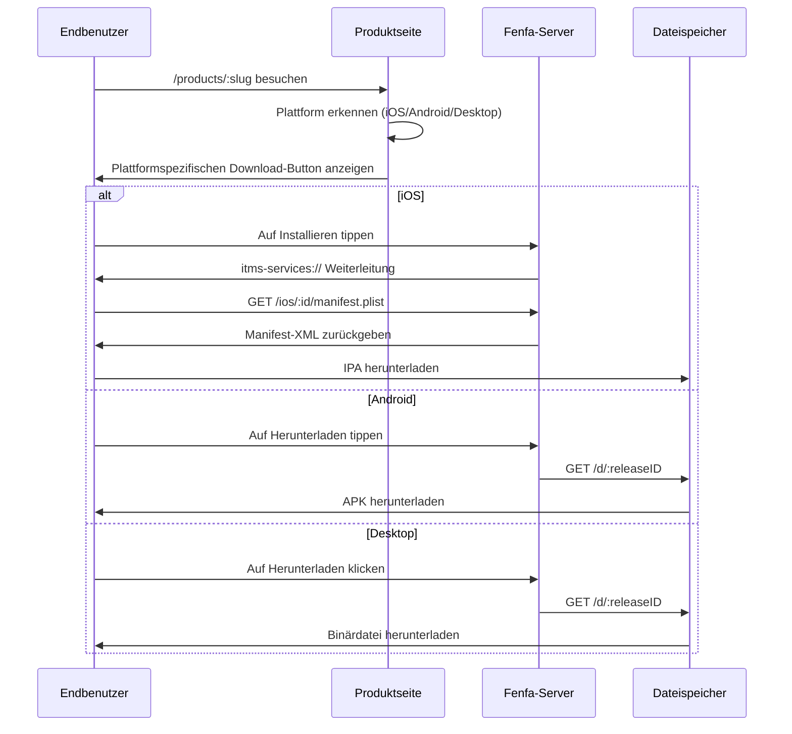

# Distributions-Übersicht

Fenfa bietet ein einheitliches Distributionserlebnis für alle Plattformen. Jedes Produkt erhält eine öffentliche Download-Seite, die automatisch die Plattform des Besuchers erkennt und den passenden Download-Button anzeigt.

## Wie Distribution funktioniert



## Produkt-Download-Seite

Jedes veröffentlichte Produkt hat eine öffentliche Seite unter `/products/:slug`. Die Seite enthält:

- **App-Icon und Name** aus der Produktkonfiguration
- **Plattformerkennung** -- Die Seite verwendet den User-Agent des Browsers, um zuerst den richtigen Download-Button anzuzeigen
- **QR-Code** -- Automatisch für einfaches mobiles Scannen generiert
- **Release-Verlauf** -- Alle Releases für die ausgewählte Variante, neueste zuerst
- **Changelogs** -- Pro-Release-Notizen inline angezeigt
- **Mehrere Varianten** -- Wenn ein Produkt Varianten für mehrere Plattformen hat, können Benutzer zwischen ihnen wechseln

## Plattformspezifische Distribution

| Plattform | Methode | Details |
|-----------|---------|---------|
| iOS | OTA über `itms-services://` | Manifest-Plist + direkter IPA-Download. Erfordert HTTPS. |
| Android | Direkter APK-Download | Browser lädt APK herunter. Benutzer aktiviert "Installation aus unbekannten Quellen". |
| macOS | Direkter Download | DMG-, PKG- oder ZIP-Dateien über Browser heruntergeladen. |
| Windows | Direkter Download | EXE-, MSI- oder ZIP-Dateien über Browser heruntergeladen. |
| Linux | Direkter Download | DEB-, RPM-, AppImage- oder tar.gz-Dateien über Browser heruntergeladen. |

## Direkte Download-Links

Jeder Release hat eine direkte Download-URL:

```
https://ihre-domain.com/d/:releaseID
```

Diese URL:
- Gibt die Binärdatei mit den richtigen `Content-Type`- und `Content-Disposition`-Headern zurück
- Unterstützt HTTP-Range-Anfragen für fortsetzbare Downloads
- Erhöht den Download-Zähler
- Funktioniert mit jedem HTTP-Client (curl, wget, Browser)

## Event-Tracking

Fenfa verfolgt drei Arten von Events:

| Event | Auslöser | Erfasste Daten |
|-------|---------|---------------|
| `visit` | Benutzer öffnet die Produktseite | IP, User-Agent, Variante |
| `click` | Benutzer klickt auf einen Download-Button | IP, User-Agent, Release-ID |
| `download` | Datei wird tatsächlich heruntergeladen | IP, User-Agent, Release-ID |

Events können im Admin-Panel angezeigt oder als CSV exportiert werden:

```bash
curl -o events.csv http://localhost:8000/admin/exports/events.csv \
  -H "X-Auth-Token: YOUR_ADMIN_TOKEN"
```

## HTTPS-Anforderung

::: warning iOS erfordert HTTPS
iOS OTA-Installation über `itms-services://` erfordert, dass der Server HTTPS mit einem gültigen TLS-Zertifikat verwendet. Für lokale Tests können Tools wie `ngrok` oder `mkcert` verwendet werden. Für die Produktion einen Reverse Proxy mit Let's Encrypt verwenden. Siehe [Produktions-Deployment](../deployment/production).
:::

## Plattform-Anleitungen

- [iOS-Distribution](./ios) -- OTA-Installation, Manifest-Generierung, UDID-Gerätebindung
- [Android-Distribution](./android) -- APK-Distribution und Installation
- [Desktop-Distribution](./desktop) -- macOS-, Windows- und Linux-Distribution
