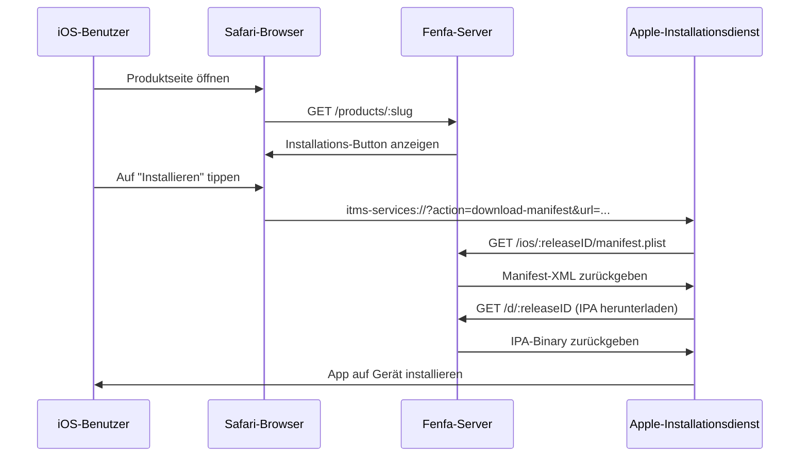
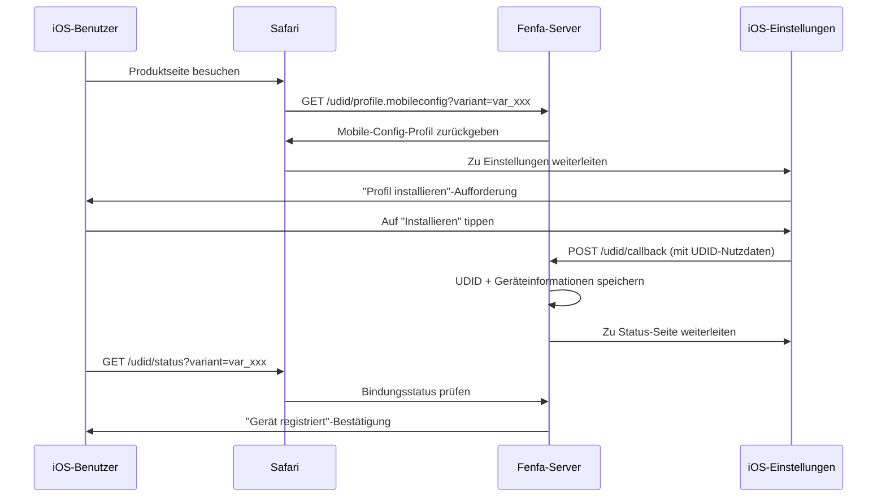

# iOS-Distribution

Fenfa bietet vollständige iOS OTA (Over-The-Air)-Distributionsunterstützung, einschließlich `itms-services://`-Manifest-Generierung, UDID-Gerätebindung für Ad-hoc-Bereitstellung und optionale Apple Developer API-Integration für automatische Geräteregistrierung.

## Wie iOS OTA funktioniert



iOS verwendet das `itms-services://`-Protokoll, um Apps direkt von einer Webseite zu installieren. Wenn ein Benutzer auf den Installations-Button tippt, übergibt Safari an den System-Installer, der:

1. Das Manifest-Plist von Fenfa abruft
2. Die IPA-Datei herunterlädt
3. Die App auf dem Gerät installiert

::: warning HTTPS erforderlich
iOS OTA-Installation erfordert HTTPS mit einem gültigen TLS-Zertifikat. Selbstsignierte Zertifikate funktionieren nicht. Für lokale Tests `ngrok` verwenden, um einen temporären HTTPS-Tunnel zu erstellen.
:::

## Manifest-Generierung

Fenfa generiert automatisch die `manifest.plist`-Datei für jeden iOS-Release. Das Manifest wird bereitgestellt unter:

```
GET /ios/:releaseID/manifest.plist
```

Das Manifest enthält:
- Bundle-Bezeichner (aus dem Bezeichner-Feld der Variante)
- Bundle-Version (aus der Release-Version)
- Download-URL (zeigt auf `/d/:releaseID`)
- App-Titel

Der `itms-services://`-Installationslink lautet:

```
itms-services://?action=download-manifest&url=https://ihre-domain.com/ios/rel_xxx/manifest.plist
```

Dieser Link wird automatisch in die Upload-API-Antwort eingeschlossen und auf der Produktseite angezeigt.

## UDID-Gerätebindung

Für Ad-hoc-Distribution müssen iOS-Geräte im Bereitstellungsprofil der App registriert sein. Fenfa bietet einen UDID-Bindungsflow, der Gerätebezeichner von Benutzern erfasst.

### Wie UDID-Bindung funktioniert



### UDID-Endpunkte

| Endpunkt | Methode | Beschreibung |
|----------|---------|-------------|
| `/udid/profile.mobileconfig?variant=:variantID` | GET | Mobile-Konfigurationsprofil herunterladen |
| `/udid/callback` | POST | Callback von iOS nach Profilinstallation (enthält UDID) |
| `/udid/status?variant=:variantID` | GET | Prüfen, ob das aktuelle Gerät gebunden ist |

### Sicherheit

Der UDID-Bindungsflow verwendet Einmal-Nonces, um Replay-Angriffe zu verhindern:
- Jeder Profildownload generiert eine eindeutige Nonce
- Die Nonce ist in die Callback-URL eingebettet
- Nach einmaliger Verwendung kann die Nonce nicht wiederverwendet werden
- Nonces laufen nach einem konfigurierbaren Timeout ab

## Apple Developer API-Integration

Fenfa kann Geräte automatisch beim Apple Developer-Konto registrieren und so den manuellen Schritt des Hinzufügens von UDIDs im Apple Developer Portal eliminieren.

### Setup

1. Zu **Admin-Panel > Einstellungen > Apple Developer API** gehen.
2. App Store Connect API-Zugangsdaten eingeben:

| Feld | Beschreibung |
|------|-------------|
| Schlüssel-ID | API-Schlüssel-ID (z.B. "ABC123DEF4") |
| Aussteller-ID | Aussteller-ID (UUID-Format) |
| Privater Schlüssel | PEM-Format privater Schlüsselinhalt |
| Team-ID | Apple Developer Team-ID |

::: tip API-Schlüssel erstellen
Im [Apple Developer Portal](https://developer.apple.com/account/resources/authkeys/list) einen API-Schlüssel mit "Geräte"-Berechtigung erstellen. Die `.p8`-Privatschlüsseldatei herunterladen -- sie kann nur einmal heruntergeladen werden.
:::

### Geräte registrieren

Nach der Konfiguration können Geräte mit Apple über das Admin-Panel registriert werden:

**Einzelnes Gerät:**

```bash
curl -X POST http://localhost:8000/admin/api/devices/DEVICE_ID/register-apple \
  -H "X-Auth-Token: YOUR_ADMIN_TOKEN"
```

**Stapelregistrierung:**

```bash
curl -X POST http://localhost:8000/admin/api/devices/register-apple \
  -H "X-Auth-Token: YOUR_ADMIN_TOKEN"
```

### Apple API-Status prüfen

```bash
curl http://localhost:8000/admin/api/apple/status \
  -H "X-Auth-Token: YOUR_ADMIN_TOKEN"
```

### Apple-registrierte Geräte auflisten

```bash
curl http://localhost:8000/admin/api/apple/devices \
  -H "X-Auth-Token: YOUR_ADMIN_TOKEN"
```

## Ad-hoc-Distributions-Workflow

Der vollständige Workflow für iOS Ad-hoc-Distribution:

1. **Benutzer bindet Gerät** -- Besucht die Produktseite, installiert das Mobileconfig-Profil, UDID wird erfasst.
2. **Admin registriert Gerät** -- Im Admin-Panel das Gerät bei Apple registrieren (oder Stapelregistrierung verwenden).
3. **Entwickler re-signiert IPA** -- Bereitstellungsprofil aktualisieren, um das neue Gerät einzuschließen, IPA neu signieren.
4. **Neuen Build hochladen** -- Die neu signierte IPA zu Fenfa hochladen.
5. **Benutzer installiert** -- Der Benutzer kann die App jetzt über die Produktseite installieren.

::: info Enterprise-Distribution
Mit einem Apple Enterprise Developer-Konto kann UDID-Bindung vollständig übersprungen werden. Enterprise-Profile erlauben die Installation auf jedem Gerät. Die Variante entsprechend setzen und Enterprise-signierte IPAs hochladen.
:::

## iOS-Geräte verwalten

Alle gebundenen Geräte im Admin-Panel oder über API anzeigen:

```bash
curl http://localhost:8000/admin/api/ios_devices \
  -H "X-Auth-Token: YOUR_ADMIN_TOKEN"
```

Geräte als CSV exportieren:

```bash
curl -o devices.csv http://localhost:8000/admin/exports/ios_devices.csv \
  -H "X-Auth-Token: YOUR_ADMIN_TOKEN"
```

## Nächste Schritte

- [Android-Distribution](./android) -- Android APK-Distribution
- [Upload-API](../api/upload) -- iOS-Uploads aus CI/CD automatisieren
- [Produktions-Deployment](../deployment/production) -- HTTPS für iOS OTA einrichten
