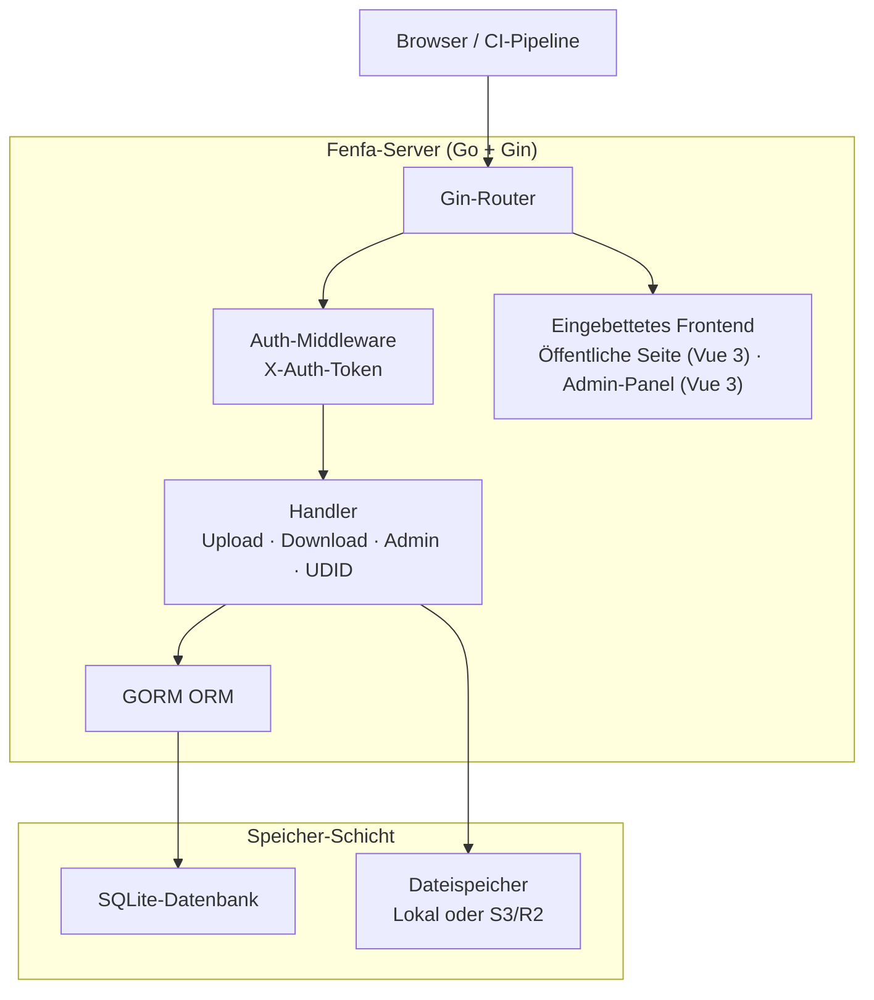
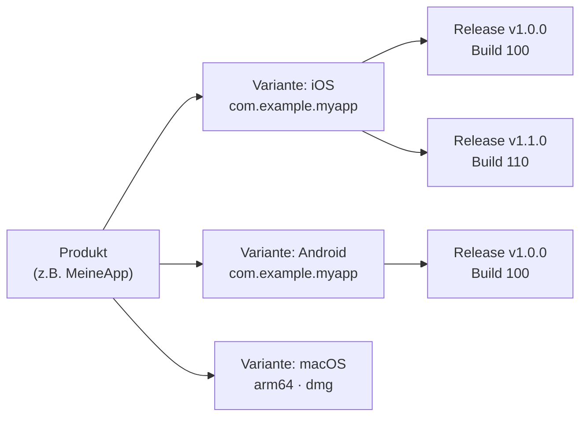

# Fenfa

**Fenfa** (分发, „verteilen" auf Chinesisch) ist eine selbst gehostete App-Distributionsplattform für iOS, Android, macOS, Windows und Linux. Builds hochladen, Installationsseiten mit QR-Codes erhalten und Releases über ein übersichtliches Admin-Panel verwalten -- alles aus einem einzigen Go-Binary mit eingebettetem Frontend und SQLite-Speicher.

Fenfa ist für Entwicklungsteams, QA-Ingenieure und Unternehmens-IT-Abteilungen konzipiert, die einen privaten, kontrollierbaren App-Distributionskanal benötigen -- einer, der iOS-OTA-Installation, Android-APK-Distribution und Desktop-App-Lieferung ohne Abhängigkeit von öffentlichen App-Stores oder Drittanbietern übernimmt.

## Warum Fenfa?

Öffentliche App-Stores verursachen Review-Verzögerungen, Inhaltsbeschränkungen und Datenschutzbedenken. Drittanbieter-Distributionsdienste berechnen Gebühren pro Download und kontrollieren die Daten. Fenfa gibt volle Kontrolle:

- **Selbst gehostet.** Eigene Builds, eigener Server, eigene Daten. Kein Vendor-Lock-in, keine Gebühren pro Download.
- **Multi-Plattform.** Eine einzige Produktseite bedient iOS-, Android-, macOS-, Windows- und Linux-Builds mit automatischer Plattformerkennung.
- **Keine Abhängigkeiten.** Ein einziges Go-Binary mit eingebettetem SQLite. Kein Redis, kein PostgreSQL, keine Message Queue.
- **iOS-OTA-Distribution.** Vollständige Unterstützung für `itms-services://`-Manifest-Generierung, UDID-Gerätebindung und Apple Developer API-Integration für Ad-hoc-Bereitstellung.

## Hauptfunktionen

<div class="vp-features">

- **Intelligenter Upload** -- App-Metadaten (Bundle-ID, Version, Icon) automatisch aus IPA- und APK-Paketen erkennen. Einfach die Datei hochladen und Fenfa erledigt den Rest.

- **Produktseiten** -- Öffentliche Download-Seiten mit QR-Codes, Plattformerkennung und pro-Release-Changelogs. Eine einzige URL für alle Plattformen teilen.

- **iOS UDID-Bindung** -- Geräteregistrierungsflow für Ad-hoc-Distribution. Benutzer binden ihre Geräte-UDID über ein geführtes Mobile-Config-Profil, und Admins können Geräte automatisch über die Apple Developer API registrieren.

- **S3/R2-Speicher** -- Optionaler S3-kompatibler Objektspeicher (Cloudflare R2, AWS S3, MinIO) für skalierbare Datei-Hosting. Lokaler Speicher funktioniert sofort.

- **Admin-Panel** -- Vollständiges Vue 3 Admin-Panel zur Verwaltung von Produkten, Varianten, Releases, Geräten und Systemeinstellungen. Unterstützt chinesische und englische Benutzeroberfläche.

- **Token-Authentifizierung** -- Separate Upload- und Admin-Token-Scopes. CI/CD-Pipelines verwenden Upload-Tokens; Administratoren verwenden Admin-Tokens für vollständige Kontrolle.

- **Event-Tracking** -- Seitenbesuche, Download-Klicks und Datei-Downloads pro Release verfolgen. Events als CSV für Analysen exportieren.

</div>

## Architektur



## Datenmodell



- **Produkt**: Eine logische App mit Name, Slug, Icon und Beschreibung. Eine einzige Produktseite bedient alle Plattformen.
- **Variante**: Ein plattformspezifisches Build-Target (iOS, Android, macOS, Windows, Linux) mit eigenem Bezeichner, Architektur und Installer-Typ.
- **Release**: Ein bestimmter hochgeladener Build mit Version, Build-Nummer, Changelog und Binärdatei.

## Schnellinstallation

```bash
docker run -d --name fenfa -p 8000:8000 fenfa/fenfa:latest
```

`http://localhost:8000/admin` besuchen und mit dem Token `dev-admin-token` anmelden.

Vollständige Anweisungen für Docker Compose, Quellcode-Builds und Produktionskonfiguration finden sich im [Installationshandbuch](./getting-started/installation).

## Dokumentationsabschnitte

| Abschnitt | Beschreibung |
|-----------|-------------|
| [Installation](./getting-started/installation) | Fenfa mit Docker installieren oder aus dem Quellcode bauen |
| [Schnellstart](./getting-started/quickstart) | Fenfa starten und ersten Build in 5 Minuten hochladen |
| [Produktverwaltung](./products/) | Multi-Plattform-Produkte erstellen und verwalten |
| [Plattform-Varianten](./products/variants) | iOS-, Android- und Desktop-Varianten konfigurieren |
| [Release-Verwaltung](./products/releases) | Releases hochladen, versionieren und verwalten |
| [Distributions-Übersicht](./distribution/) | Wie Fenfa Apps an Endbenutzer verteilt |
| [iOS-Distribution](./distribution/ios) | iOS OTA-Installation, Manifest-Generierung, UDID-Bindung |
| [Android-Distribution](./distribution/android) | Android APK-Distribution |
| [Desktop-Distribution](./distribution/desktop) | macOS-, Windows- und Linux-Distribution |
| [API-Übersicht](./api/) | REST-API-Referenz |
| [Upload-API](./api/upload) | Builds über API oder CI/CD hochladen |
| [Admin-API](./api/admin) | Vollständige Admin-API-Referenz |
| [Konfiguration](./configuration/) | Alle Konfigurationsoptionen |
| [Docker-Deployment](./deployment/docker) | Docker und Docker Compose Deployment |
| [Produktions-Deployment](./deployment/production) | Reverse Proxy, TLS, Backups und Monitoring |
| [Fehlerbehebung](./troubleshooting/) | Häufige Probleme und Lösungen |

## Projektinfo

- **Lizenz:** MIT
- **Sprache:** Go 1.25+ (Backend), Vue 3 + Vite (Frontend)
- **Datenbank:** SQLite (via GORM)
- **Repository:** [github.com/openprx/fenfa](https://github.com/openprx/fenfa)
- **Organisation:** [OpenPRX](https://github.com/openprx)
