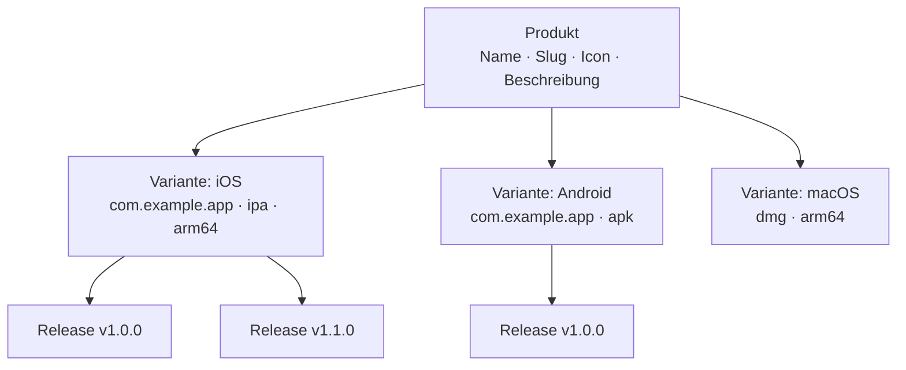

# Produktverwaltung

Produkte sind die übergeordnete Organisationseinheit in Fenfa. Jedes Produkt repräsentiert eine einzelne Anwendung und kann mehrere Plattform-Varianten enthalten (iOS, Android, macOS, Windows, Linux). Ein Produkt hat eine eigene öffentliche Download-Seite, Icon und Slug-URL.

## Konzepte



- **Produkt**: Die logische Anwendung. Hat einen eindeutigen Slug, der zur Download-Seiten-URL wird (`/products/:slug`).
- **Variante**: Ein plattformspezifisches Build-Target unter einem Produkt. Siehe [Plattform-Varianten](./variants).
- **Release**: Ein bestimmter hochgeladener Build unter einer Variante. Siehe [Release-Verwaltung](./releases).

## Produkt erstellen

### Über das Admin-Panel

1. Im Admin-Panel zu **Produkte** navigieren.
2. Auf **Produkt erstellen** klicken.
3. Felder ausfüllen:

| Feld | Erforderlich | Beschreibung |
|------|-------------|-------------|
| Name | Ja | Anzeigename (z.B. "MeineApp") |
| Slug | Ja | URL-Bezeichner (z.B. "meineapp"). Muss eindeutig sein. |
| Beschreibung | Nein | Kurze App-Beschreibung auf der Download-Seite |
| Icon | Nein | App-Icon (als Bilddatei hochgeladen) |

4. Auf **Speichern** klicken.

### Über API

```bash
curl -X POST http://localhost:8000/admin/api/products \
  -H "X-Auth-Token: YOUR_ADMIN_TOKEN" \
  -H "Content-Type: application/json" \
  -d '{
    "name": "MyApp",
    "slug": "myapp",
    "description": "A cross-platform mobile app"
  }'
```

## Produkte auflisten

### Über das Admin-Panel

Die **Produkte**-Seite im Admin-Panel zeigt alle Produkte mit Variantenanzahl und Gesamt-Downloads.

### Über API

```bash
curl http://localhost:8000/admin/api/products \
  -H "X-Auth-Token: YOUR_ADMIN_TOKEN"
```

Antwort:

```json
{
  "ok": true,
  "data": [
    {
      "id": "prd_abc123",
      "name": "MyApp",
      "slug": "myapp",
      "description": "A cross-platform mobile app",
      "published": true,
      "created_at": "2025-01-15T10:30:00Z"
    }
  ]
}
```

## Produkt aktualisieren

```bash
curl -X PUT http://localhost:8000/admin/api/products/prd_abc123 \
  -H "X-Auth-Token: YOUR_ADMIN_TOKEN" \
  -H "Content-Type: application/json" \
  -d '{
    "name": "MyApp Pro",
    "description": "Updated description"
  }'
```

## Produkt löschen

::: danger Kaskadierendes Löschen
Das Löschen eines Produkts entfernt dauerhaft alle Varianten, Releases und hochgeladenen Dateien.
:::

```bash
curl -X DELETE http://localhost:8000/admin/api/products/prd_abc123 \
  -H "X-Auth-Token: YOUR_ADMIN_TOKEN"
```

## Veröffentlichen und Unveröffentlichen

Produkte können veröffentlicht oder unveröffentlicht werden. Unveröffentlichte Produkte geben auf ihrer öffentlichen Download-Seite einen 404-Fehler zurück.

```bash
# Unveröffentlichen
curl -X PUT http://localhost:8000/admin/api/apps/prd_abc123/unpublish \
  -H "X-Auth-Token: YOUR_ADMIN_TOKEN"

# Veröffentlichen
curl -X PUT http://localhost:8000/admin/api/apps/prd_abc123/publish \
  -H "X-Auth-Token: YOUR_ADMIN_TOKEN"
```

## Öffentliche Download-Seite

Jedes veröffentlichte Produkt hat eine öffentliche Download-Seite unter:

```
https://ihre-domain.com/products/:slug
```

Die Seite bietet:
- App-Icon, Name und Beschreibung
- Plattformspezifische Download-Buttons (automatisch basierend auf dem Gerät des Besuchers erkannt)
- QR-Code für mobiles Scannen
- Release-Verlauf mit Versionsnummern und Changelogs
- iOS `itms-services://`-Links für OTA-Installation

## ID-Format

Produkt-IDs verwenden das Präfix `prd_` gefolgt von einem zufälligen String (z.B. `prd_abc123`). IDs werden automatisch generiert und können nicht geändert werden.

## Nächste Schritte

- [Plattform-Varianten](./variants) -- iOS-, Android- und Desktop-Varianten zum Produkt hinzufügen
- [Release-Verwaltung](./releases) -- Builds hochladen und verwalten
- [Distributions-Übersicht](../distribution/) -- Wie Endbenutzer Apps installieren
