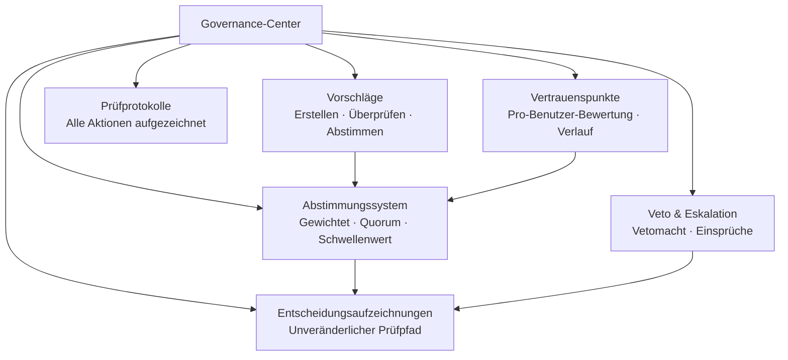

# Governance-Center

Das Governance-Center ist ein Kernmodul in OpenPR, das transparente, strukturierte Entscheidungsfindung ins Projektmanagement bringt. Es bietet Vorschläge, Abstimmungen, Entscheidungsaufzeichnungen, Vertrauenspunkte, Veto-Mechanismen und umfassende Prüfpfade.

## Warum Governance?

Traditionelle Projektmanagement-Tools konzentrieren sich auf die Aufgabenverfolgung, lassen aber die Entscheidungsfindung unstrukturiert. Das Governance-Center von OpenPR stellt sicher, dass:

- **Entscheidungen dokumentiert werden.** Jeder Vorschlag, jede Abstimmung und jede Entscheidung wird mit vollständigen Prüfpfaden aufgezeichnet.
- **Prozesse transparent sind.** Abstimmungsschwellenwerte, Quorum-Regeln und Vertrauenspunkte sind für alle Mitglieder sichtbar.
- **Macht verteilt wird.** Veto-Mechanismen und Eskalationspfade verhindern einseitige Entscheidungen.
- **Geschichte erhalten bleibt.** Entscheidungsaufzeichnungen erstellen ein unveränderliches Protokoll darüber, was entschieden wurde, von wem und warum.

## Governance-Module

| Modul | Beschreibung |
|-------|-------------|
| [Vorschläge](./proposals) | Vorschläge erstellen, überprüfen und darüber abstimmen |
| [Abstimmung & Entscheidungen](./voting) | Gewichtete Abstimmung mit Quorum- und Schwellenwertregeln |
| [Vertrauenspunkte](./trust-scores) | Pro-Benutzer-Reputationsbewertung mit Verlauf |
| Veto & Eskalation | Vetomacht mit Eskalationsabstimmung und Einsprüchen |
| Entscheidungsdomänen | Entscheidungen nach Domänen kategorisieren |
| Auswirkungsbewertungen | Auswirkungen von Vorschlägen mit Metriken bewerten |
| Prüfprotokolle | Vollständige Aufzeichnung aller Governance-Aktionen |

## Datenbankschema

Das Governance-Modul verwendet 20 dedizierte Tabellen:

| Tabelle | Zweck |
|---------|-------|
| `proposals` | Vorschlagsdatensätze |
| `proposal_templates` | Wiederverwendbare Vorschlagsvorlagen |
| `proposal_comments` | Diskussion zu Vorschlägen |
| `proposal_issue_links` | Vorschläge mit zugehörigen Issues verknüpfen |
| `votes` | Einzelne Abstimmungsdatensätze |
| `decisions` | Abgeschlossene Entscheidungsaufzeichnungen |
| `decision_domains` | Domänen zur Entscheidungskategorisierung |
| `decision_audit_reports` | Prüfberichte zu Entscheidungen |
| `governance_configs` | Arbeitsbereichs-Governance-Einstellungen |
| `governance_audit_logs` | Alle Governance-Aktionsprotokolle |
| `vetoers` | Benutzer mit Vetomacht |
| `veto_events` | Veto-Aktionsdatensätze |
| `appeals` | Einsprüche gegen Entscheidungen oder Vetos |
| `trust_scores` | Aktuelle Vertrauenspunkte pro Benutzer |
| `trust_score_logs` | Verlauf der Vertrauenspunkteänderungen |
| `impact_reviews` | Auswirkungsbewertungen von Vorschlägen |
| `impact_metrics` | Quantitative Auswirkungsmaßnahmen |
| `review_participants` | Bewertungszuweisungsdatensätze |
| `feedback_loop_links` | Feedback-Schleifen-Verbindungen |

## API-Endpunkte

| Kategorie | Basispfad | Operationen |
|-----------|-----------|------------|
| Vorschläge | `/api/proposals/*` | Erstellen, abstimmen, einreichen, archivieren |
| Governance | `/api/governance/*` | Konfiguration, Prüfprotokolle |
| Entscheidungen | `/api/decisions/*` | Entscheidungsaufzeichnungen |
| Vertrauenspunkte | `/api/trust-scores/*` | Punkte, Verlauf, Einsprüche |
| Veto | `/api/veto/*` | Veto, Eskalation, Abstimmung |

## MCP-Tools

| Tool | Parameter | Beschreibung |
|------|-----------|-------------|
| `proposals.list` | `project_id` | Vorschläge mit optionalem Statusfilter auflisten |
| `proposals.get` | `proposal_id` | Vorschlagsdetails abrufen |
| `proposals.create` | `project_id`, `title`, `description` | Einen Governance-Vorschlag erstellen |

## Nächste Schritte

- [Vorschläge](./proposals) -- Governance-Vorschläge erstellen und verwalten
- [Abstimmung & Entscheidungen](./voting) -- Abstimmungsregeln konfigurieren und Entscheidungen ansehen
- [Vertrauenspunkte](./trust-scores) -- Den Vertrauenspunktemechanismus verstehen
