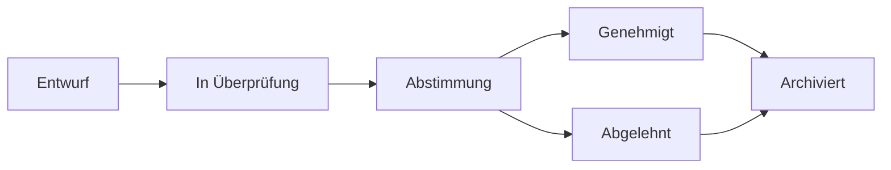

# Vorschläge

Vorschläge sind der Einstiegspunkt für Governance-Entscheidungen in OpenPR. Ein Vorschlag beschreibt eine Änderung, Verbesserung oder Entscheidung, die Team-Input erfordert, und folgt einem strukturierten Lebenszyklus von der Erstellung über die Abstimmung bis zur endgültigen Entscheidung.

## Vorschlagslebenszyklus



1. **Entwurf** -- Autor erstellt den Vorschlag mit Titel, Beschreibung und Kontext.
2. **In Überprüfung** -- Teammitglieder diskutieren und geben Feedback durch Kommentare.
3. **Abstimmung** -- Abstimmungszeitraum beginnt. Mitglieder stimmen entsprechend der Governance-Regeln ab.
4. **Genehmigt/Abgelehnt** -- Abstimmung endet. Ergebnis wird durch Schwellenwert und Quorum bestimmt.
5. **Archiviert** -- Entscheidung wird aufgezeichnet und der Vorschlag archiviert.

## Einen Vorschlag erstellen

### Über die Web-UI

1. Zum Projekt navigieren.
2. Zu **Governance** > **Vorschläge** gehen.
3. Auf **Neuer Vorschlag** klicken.
4. Titel, Beschreibung und verknüpfte Issues ausfüllen.
5. Auf **Erstellen** klicken.

### Über die API

```bash
curl -X POST http://localhost:8080/api/proposals \
  -H "Content-Type: application/json" \
  -H "Authorization: Bearer <token>" \
  -d '{
    "project_id": "<project_uuid>",
    "title": "Adopt TypeScript for frontend modules",
    "description": "Proposal to migrate frontend modules from JavaScript to TypeScript for better type safety."
  }'
```

### Über MCP

```json
{
  "method": "tools/call",
  "params": {
    "name": "proposals.create",
    "arguments": {
      "project_id": "<project_uuid>",
      "title": "Adopt TypeScript for frontend modules",
      "description": "Proposal to migrate frontend modules from JavaScript to TypeScript."
    }
  }
}
```

## Vorschlagsvorlagen

Arbeitsbereichsadministratoren können Vorschlagsvorlagen erstellen, um das Vorschlagsformat zu standardisieren. Vorlagen definieren:

- Titelmuster
- Erforderliche Abschnitte in der Beschreibung
- Standard-Abstimmungsparameter

Vorlagen werden in **Arbeitsbereich-Einstellungen** > **Governance** > **Vorlagen** verwaltet.

## Vorschläge mit Issues verknüpfen

Vorschläge können über die Tabelle `proposal_issue_links` mit verwandten Issues verknüpft werden. Dies erstellt einen bidirektionalen Bezug:

- Vom Vorschlag aus können Sie sehen, welche Issues betroffen sind.
- Von einem Issue aus können Sie sehen, welche Vorschläge darauf verweisen.

## Vorschlagskommentare

Jeder Vorschlag hat seinen eigenen Diskussionsthread, getrennt von Issue-Kommentaren. Vorschlagskommentare unterstützen Markdown-Formatierung und sind für alle Arbeitsbereichsmitglieder sichtbar.

## MCP-Tools

| Tool | Parameter | Beschreibung |
|------|-----------|-------------|
| `proposals.list` | `project_id` | Vorschläge auflisten, optionaler `status`-Filter |
| `proposals.get` | `proposal_id` | Vollständige Vorschlagsdetails abrufen |
| `proposals.create` | `project_id`, `title`, `description` | Einen neuen Vorschlag erstellen |

## Nächste Schritte

- [Abstimmung & Entscheidungen](./voting) -- Wie Abstimmungen durchgeführt und Entscheidungen getroffen werden
- [Vertrauenspunkte](./trust-scores) -- Wie Vertrauenspunkte das Abstimmungsgewicht beeinflussen
- [Governance-Übersicht](./index) -- Vollständige Governance-Modulreferenz
