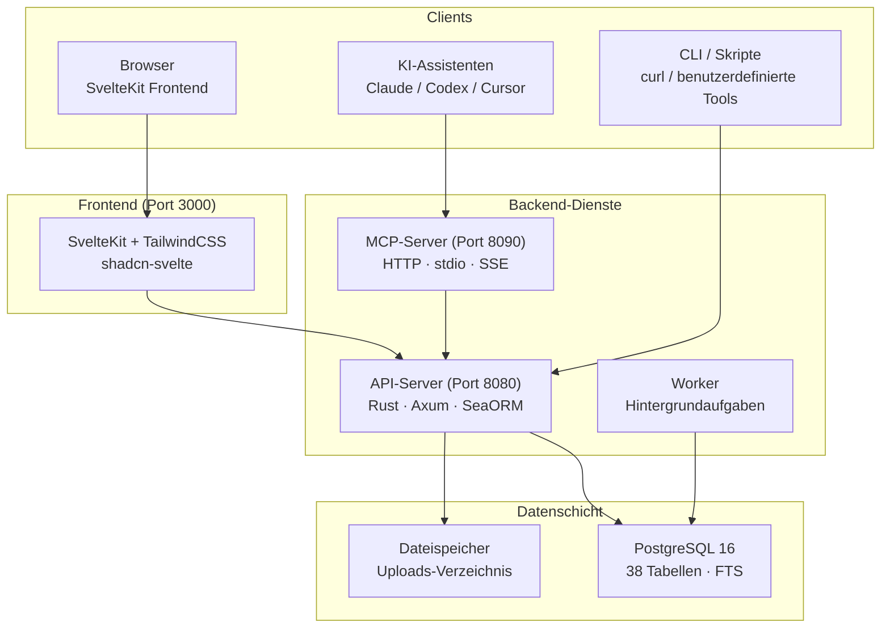

# OpenPR

**OpenPR** ist eine Open-Source-Projektmanagementplattform für Teams, die transparente Governance, KI-unterstützte Workflows und volle Kontrolle über ihre Projektdaten benötigen. Sie kombiniert Issue-Tracking, Sprint-Planung, Kanban-Boards und ein vollständiges Governance-Center -- Vorschläge, Abstimmungen, Vertrauenspunkte, Veto-Mechanismen -- in einer einzigen selbst-gehosteten Plattform.

OpenPR ist mit **Rust** (Axum + SeaORM) im Backend und **SvelteKit** im Frontend entwickelt, gestützt auf **PostgreSQL**. Es bietet eine REST-API und einen eingebauten MCP-Server mit 34 Tools über drei Transport-Protokolle und ist damit ein erstklassiger Tool-Provider für KI-Assistenten wie Claude, Codex und andere MCP-kompatible Clients.

## Warum OpenPR?

Die meisten Projektmanagement-Tools sind entweder Closed-Source-SaaS-Plattformen mit begrenzter Anpassbarkeit oder Open-Source-Alternativen ohne Governance-Funktionen. OpenPR verfolgt einen anderen Ansatz:

- **Selbst-gehostet und prüfbar.** Ihre Projektdaten bleiben auf Ihrer Infrastruktur. Jede Funktion, jeder Entscheidungsdatensatz, jedes Auditprotokoll liegt unter Ihrer Kontrolle.
- **Governance eingebaut.** Vorschläge, Abstimmungen, Vertrauenspunkte, Veto-Recht und Eskalation sind keine Nachgedanken -- sie sind Kernmodule mit vollständiger API-Unterstützung.
- **KI-nativ.** Ein eingebauter MCP-Server macht OpenPR zum Tool-Provider für KI-Agenten. Bot-Tokens, KI-Aufgabenzuweisung und Webhook-Callbacks ermöglichen vollautomatisierte Workflows.
- **Rust-Performance.** Das Backend verarbeitet Tausende von gleichzeitigen Anfragen mit minimalem Ressourcenverbrauch. PostgreSQL-Volltextsuche ermöglicht sofortige Suchen über alle Entitäten.

## Hauptfunktionen

| Kategorie | Funktionen |
|-----------|-----------|
| **Projektmanagement** | Arbeitsbereiche, Projekte, Issues, Kanban-Board, Sprints, Labels, Kommentare, Dateianhänge, Aktivitäts-Feed, Benachrichtigungen, Volltextsuche |
| **Governance-Center** | Vorschläge, Abstimmungen mit Quorum, Entscheidungsdatensätze, Veto und Eskalation, Vertrauenspunkte mit Verlauf und Einsprüchen, Vorschlagsvorlagen, Auswirkungsprüfungen, Auditprotokolle |
| **KI-Integration** | Bot-Tokens (`opr_`-Präfix), KI-Agenten-Registrierung, KI-Aufgabenzuweisung mit Fortschrittsverfolgung, KI-Review bei Vorschlägen, MCP-Server (34 Tools, 3 Transporte), Webhook-Callbacks |
| **Authentifizierung** | JWT (Zugriffs- + Aktualisierungs-Token), Bot-Token-Authentifizierung, rollenbasierter Zugriff (admin/user), arbeitsbereichs-basierte Berechtigungen (owner/admin/member) |
| **Bereitstellung** | Docker Compose, Podman, Caddy/Nginx Reverse-Proxy, PostgreSQL 15+ |

## Architektur



## Technologie-Stack

| Schicht | Technologie |
|---------|------------|
| **Backend** | Rust, Axum, SeaORM, PostgreSQL |
| **Frontend** | SvelteKit, TailwindCSS, shadcn-svelte |
| **MCP** | JSON-RPC 2.0 (HTTP + stdio + SSE) |
| **Auth** | JWT (Zugriff + Aktualisierung) + Bot-Tokens (`opr_`) |
| **Bereitstellung** | Docker Compose, Podman, Caddy, Nginx |

## Schnellstart

```bash
git clone https://github.com/openprx/openpr.git
cd openpr
cp .env.example .env
docker-compose up -d
```

Dienste starten unter:
- **Frontend**: http://localhost:3000
- **API**: http://localhost:8080
- **MCP-Server**: http://localhost:8090

Der erste registrierte Benutzer wird automatisch Admin.

Weitere Installationsmethoden finden Sie im [Installationsleitfaden](./getting-started/installation), oder starten Sie mit dem [Schnellstart](./getting-started/quickstart) in 5 Minuten.

## Dokumentations-Abschnitte

| Abschnitt | Beschreibung |
|-----------|-------------|
| [Installation](./getting-started/installation) | Docker Compose, Quellcode-Build und Bereitstellungsoptionen |
| [Schnellstart](./getting-started/quickstart) | OpenPR in 5 Minuten zum Laufen bringen |
| [Arbeitsbereiche](./workspace/) | Arbeitsbereiche, Projekte und Mitglieder-Rollen |
| [Issues & Tracking](./issues/) | Issues, Workflow-Zustände, Sprints und Labels |
| [Governance-Center](./governance/) | Vorschläge, Abstimmungen, Entscheidungen und Vertrauenspunkte |
| [REST-API](./api/) | Authentifizierung, Endpunkte und Antwortformate |
| [MCP-Server](./mcp-server/) | KI-Integration mit 34 Tools und 3 Transporten |
| [Konfiguration](./configuration/) | Umgebungsvariablen und Einstellungen |
| [Bereitstellung](./deployment/docker) | Docker- und Produktionsbereitstellungsanleitungen |
| [Fehlerbehebung](./troubleshooting/) | Häufige Probleme und Lösungen |

## Verwandte Projekte

| Repository | Beschreibung |
|------------|-------------|
| [openpr](https://github.com/openprx/openpr) | Kernplattform (dieses Projekt) |
| [openpr-webhook](https://github.com/openprx/openpr-webhook) | Webhook-Empfänger für externe Integrationen |
| [prx](https://github.com/openprx/prx) | KI-Assistenten-Framework mit eingebautem OpenPR MCP |
| [prx-memory](https://github.com/openprx/prx-memory) | Local-First MCP-Speicher für Coding-Agenten |

## Projektinformationen

- **Lizenz:** MIT OR Apache-2.0
- **Sprache:** Rust (2024-Edition)
- **Repository:** [github.com/openprx/openpr](https://github.com/openprx/openpr)
- **Mindest-Rust:** 1.75.0
- **Frontend:** SvelteKit
