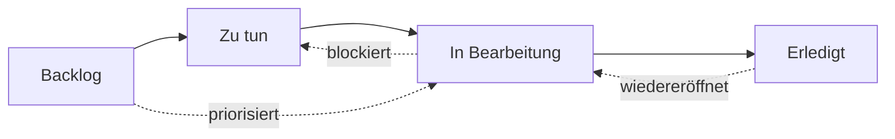
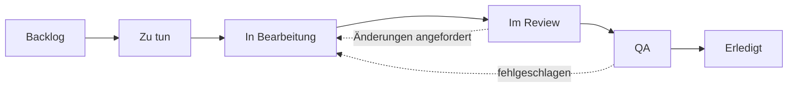

# Workflow-Zustände

Jedes Issue in OpenPR hat einen **Zustand**, der seine Position im Workflow repräsentiert. Die Kanban-Board-Spalten werden direkt diesen Zuständen zugeordnet.

OpenPR wird mit vier Standardzuständen ausgeliefert, unterstützt aber vollständig **benutzerdefinierte Workflow-Zustände** durch ein 3-Ebenen-Auflösungssystem. Sie können verschiedene Workflows pro Projekt, pro Arbeitsbereich oder die Systemstandards verwenden.

## Standardzustände



| Zustand | Wert | Beschreibung |
|---------|------|-------------|
| **Backlog** | `backlog` | Ideen, zukünftige Arbeit und ungeplante Elemente. Noch nicht geplant. |
| **Zu tun** | `todo` | Geplant und priorisiert. Bereit zur Aufnahme. |
| **In Bearbeitung** | `in_progress` | Wird aktiv von einem Bearbeiter bearbeitet. |
| **Erledigt** | `done` | Abgeschlossen und verifiziert. |

Dies sind die eingebauten Zustände, mit denen jeder neue Arbeitsbereich beginnt. Sie können diese anpassen oder zusätzliche Zustände hinzufügen, wie unten unter [Benutzerdefinierte Workflows](#benutzerdefinierte-workflows) beschrieben.

## Zustandsübergänge

OpenPR erlaubt flexible Zustandsübergänge. Es gibt keine erzwungenen Einschränkungen -- jeder Zustand kann zu jedem anderen übergehen. Häufige Muster sind:

| Übergang | Auslöser | Beispiel |
|----------|---------|---------|
| Backlog -> Zu tun | Sprint-Planung, Priorisierung | Issue in kommenden Sprint gezogen |
| Zu tun -> In Bearbeitung | Entwickler nimmt Arbeit auf | Bearbeiter beginnt Implementierung |
| In Bearbeitung -> Erledigt | Arbeit abgeschlossen | Pull Request zusammengeführt |
| In Bearbeitung -> Zu tun | Arbeit blockiert oder pausiert | Warten auf externe Abhängigkeit |
| Erledigt -> In Bearbeitung | Issue wiedereröffnet | Bug-Regression entdeckt |
| Backlog -> In Bearbeitung | Dringender Hotfix | Kritisches Produktionsproblem |

## Benutzerdefinierte Workflows

OpenPR unterstützt benutzerdefinierte Workflow-Zustände durch ein **3-Ebenen-Auflösungs**-System. Wenn die API einen Zustand für ein Work Item validiert, löst sie den effektiven Workflow auf, indem drei Ebenen der Reihe nach geprüft werden:

```
Projekt-Workflow  >  Arbeitsbereichs-Workflow  >  Systemstandards
```

Wenn ein Projekt seinen eigenen Workflow definiert, hat dieser Vorrang. Andernfalls wird der Arbeitsbereichs-Workflow verwendet. Wenn keiner existiert, gelten die vier Systemstandard-Zustände.

### Benutzerdefinierten Workflow über API erstellen

**Schritt 1 -- Einen Workflow für ein Projekt erstellen:**

```bash
curl -X POST http://localhost:8080/api/workflows \
  -H "Content-Type: application/json" \
  -H "Authorization: Bearer <token>" \
  -d '{
    "name": "Engineering Flow",
    "project_id": "<project_uuid>"
  }'
```

**Schritt 2 -- Zustände zum Workflow hinzufügen:**

```bash
curl -X POST http://localhost:8080/api/workflows/<workflow_id>/states \
  -H "Content-Type: application/json" \
  -H "Authorization: Bearer <token>" \
  -d '{
    "key": "in_review",
    "display_name": "Im Review",
    "category": "active",
    "position": 3,
    "color": "#f59e0b",
    "is_initial": false,
    "is_terminal": false
  }'
```

### Beispiel: 6-Zustands-Engineering-Workflow



| Zustand | Schlüssel | Kategorie | Initial | Terminal |
|---------|-----------|-----------|---------|----------|
| Backlog | `backlog` | backlog | ja | nein |
| Zu tun | `todo` | planned | nein | nein |
| In Bearbeitung | `in_progress` | active | nein | nein |
| Im Review | `in_review` | active | nein | nein |
| QA | `qa` | active | nein | nein |
| Erledigt | `done` | completed | nein | ja |

## Kanban-Board

Die Board-Ansicht zeigt Issues als Karten in Spalten entsprechend den Workflow-Zuständen. Eine Karte per Drag-and-Drop zwischen Spalten verschieben, um ihren Zustand zu ändern.

## Zustand über API aktualisieren

```bash
# Issue zu "in_progress" verschieben
curl -X PATCH http://localhost:8080/api/issues/<issue_id> \
  -H "Content-Type: application/json" \
  -H "Authorization: Bearer <token>" \
  -d '{"state": "in_progress"}'
```

## Prioritätsstufen

Zusätzlich zu Zuständen kann jedes Issue eine Prioritätsstufe haben:

| Priorität | Wert | Beschreibung |
|-----------|------|-------------|
| Niedrig | `low` | Nice-to-have, kein Zeitdruck |
| Mittel | `medium` | Standardpriorität, geplante Arbeit |
| Hoch | `high` | Wichtig, sollte bald bearbeitet werden |
| Dringend | `urgent` | Kritisch, braucht sofortige Aufmerksamkeit |

## Nächste Schritte

- [Sprint-Planung](./sprints) -- Issues in zeitlich begrenzte Iterationen organisieren
- [Labels](./labels) -- Kategorisierung zu Issues hinzufügen
- [Issues-Übersicht](./index) -- Vollständige Issue-Feldreferenz
