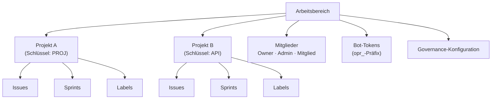

# Arbeitsbereichsverwaltung

Ein **Arbeitsbereich** ist die übergeordnete Organisationseinheit in OpenPR. Er bietet Mandantentrennung -- jeder Arbeitsbereich hat eigene Projekte, Mitglieder, Labels, Bot-Tokens und Governance-Einstellungen. Benutzer können zu mehreren Arbeitsbereichen gehören.

## Einen Arbeitsbereich erstellen

Nach dem Einloggen auf dem Dashboard auf **Arbeitsbereich erstellen** klicken oder zu **Einstellungen** > **Arbeitsbereiche** > **Neu** navigieren.

Angaben machen:

| Feld | Erforderlich | Beschreibung |
|------|-------------|-------------|
| Name | Ja | Anzeigename (z.B. "Engineering-Team") |
| Slug | Ja | URL-freundlicher Bezeichner (z.B. "engineering") |

Der erstellende Benutzer wird automatisch der **Owner**-Rolle zugewiesen.

## Arbeitsbereichsstruktur



## Arbeitsbereich-Einstellungen

Auf Arbeitsbereich-Einstellungen über das Zahnrad-Symbol oder **Einstellungen** in der Seitenleiste zugreifen:

- **Allgemein** -- Arbeitsbereichsname, Slug und Beschreibung aktualisieren.
- **Mitglieder** -- Benutzer einladen, Rollen ändern, Mitglieder entfernen. Siehe [Mitglieder](./members).
- **Bot-Tokens** -- MCP-Bot-Tokens erstellen und verwalten.
- **Governance** -- Abstimmungsschwellenwerte, Vorschlagsvorlagen und Vertrauenspunkt-Regeln konfigurieren. Siehe [Governance](../governance/).
- **Webhooks** -- Webhook-Endpunkte für externe Integrationen einrichten.

## API-Zugriff

```bash
# Arbeitsbereiche auflisten
curl -H "Authorization: Bearer <token>" \
  http://localhost:8080/api/workspaces

# Arbeitsbereichsdetails abrufen
curl -H "Authorization: Bearer <token>" \
  http://localhost:8080/api/workspaces/<workspace_id>
```

## MCP-Zugriff

Über den MCP-Server arbeiten KI-Assistenten innerhalb des Arbeitsbereichs, der durch die Umgebungsvariable `OPENPR_WORKSPACE_ID` angegeben wird. Alle MCP-Tools beschränken Operationen automatisch auf diesen Arbeitsbereich.

## Nächste Schritte

- [Projekte](./projects) -- Projekte innerhalb eines Arbeitsbereichs erstellen und verwalten
- [Mitglieder & Berechtigungen](./members) -- Benutzer einladen und Rollen konfigurieren
