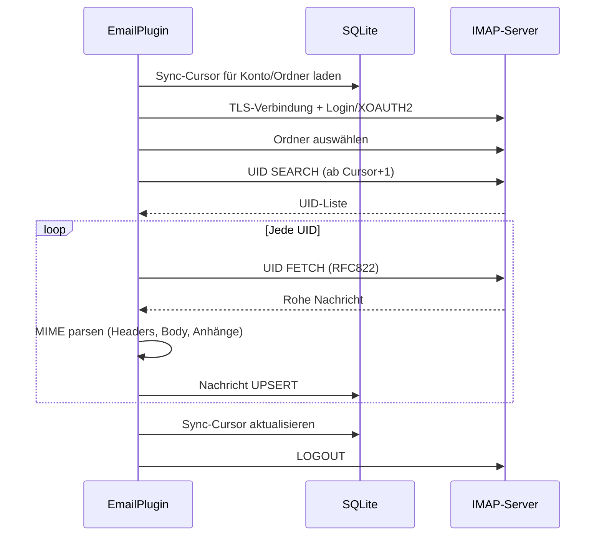

# IMAP-Konfiguration

PRX-Email verbindet sich über TLS mit der `rustls`-Bibliothek mit IMAP-Servern. Es unterstützt Passwort-Authentifizierung und XOAUTH2 für Gmail und Outlook. Die Posteingangs-Synchronisation ist UID-basiert und inkrementell, mit Cursor-Persistenz in der SQLite-Datenbank.

## Grundlegendes IMAP-Setup

```rust
use prx_email::plugin::{ImapConfig, AuthConfig};

let imap = ImapConfig {
    host: "imap.example.com".to_string(),
    port: 993,
    user: "you@example.com".to_string(),
    auth: AuthConfig {
        password: Some("your-app-password".to_string()),
        oauth_token: None,
    },
};
```

### Konfigurationsfelder

| Feld | Typ | Erforderlich | Beschreibung |
|------|-----|-------------|-------------|
| `host` | `String` | Ja | IMAP-Server-Hostname (darf nicht leer sein) |
| `port` | `u16` | Ja | IMAP-Server-Port (typischerweise 993 für TLS) |
| `user` | `String` | Ja | IMAP-Benutzername (normalerweise die E-Mail-Adresse) |
| `auth.password` | `Option<String>` | Eines von | App-Passwort für IMAP LOGIN |
| `auth.oauth_token` | `Option<String>` | Eines von | OAuth-Zugriffstoken für XOAUTH2 |

::: warning Authentifizierung
Genau eines von `password` oder `oauth_token` muss gesetzt sein. Beides oder keines zu setzen führt zu einem Validierungsfehler.
:::

## Häufige Provider-Einstellungen

| Provider | Host | Port | Auth-Methode |
|----------|------|------|-------------|
| Gmail | `imap.gmail.com` | 993 | App-Passwort oder XOAUTH2 |
| Outlook / Office 365 | `outlook.office365.com` | 993 | XOAUTH2 (empfohlen) |
| Yahoo | `imap.mail.yahoo.com` | 993 | App-Passwort |
| Fastmail | `imap.fastmail.com` | 993 | App-Passwort |
| ProtonMail Bridge | `127.0.0.1` | 1143 | Bridge-Passwort |

## Posteingang synchronisieren

Die `sync`-Methode verbindet sich mit dem IMAP-Server, wählt einen Ordner aus, ruft neue Nachrichten nach UID ab und speichert sie in SQLite:

```rust
use prx_email::plugin::SyncRequest;

plugin.sync(SyncRequest {
    account_id: 1,
    folder: Some("INBOX".to_string()),
    cursor: None,        // Ab letztem gespeichertem Cursor fortsetzen
    now_ts: now,
    max_messages: 100,   // Maximal 100 Nachrichten pro Synchronisation abrufen
})?;
```

### Synchronisationsablauf



### Inkrementelle Synchronisation

PRX-Email verwendet UID-basierte Cursor, um das erneute Abrufen von Nachrichten zu vermeiden. Nach jeder Synchronisation:

1. Die höchste gesehene UID wird als Cursor gespeichert
2. Die nächste Synchronisation startet ab `Cursor + 1`
3. Nachrichten mit vorhandenen `(account_id, message_id)`-Paaren werden aktualisiert (UPSERT)

Der Cursor wird in der `sync_state`-Tabelle mit dem zusammengesetzten Schlüssel `(account_id, folder_id)` gespeichert.

## Multi-Ordner-Synchronisation

Mehrere Ordner für dasselbe Konto synchronisieren:

```rust
for folder in &["INBOX", "Sent", "Drafts", "Archive"] {
    plugin.sync(SyncRequest {
        account_id,
        folder: Some(folder.to_string()),
        cursor: None,
        now_ts: now,
        max_messages: 100,
    })?;
}
```

## Synchronisationsplaner

Für periodische Synchronisation den eingebauten Sync-Runner verwenden:

```rust
use prx_email::plugin::{SyncJob, SyncRunnerConfig};

let jobs = vec![
    SyncJob { account_id: 1, folder: "INBOX".into(), max_messages: 100 },
    SyncJob { account_id: 1, folder: "Sent".into(), max_messages: 50 },
    SyncJob { account_id: 2, folder: "INBOX".into(), max_messages: 100 },
];

let config = SyncRunnerConfig {
    max_concurrency: 4,         // Max. Jobs pro Runner-Tick
    base_backoff_seconds: 10,   // Anfänglicher Backoff bei Fehler
    max_backoff_seconds: 300,   // Maximaler Backoff (5 Minuten)
};

let report = plugin.run_sync_runner(&jobs, now, &config);
println!(
    "Run {}: attempted={}, succeeded={}, failed={}",
    report.run_id, report.attempted, report.succeeded, report.failed
);
```

### Planer-Verhalten

- **Parallelitätslimit**: Maximal `max_concurrency` Jobs pro Tick
- **Fehler-Backoff**: Exponentieller Backoff mit `base * 2^failures`-Formel, begrenzt auf `max_backoff_seconds`
- **Fälligkeitsprüfung**: Jobs werden übersprungen, wenn ihr Backoff-Fenster noch nicht abgelaufen ist
- **Statusverfolgung**: Pro `account::folder`-Schlüssel werden `(next_allowed_at, failure_count)` verfolgt

## Nachrichtenanalyse

Eingehende Nachrichten werden mit dem `mail-parser`-Crate analysiert:

| Feld | Quelle | Hinweise |
|------|--------|---------|
| `message_id` | `Message-ID`-Header | Fallback auf SHA-256 der rohen Bytes |
| `subject` | `Subject`-Header | |
| `sender` | Erste Adresse aus `From`-Header | |
| `recipients` | Alle Adressen aus `To`-Header | Kommagetrennt |
| `body_text` | Erster `text/plain`-Teil | |
| `body_html` | Erster `text/html`-Teil | Fallback: Rohabschnitt-Extraktion |
| `snippet` | Erste 120 Zeichen von body_text oder body_html | |
| `references_header` | `References`-Header | Für Threading |
| `attachments` | MIME-Anhangsteile | JSON-serialisierte Metadaten |

## TLS

Alle IMAP-Verbindungen verwenden TLS über `rustls` mit dem `webpki-roots`-Zertifikatsbündel. Es gibt keine Option, TLS zu deaktivieren oder STARTTLS zu verwenden -- Verbindungen sind immer von Anfang an verschlüsselt.

## Nächste Schritte

- [SMTP-Konfiguration](./smtp) -- E-Mail-Versand konfigurieren
- [OAuth-Authentifizierung](./oauth) -- XOAUTH2 für Gmail und Outlook einrichten
- [SQLite-Speicher](../storage/) -- Datenbankschema verstehen
