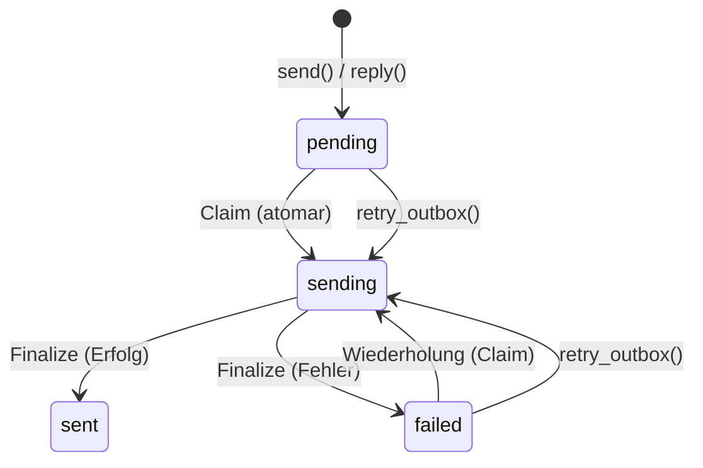

# SMTP-Konfiguration

PRX-Email sendet E-Mails über SMTP mit dem `lettre`-Crate und `rustls` TLS. Die Postausgangs-Pipeline verwendet einen atomaren Claim-Send-Finalize-Workflow, um doppeltes Senden zu verhindern, mit exponentiellem Backoff-Wiederholungsversuch und deterministischen Message-ID-Idempotenzschlüsseln.

## Grundlegendes SMTP-Setup

```rust
use prx_email::plugin::{SmtpConfig, AuthConfig};

let smtp = SmtpConfig {
    host: "smtp.example.com".to_string(),
    port: 465,
    user: "you@example.com".to_string(),
    auth: AuthConfig {
        password: Some("your-app-password".to_string()),
        oauth_token: None,
    },
};
```

### Konfigurationsfelder

| Feld | Typ | Erforderlich | Beschreibung |
|------|-----|-------------|-------------|
| `host` | `String` | Ja | SMTP-Server-Hostname (darf nicht leer sein) |
| `port` | `u16` | Ja | SMTP-Server-Port (465 für implizites TLS, 587 für STARTTLS) |
| `user` | `String` | Ja | SMTP-Benutzername (normalerweise die E-Mail-Adresse) |
| `auth.password` | `Option<String>` | Eines von | Passwort für SMTP AUTH PLAIN/LOGIN |
| `auth.oauth_token` | `Option<String>` | Eines von | OAuth-Zugriffstoken für XOAUTH2 |

## Häufige Provider-Einstellungen

| Provider | Host | Port | Auth-Methode |
|----------|------|------|-------------|
| Gmail | `smtp.gmail.com` | 465 | App-Passwort oder XOAUTH2 |
| Outlook / Office 365 | `smtp.office365.com` | 587 | XOAUTH2 |
| Yahoo | `smtp.mail.yahoo.com` | 465 | App-Passwort |
| Fastmail | `smtp.fastmail.com` | 465 | App-Passwort |

## E-Mail senden

### Einfaches Senden

```rust
use prx_email::plugin::SendEmailRequest;

let response = plugin.send(SendEmailRequest {
    account_id: 1,
    to: "recipient@example.com".to_string(),
    subject: "Hello".to_string(),
    body_text: "Message body here.".to_string(),
    now_ts: now,
    attachment: None,
    failure_mode: None,
});
```

### Auf eine Nachricht antworten

```rust
use prx_email::plugin::ReplyEmailRequest;

let response = plugin.reply(ReplyEmailRequest {
    account_id: 1,
    in_reply_to_message_id: "<original-msg-id@example.com>".to_string(),
    body_text: "Thanks for your message!".to_string(),
    now_ts: now,
    attachment: None,
    failure_mode: None,
});
```

Antworten setzen automatisch:
- Den `In-Reply-To`-Header
- Die `References`-Kette aus der Elternnachricht
- Den Empfänger aus dem Absender der Elternnachricht
- Den Betreff mit dem Präfix `Re:`

## Postausgangs-Pipeline

Die Postausgangs-Pipeline gewährleistet zuverlässige E-Mail-Zustellung durch eine atomare Zustandsmaschine:



### Zustandsmaschinen-Regeln

| Übergang | Bedingung | Guard |
|---------|-----------|-------|
| `pending` -> `sending` | `claim_outbox_for_send()` | `status IN ('pending','failed') AND next_attempt_at <= now` |
| `sending` -> `sent` | Provider akzeptiert | `update_outbox_status_if_current(status='sending')` |
| `sending` -> `failed` | Provider abgelehnt oder Netzwerkfehler | `update_outbox_status_if_current(status='sending')` |
| `failed` -> `sending` | `retry_outbox()` | `status IN ('pending','failed') AND next_attempt_at <= now` |

### Idempotenz

Jede Postausgangs-Nachricht erhält eine deterministische Message-ID:

```
<outbox-{id}-{retries}@prx-email.local>
```

Dies stellt sicher, dass Wiederholungsversuche von der ursprünglichen Sendung unterscheidbar sind, und Provider, die nach Message-ID deduplizieren, jeden Wiederholungsversuch akzeptieren.

### Wiederholungs-Backoff

Fehlgeschlagene Sendungen verwenden exponentiellen Backoff:

```
next_attempt_at = now + base_backoff * 2^retries
```

Mit einem Basis-Backoff von 5 Sekunden:

| Wiederholung | Backoff |
|-------------|---------|
| 1 | 10s |
| 2 | 20s |
| 3 | 40s |
| 4 | 80s |
| 5 | 160s |
| 6 | 320s |
| 7 | 640s |
| 10 | 5.120s (~85 Min.) |

### Manuelle Wiederholung

```rust
use prx_email::plugin::RetryOutboxRequest;

let response = plugin.retry_outbox(RetryOutboxRequest {
    outbox_id: 42,
    now_ts: now,
    failure_mode: None,
});
```

Wiederholung wird abgelehnt, wenn:
- Der Postausgangsstatus `sent` oder `sending` ist (nicht wiederholbar)
- `next_attempt_at` noch nicht erreicht wurde (`retry_not_due`)

## Anhänge

### Senden mit Anhang

```rust
use prx_email::plugin::{SendEmailRequest, AttachmentInput};

let response = plugin.send(SendEmailRequest {
    account_id: 1,
    to: "recipient@example.com".to_string(),
    subject: "Report attached".to_string(),
    body_text: "Please find the report attached.".to_string(),
    now_ts: now,
    attachment: Some(AttachmentInput {
        filename: "report.pdf".to_string(),
        content_type: "application/pdf".to_string(),
        base64: Some(base64_encoded_content),
        path: None,
    }),
    failure_mode: None,
});
```

### Anhang-Richtlinie

Die `AttachmentPolicy` setzt Größen- und MIME-Typ-Einschränkungen durch:

```rust
use prx_email::plugin::AttachmentPolicy;

let policy = AttachmentPolicy {
    max_size_bytes: 25 * 1024 * 1024,  // 25 MiB
    allowed_content_types: [
        "application/pdf",
        "image/jpeg",
        "image/png",
        "text/plain",
        "application/zip",
    ].into_iter().map(String::from).collect(),
};
```

| Regel | Verhalten |
|-------|----------|
| Größe überschreitet `max_size_bytes` | Abgelehnt mit `attachment exceeds size limit` |
| MIME-Typ nicht in `allowed_content_types` | Abgelehnt mit `attachment content type is not allowed` |
| Pfadbasierter Anhang ohne `attachment_store` | Abgelehnt mit `attachment store not configured` |
| Pfad verlässt Speicherwurzel (`../`-Traversal) | Abgelehnt mit `attachment path escapes storage root` |

### Pfadbasierte Anhänge

Für auf der Festplatte gespeicherte Anhänge den Anhang-Speicher konfigurieren:

```rust
use prx_email::plugin::AttachmentStoreConfig;

let store = AttachmentStoreConfig {
    enabled: true,
    dir: "/var/lib/prx-email/attachments".to_string(),
};
```

Die Pfadauflösung enthält Directory-Traversal-Schutz -- jeder Pfad, der außerhalb des konfigurierten Speicherwurzels aufgelöst wird, wird abgelehnt, einschließlich symlink-basierter Ausbrüche.

## API-Antwortformat

Alle Sendeoperationen geben eine `ApiResponse<SendResult>` zurück:

```rust
pub struct SendResult {
    pub outbox_id: i64,
    pub status: String,          // "sent" oder "failed"
    pub retries: i64,
    pub provider_message_id: Option<String>,
    pub next_attempt_at: i64,
}
```

## Nächste Schritte

- [OAuth-Authentifizierung](./oauth) -- XOAUTH2 für Provider einrichten, die es erfordern
- [Konfigurationsreferenz](../configuration/) -- Alle Einstellungen und Umgebungsvariablen
- [Fehlerbehebung](../troubleshooting/) -- Häufige SMTP-Probleme und Lösungen
