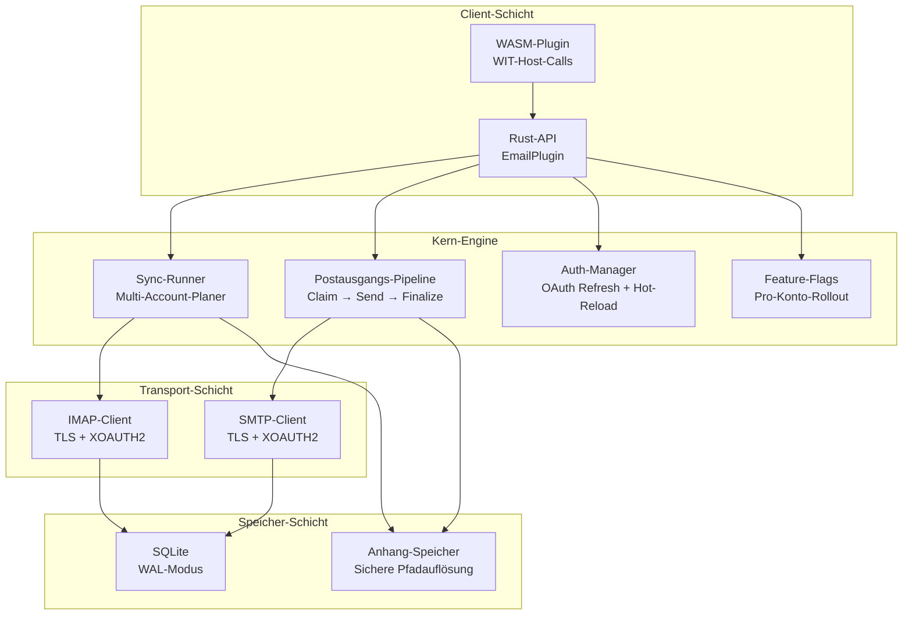

# PRX-Email

**PRX-Email** ist ein selbst gehostetes E-Mail-Client-Plugin in Rust mit SQLite-Persistenz und produktionsgehärteten Primitiven. Es bietet IMAP-Posteingangs-Synchronisation, SMTP-Versand mit einer atomaren Postausgangs-Pipeline, OAuth 2.0-Authentifizierung für Gmail und Outlook, Anhang-Governance und eine WASM-Plugin-Schnittstelle für die Integration in das PRX-Ökosystem.

PRX-Email ist für Entwickler und Teams konzipiert, die ein zuverlässiges, einbettbares E-Mail-Backend benötigen -- eines, das Multi-Account-Synchronisationsplanung, sichere Postausgangslieferung mit Wiederholung und Backoff, OAuth-Token-Lebenszyklus-Management und Feature-Flag-Rollout übernimmt -- alles ohne Abhängigkeit von SaaS-E-Mail-APIs von Drittanbietern.

## Warum PRX-Email?

Die meisten E-Mail-Integrationen basieren auf anbieterspezifischen APIs oder fragilen IMAP/SMTP-Wrappern, die Produktionsaspekte wie doppeltes Senden, Token-Ablauf und Anhang-Sicherheit ignorieren. PRX-Email verfolgt einen anderen Ansatz:

- **Produktionsgehärteter Postausgang.** Atomare Claim-and-Finalize-Zustandsmaschine verhindert doppeltes Senden. Exponentieller Backoff und deterministische Message-ID-Idempotenzschlüssel gewährleisten sichere Wiederholungen.
- **OAuth-first-Authentifizierung.** Natives XOAUTH2-Support für IMAP und SMTP mit Token-Ablauf-Tracking, austauschbaren Refresh-Providern und Hot-Reload aus Umgebungsvariablen.
- **SQLite-natives Speichern.** WAL-Modus, begrenzte Prüfpunkte und parametrisierte Abfragen bieten schnelle, zuverlässige lokale Persistenz ohne externe Datenbankabhängigkeiten.
- **Erweiterbar über WASM.** Das Plugin kompiliert zu WebAssembly und stellt E-Mail-Operationen über WIT-Host-Calls bereit, mit einem Netzwerk-Sicherheitsschalter, der echtes IMAP/SMTP standardmäßig deaktiviert.

## Hauptfunktionen

<div class="vp-features">

- **IMAP-Posteingangs-Synchronisation** -- Verbindung zu jedem IMAP-Server mit TLS. Mehrere Konten und Ordner mit UID-basiertem inkrementellem Abruf und Cursor-Persistenz synchronisieren.

- **SMTP-Postausgangs-Pipeline** -- Atomarer Claim-Send-Finalize-Workflow verhindert doppeltes Senden. Fehlgeschlagene Nachrichten werden mit exponentiellem Backoff und konfigurierbaren Limits erneut versucht.

- **OAuth 2.0-Authentifizierung** -- XOAUTH2 für Gmail und Outlook. Token-Ablauf-Tracking, austauschbare Refresh-Provider und umgebungsbasierter Hot-Reload ohne Neustart.

- **Multi-Account-Synchronisationsplaner** -- Periodisches Polling nach Konto und Ordner mit konfigurierbarer Parallelität, Fehler-Backoff und pro-Lauf-Hard-Caps.

- **SQLite-Persistenz** -- WAL-Modus, NORMAL-Synchronisation, 5s Busy-Timeout. Vollständiges Schema mit Konten, Ordnern, Nachrichten, Postausgang, Synchronisationsstatus und Feature-Flags.

- **Anhang-Governance** -- Maximale Größenlimits, MIME-Whitelist-Durchsetzung und Directory-Traversal-Schutz vor überdimensionierten oder bösartigen Anhängen.

- **Feature-Flag-Rollout** -- Pro-Konto-Feature-Flags mit prozentualem Rollout. Posteingang-Lesen, Suchen, Senden, Antworten und Wiederholung unabhängig steuern.

- **WASM-Plugin-Schnittstelle** -- Zu WebAssembly kompilieren für sandboxed Ausführung in der PRX-Laufzeitumgebung. Host-Calls bieten email.sync, list, get, search, send und reply-Operationen.

- **Beobachtbarkeit** -- In-Memory-Laufzeitmetriken (Sync-Versuche/Erfolge/Fehler, Sendefehler, Wiederholungsanzahl) und strukturierte Log-Nutzdaten mit account, folder, message_id, run_id und error_code.

</div>

## Architektur



## Schnellinstallation

Repository klonen und bauen:

```bash
git clone https://github.com/openprx/prx_email.git
cd prx_email
cargo build --release
```

Oder als Abhängigkeit in der `Cargo.toml` hinzufügen:

```toml
[dependencies]
prx_email = { git = "https://github.com/openprx/prx_email.git" }
```

Vollständige Setup-Anweisungen einschließlich WASM-Plugin-Kompilierung finden sich im [Installationshandbuch](./getting-started/installation).

## Dokumentationsabschnitte

| Abschnitt | Beschreibung |
|-----------|-------------|
| [Installation](./getting-started/installation) | PRX-Email installieren, Abhängigkeiten konfigurieren und WASM-Plugin bauen |
| [Schnellstart](./getting-started/quickstart) | Erstes Konto einrichten und E-Mail in 5 Minuten senden |
| [Kontoverwaltung](./accounts/) | E-Mail-Konten hinzufügen, konfigurieren und verwalten |
| [IMAP-Konfiguration](./accounts/imap) | IMAP-Server-Einstellungen, TLS und Ordner-Synchronisation |
| [SMTP-Konfiguration](./accounts/smtp) | SMTP-Server-Einstellungen, TLS und Sende-Pipeline |
| [OAuth-Authentifizierung](./accounts/oauth) | OAuth 2.0-Setup für Gmail und Outlook |
| [SQLite-Speicher](./storage/) | Datenbankschema, WAL-Modus, Leistungsoptimierung und Wartung |
| [WASM-Plugins](./plugins/) | WASM-Plugin mit WIT-Host-Calls bauen und bereitstellen |
| [Konfigurationsreferenz](./configuration/) | Alle Umgebungsvariablen, Laufzeiteinstellungen und Richtlinienoptionen |
| [Fehlerbehebung](./troubleshooting/) | Häufige Probleme und Lösungen |

## Projektinfo

- **Lizenz:** MIT ODER Apache-2.0
- **Sprache:** Rust (2024 Edition)
- **Repository:** [github.com/openprx/prx_email](https://github.com/openprx/prx_email)
- **Speicher:** SQLite (rusqlite mit bundled Feature)
- **IMAP:** `imap`-Crate mit rustls TLS
- **SMTP:** `lettre`-Crate mit rustls TLS
