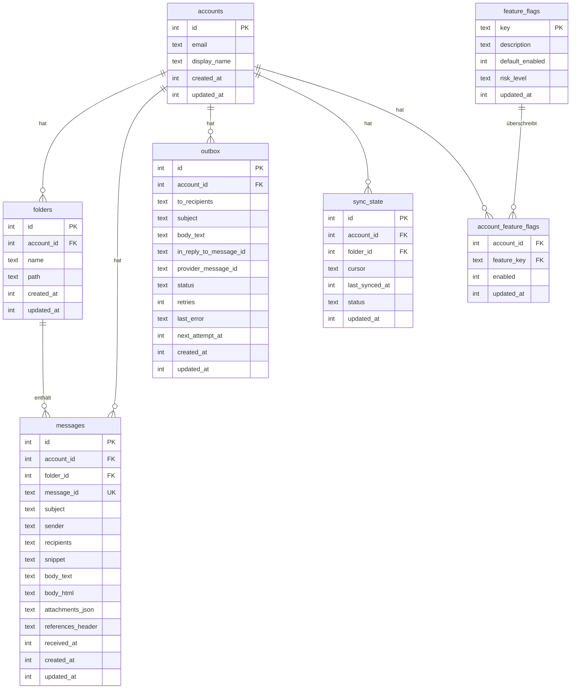

# SQLite-Speicher

PRX-Email verwendet SQLite als einziges Speicher-Backend, zugänglich über das `rusqlite`-Crate mit gebündelter SQLite-Kompilierung. Die Datenbank läuft im WAL-Modus mit aktivierten Fremdschlüsseln und bietet schnelle gleichzeitige Lesevorgänge und zuverlässige Schreib-Isolation.

## Datenbankkonfiguration

### Standardeinstellungen

| Einstellung | Wert | Beschreibung |
|------------|------|-------------|
| `journal_mode` | WAL | Write-Ahead Logging für gleichzeitige Lesevorgänge |
| `synchronous` | NORMAL | Ausgewogene Haltbarkeit/Leistung |
| `foreign_keys` | ON | Referenzielle Integrität erzwingen |
| `busy_timeout` | 5000ms | Wartezeit bei gesperrter Datenbank |
| `wal_autocheckpoint` | 1000 Seiten | Automatischer WAL-Prüfpunkt-Schwellenwert |

### Benutzerdefinierte Konfiguration

```rust
use prx_email::db::{EmailStore, StoreConfig, SynchronousMode};

let config = StoreConfig {
    enable_wal: true,
    busy_timeout_ms: 5_000,
    wal_autocheckpoint_pages: 1_000,
    synchronous: SynchronousMode::Normal,
};

let store = EmailStore::open_with_config("./email.db", &config)?;
```

### Synchronisationsmodi

| Modus | Haltbarkeit | Leistung | Anwendungsfall |
|-------|------------|---------|--------------|
| `Full` | Maximum | Langsamste Schreibvorgänge | Finanz- oder Compliance-Workloads |
| `Normal` | Gut (Standard) | Ausgewogen | Allgemeiner Produktionseinsatz |
| `Off` | Minimal | Schnellste Schreibvorgänge | Nur Entwicklung und Tests |

### In-Memory-Datenbank

Für Tests eine In-Memory-Datenbank verwenden:

```rust
let store = EmailStore::open_in_memory()?;
store.migrate()?;
```

## Schema

Das Datenbankschema wird durch inkrementelle Migrationen angewendet. `store.migrate()` ausführen, um alle ausstehenden Migrationen anzuwenden.

### Tabellen



### Indizes

| Tabelle | Index | Zweck |
|---------|-------|-------|
| `messages` | `(account_id)` | Nachrichten nach Konto filtern |
| `messages` | `(folder_id)` | Nachrichten nach Ordner filtern |
| `messages` | `(subject)` | LIKE-Suche auf Betreffs |
| `messages` | `(account_id, message_id)` | Eindeutigkeitsbeschränkung für UPSERT |
| `outbox` | `(account_id)` | Postausgang nach Konto filtern |
| `outbox` | `(status, next_attempt_at)` | Berechtigte Postausgangs-Datensätze claimen |
| `sync_state` | `(account_id, folder_id)` | Eindeutigkeitsbeschränkung für UPSERT |
| `account_feature_flags` | `(account_id)` | Feature-Flag-Suchen |

## Migrationen

Migrationen sind in das Binary eingebettet und werden der Reihe nach angewendet:

| Migration | Beschreibung |
|-----------|-------------|
| `0001_init.sql` | Accounts-, Folders-, Messages-, Sync_state-Tabellen |
| `0002_outbox.sql` | Outbox-Tabelle für Sende-Pipeline |
| `0003_rollout.sql` | Feature-Flags und Account-Feature-Flags |
| `0005_m41.sql` | M4.1-Schema-Verfeinerungen |
| `0006_m42_perf.sql` | M4.2-Leistungsindizes |

Zusätzliche Spalten (`body_html`, `attachments_json`, `references_header`) werden über `ALTER TABLE` hinzugefügt, falls nicht vorhanden.

## Leistungsoptimierung

### Leselastige Workloads

Für Anwendungen, die viel mehr lesen als schreiben (typische E-Mail-Clients):

```rust
let config = StoreConfig {
    enable_wal: true,              // Gleichzeitige Lesevorgänge
    busy_timeout_ms: 10_000,       // Höheres Timeout für Contention
    wal_autocheckpoint_pages: 2_000, // Weniger häufige Prüfpunkte
    synchronous: SynchronousMode::Normal,
};
```

### Schreiblastige Workloads

Für hochvolumige Synchronisationsoperationen:

```rust
let config = StoreConfig {
    enable_wal: true,
    busy_timeout_ms: 5_000,
    wal_autocheckpoint_pages: 500, // Häufigere Prüfpunkte
    synchronous: SynchronousMode::Normal,
};
```

### Abfrageplan-Analyse

Langsame Abfragen mit `EXPLAIN QUERY PLAN` prüfen:

```sql
EXPLAIN QUERY PLAN
SELECT * FROM messages
WHERE account_id = 1 AND subject LIKE '%invoice%'
ORDER BY received_at DESC LIMIT 50;
```

## Kapazitätsplanung

### Wachstumstreiber

| Tabelle | Wachstumsmuster | Aufbewahrungsstrategie |
|---------|----------------|----------------------|
| `messages` | Dominante Tabelle; wächst mit jeder Synchronisation | Alte Nachrichten regelmäßig bereinigen |
| `outbox` | Akkumuliert gesendete + fehlgeschlagene Historie | Alte gesendete Datensätze löschen |
| WAL-Datei | Spitzen bei Schreib-Bursts | Automatischer Prüfpunkt |

### Überwachungsschwellenwerte

- DB-Dateigröße und WAL-Größe unabhängig verfolgen
- Alarm, wenn WAL über mehrere Prüfpunkte hinweg groß bleibt
- Alarm, wenn fehlgeschlagener Postausgangs-Rückstand operatives SLO überschreitet

## Datenwartung

### Bereinigungshilfen

```rust
// Gesendete Postausgangs-Datensätze älter als 30 Tage löschen
let cutoff = now - 30 * 86400;
let deleted = repo.delete_sent_outbox_before(cutoff)?;
println!("Deleted {} old sent records", deleted);

// Nachrichten älter als 90 Tage löschen
let cutoff = now - 90 * 86400;
let deleted = repo.delete_old_messages_before(cutoff)?;
println!("Deleted {} old messages", deleted);
```

### Wartungs-SQL

Postausgangs-Status-Verteilung prüfen:

```sql
SELECT status, COUNT(*) FROM outbox GROUP BY status;
```

Nachrichten-Altersverteilung:

```sql
SELECT
  CASE
    WHEN received_at >= strftime('%s','now') - 86400 THEN 'lt_1d'
    WHEN received_at >= strftime('%s','now') - 604800 THEN 'lt_7d'
    ELSE 'ge_7d'
  END AS age_bucket,
  COUNT(*)
FROM messages
GROUP BY age_bucket;
```

WAL-Prüfpunkt und Komprimierung:

```sql
PRAGMA wal_checkpoint(TRUNCATE);
VACUUM;
```

::: warning VACUUM
`VACUUM` baut die gesamte Datenbankdatei neu auf und benötigt freien Speicherplatz in Höhe der Datenbankgröße. In einem Wartungsfenster nach großen Löschvorgängen ausführen.
:::

## SQL-Sicherheit

Alle Datenbankabfragen verwenden parametrisierte Anweisungen, um SQL-Injection zu verhindern:

```rust
// Sicher: parametrisierte Abfrage
conn.execute(
    "SELECT * FROM messages WHERE account_id = ?1 AND message_id = ?2",
    params![account_id, message_id],
)?;
```

Dynamische Bezeichner (Tabellennamen, Spaltennamen) werden gegen `^[a-zA-Z_][a-zA-Z0-9_]{0,62}$` validiert, bevor sie in SQL-Strings verwendet werden.

## Nächste Schritte

- [Konfigurationsreferenz](../configuration/) -- Alle Laufzeiteinstellungen
- [Fehlerbehebung](../troubleshooting/) -- Datenbankbezogene Probleme
- [IMAP-Konfiguration](../accounts/imap) -- Synchronisations-Datenfluss verstehen
