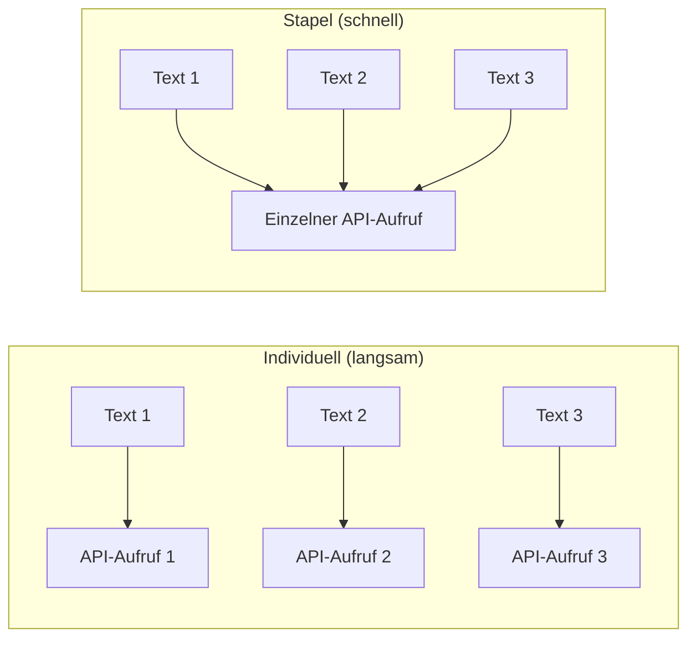

# Stapelverarbeitung

Bei der Arbeit mit großen Speichersätzen ist das einzelne Einbetten jeweils eines Textes ineffizient. PRX-Memory unterstützt Batch-Embedding, um API-Round-Trips zu reduzieren und den Durchsatz zu verbessern.

## Funktionsweise des Batch-Embeddings

Anstatt individuelle API-Aufrufe für jede Erinnerung zu machen, gruppiert die Stapelverarbeitung mehrere Texte in einer einzigen Anfrage. Die meisten Embedding-Provider unterstützen Stapelgrößen von 100--2048 Texten pro Aufruf.



## Anwendungsfälle

### Erstimport

Beim Import eines großen Satzes vorhandenen Wissens `memory_import` verwenden, um Erinnerungen zu laden und Batch-Embedding auszulösen:

```json
{
  "jsonrpc": "2.0",
  "id": 1,
  "method": "tools/call",
  "params": {
    "name": "memory_import",
    "arguments": {
      "data": "... exported memory JSON ..."
    }
  }
}
```

### Neu-Embedding nach Modellwechsel

Beim Wechsel zu einem neuen Embedding-Modell verarbeitet das `memory_reembed`-Tool alle gespeicherten Erinnerungen in Stapeln:

```json
{
  "jsonrpc": "2.0",
  "id": 1,
  "method": "tools/call",
  "params": {
    "name": "memory_reembed",
    "arguments": {}
  }
}
```

### Speicherkomprimierung

Das `memory_compact`-Tool optimiert den Speicher und kann Neu-Embedding für Einträge mit veralteten oder fehlenden Vektoren auslösen:

```json
{
  "jsonrpc": "2.0",
  "id": 1,
  "method": "tools/call",
  "params": {
    "name": "memory_compact",
    "arguments": {}
  }
}
```

## Leistungstipps

| Tipp | Beschreibung |
|------|-------------|
| Stapelfreundliche Provider verwenden | Jina und OpenAI-kompatible Endpunkte unterstützen große Stapelgrößen |
| Bei geringer Nutzung planen | Stapeloperationen konkurrieren mit dem gleichen API-Kontingent wie Echtzeit-Abfragen |
| Via Metriken überwachen | Den `/metrics`-Endpunkt verwenden, um Embedding-Aufrufanzahlen und Latenzen zu verfolgen |
| Effiziente Modelle wählen | Kleinere Modelle (768 Dimensionen) betten schneller ein als größere (3072 Dimensionen) |

## Ratenlimitierung

Die meisten Embedding-Provider erzwingen Ratenlimits. PRX-Memory behandelt Ratenlimit-Antworten (HTTP 429) mit automatischem Backoff. Bei anhaltender Ratenlimitierung:

- Die Stapelgröße reduzieren, indem weniger Erinnerungen auf einmal verarbeitet werden.
- Einen Provider mit höheren Ratenlimits verwenden.
- Stapeloperationen über einen längeren Zeitraum verteilen.

::: tip
Für groß angelegte Neu-Embedding-Operationen einen lokalen Inferenzserver in Betracht ziehen, um Ratenlimits vollständig zu vermeiden. `PRX_EMBED_PROVIDER=openai-compatible` setzen und `PRX_EMBED_BASE_URL` auf den lokalen Server zeigen lassen.
:::

## Nächste Schritte

- [Unterstützte Modelle](./models) -- Das richtige Embedding-Modell wählen
- [Speicher-Backends](../storage/) -- Wo Vektoren gespeichert werden
- [Konfigurationsreferenz](../configuration/) -- Alle Umgebungsvariablen
