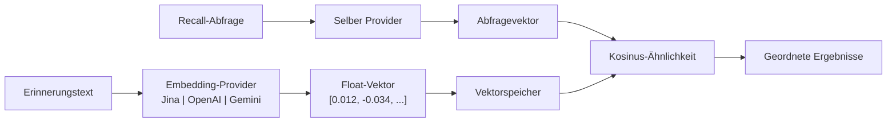

# Embedding-Engine

Die Embedding-Engine ist das Fundament der semantischen Retrieval-Fähigkeit von PRX-Memory. Sie konvertiert Text-Erinnerungen in hochdimensionale Vektoren, die Bedeutung erfassen und ähnlichkeitsbasierte Suche ermöglichen, die über Keyword-Matching hinausgeht.

## Funktionsweise

Wenn eine Erinnerung mit aktiviertem Embedding gespeichert wird, führt PRX-Memory folgendes aus:

1. Sendet den Erinnerungstext an den konfigurierten Embedding-Provider.
2. Empfängt eine Vektordarstellung (typischerweise 768--3072 Dimensionen).
3. Speichert den Vektor neben den Erinnerungsmetadaten.
4. Verwendet den Vektor für Kosinus-Ähnlichkeitssuche beim Recall.



## Provider-Architektur

Das `prx-memory-embed`-Crate definiert ein Provider-Trait, das alle Embedding-Backends implementieren. Dieses Design ermöglicht den Wechsel zwischen Providern ohne Änderung des Anwendungscodes.

Unterstützte Provider:

| Provider | Umgebungsschlüssel | Beschreibung |
|----------|-------------------|-------------|
| OpenAI-kompatibel | `PRX_EMBED_PROVIDER=openai-compatible` | Jede OpenAI-kompatible API (OpenAI, Azure, lokale Server) |
| Jina | `PRX_EMBED_PROVIDER=jina` | Jina-AI-Embedding-Modelle |
| Gemini | `PRX_EMBED_PROVIDER=gemini` | Google-Gemini-Embedding-Modelle |

## Konfiguration

Provider und Zugangsdaten über Umgebungsvariablen setzen:

```bash
PRX_EMBED_PROVIDER=jina
PRX_EMBED_API_KEY=your_api_key
PRX_EMBED_MODEL=jina-embeddings-v3
PRX_EMBED_BASE_URL=https://api.jina.ai  # optional, für benutzerdefinierte Endpunkte
```

::: tip Provider-Fallback-Schlüssel
Wenn `PRX_EMBED_API_KEY` nicht gesetzt ist, greift das System auf provider-spezifische Schlüssel zurück:
- Jina: `JINA_API_KEY`
- Gemini: `GEMINI_API_KEY`
:::

## Wann Embeddings aktivieren

| Szenario | Embeddings benötigt? |
|----------|---------------------|
| Kleiner Speichersatz (<100 Einträge) | Optional -- lexikalische Suche kann ausreichen |
| Großer Speichersatz (1000+ Einträge) | Empfohlen -- Vektorähnlichkeit verbessert Recall erheblich |
| Abfragen in natürlicher Sprache | Empfohlen -- erfasst semantische Bedeutung |
| Exakte Tag/Scope-Filterung | Nicht erforderlich -- lexikalische Suche behandelt dies |
| Sprachübergreifender Recall | Empfohlen -- mehrsprachige Modelle funktionieren sprachübergreifend |

## Leistungsmerkmale

- **Latenz:** 50--200ms pro Embedding-Aufruf je nach Provider und Modell.
- **Stapelmodus:** Mehrere Texte in einem einzigen API-Aufruf gruppieren, um Round Trips zu reduzieren.
- **Lokales Caching:** Vektoren werden lokal gespeichert und wiederverwendet; nur neue oder geänderte Erinnerungen erfordern Embedding-Aufrufe.
- **100k-Benchmark:** p95-Retrieval unter 123ms für Lexical+Importance+Recency-Recall bei 100.000 Einträgen (ohne Netzwerkaufrufe).

## Nächste Schritte

- [Unterstützte Modelle](./models) -- Detaillierter Modellvergleich
- [Stapelverarbeitung](./batch-processing) -- Effizientes Massen-Embedding
- [Reranking](../reranking/) -- Zweistufiges Reranking für bessere Präzision
