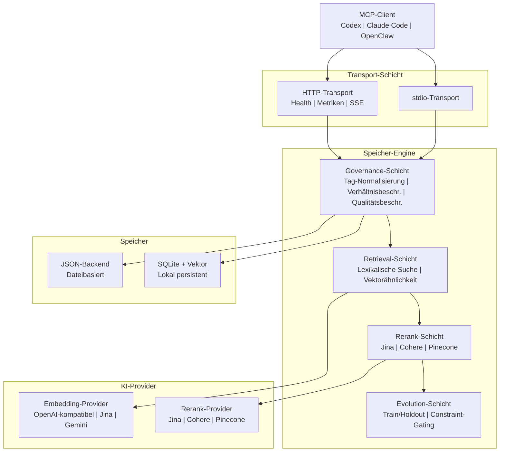

# PRX-Memory

**PRX-Memory** ist eine lokale semantische Speicher-Engine für Coding-Agenten. Sie kombiniert Embedding-basiertes Retrieval, Reranking, Governance-Kontrollen und messbare Evolution in einer einzelnen MCP-kompatiblen Komponente. PRX-Memory wird als eigenständiger Daemon (`prx-memoryd`) geliefert, der über stdio oder HTTP kommuniziert und mit Codex, Claude Code, OpenClaw, OpenPRX und jedem anderen MCP-Client kompatibel ist.

PRX-Memory konzentriert sich auf **wiederverwendbares Engineering-Wissen**, nicht auf rohe Protokolle. Das System speichert strukturierte Erinnerungen mit Tags, Scopes und Wichtigkeitsbewertungen und ruft sie mit einer Kombination aus lexikalischer Suche, Vektorähnlichkeit und optionalem Reranking ab -- alles durch Qualitäts- und Sicherheitseinschränkungen gesteuert.

## Warum PRX-Memory?

Die meisten Coding-Agenten behandeln Speicher als Nachgedanken -- flache Dateien, unstrukturierte Protokolle oder anbietergebundene Cloud-Dienste. PRX-Memory verfolgt einen anderen Ansatz:

- **Lokal zuerst.** Alle Daten bleiben auf Ihrem Computer. Keine Cloud-Abhängigkeit, keine Telemetrie, keine Daten verlassen Ihr Netzwerk.
- **Strukturiert und gesteuert.** Jeder Speichereintrag folgt einem standardisierten Format mit Tags, Scopes, Kategorien und Qualitätseinschränkungen. Tag-Normalisierung und Verhältnisbeschränkungen verhindern Drift.
- **Semantisches Retrieval.** Kombiniert lexikalisches Matching mit Vektorähnlichkeit und optionalem Reranking, um die relevantesten Erinnerungen für einen gegebenen Kontext zu finden.
- **Messbare Evolution.** Das `memory_evolve`-Tool verwendet Train/Holdout-Splits und Constraint-Gating, um Kandidatenverbesserungen zu akzeptieren oder abzulehnen -- kein Rätselraten.
- **MCP-nativ.** Erstklassige Unterstützung für das Model Context Protocol über stdio und HTTP-Transporte, mit Ressourcentemplates, Skill-Manifesten und Streaming-Sitzungen.

## Hauptfunktionen

- **Multi-Provider-Embedding** -- Unterstützt OpenAI-kompatible, Jina- und Gemini-Embedding-Provider durch eine einheitliche Adapter-Schnittstelle. Provider durch Änderung einer Umgebungsvariablen wechseln.

- **Reranking-Pipeline** -- Optionales zweistufiges Reranking mit Jina-, Cohere- oder Pinecone-Rerankern zur Verbesserung der Retrieval-Präzision über rohe Vektorähnlichkeit hinaus.

- **Governance-Kontrollen** -- Strukturiertes Speicherformat mit Tag-Normalisierung, Verhältnisbeschränkungen, periodischer Wartung und Qualitätseinschränkungen sorgen für dauerhaft hohe Speicherqualität.

- **Speicher-Evolution** -- Das `memory_evolve`-Tool bewertet Kandidatenänderungen mithilfe von Train/Holdout-Akzeptanztests und Constraint-Gating und bietet messbare Verbesserungsgarantien.

- **Dual-Transport-MCP-Server** -- Als stdio-Server für direkte Integration oder als HTTP-Server mit Integritätsprüfungen, Prometheus-Metriken und Streaming-Sitzungen betreiben.

- **Skill-Verteilung** -- Eingebaute Governance-Skill-Pakete, die über MCP-Ressourcen- und Tool-Protokolle auffindbar sind, mit Nutzlastvorlagen für standardisierte Speicheroperationen.

- **Beobachtbarkeit** -- Prometheus-Metriken-Endpunkt, Grafana-Dashboard-Vorlagen, konfigurierbare Alarmschwellenwerte und Kardinalitätskontrollen für Produktionsbereitstellungen.

## Architektur



## Schnellstart

Daemon erstellen und ausführen:

```bash
cargo build -p prx-memory-mcp --bin prx-memoryd

PRX_MEMORYD_TRANSPORT=stdio \
PRX_MEMORY_DB=./data/memory-db.json \
./target/debug/prx-memoryd
```

Oder über Cargo installieren:

```bash
cargo install prx-memory-mcp
```

Siehe den [Installationsleitfaden](./getting-started/installation) für alle Methoden und Konfigurationsoptionen.

## Workspace-Crates

| Crate | Beschreibung |
|-------|-------------|
| `prx-memory-core` | Kern-Bewertungs- und Evolutionsdomänen-Primitive |
| `prx-memory-embed` | Embedding-Provider-Abstraktion und Adapter |
| `prx-memory-rerank` | Rerank-Provider-Abstraktion und Adapter |
| `prx-memory-ai` | Einheitliche Provider-Abstraktion für Embeddings und Reranking |
| `prx-memory-skill` | Eingebaute Governance-Skill-Nutzlasten |
| `prx-memory-storage` | Lokale persistente Speicher-Engine (JSON, SQLite, LanceDB) |
| `prx-memory-mcp` | MCP-Server-Oberfläche mit stdio- und HTTP-Transporten |

## Dokumentationsabschnitte

| Abschnitt | Beschreibung |
|-----------|-------------|
| [Installation](./getting-started/installation) | Aus dem Quellcode erstellen oder über Cargo installieren |
| [Schnellstart](./getting-started/quickstart) | PRX-Memory in 5 Minuten zum Laufen bringen |
| [Embedding-Engine](./embedding/) | Embedding-Provider und Stapelverarbeitung |
| [Unterstützte Modelle](./embedding/models) | OpenAI-kompatibel, Jina, Gemini-Modelle |
| [Reranking-Engine](./reranking/) | Zweistufige Reranking-Pipeline |
| [Speicher-Backends](./storage/) | JSON, SQLite und Vektorsuche |
| [MCP-Integration](./mcp/) | MCP-Protokoll, Tools, Ressourcen und Vorlagen |
| [Rust-API-Referenz](./api/) | Bibliotheks-API zum Einbetten von PRX-Memory in Rust-Projekte |
| [Konfiguration](./configuration/) | Alle Umgebungsvariablen und Profile |
| [Fehlerbehebung](./troubleshooting/) | Häufige Probleme und Lösungen |

## Projektinfo

- **Lizenz:** MIT OR Apache-2.0
- **Sprache:** Rust (2024 Edition)
- **Repository:** [github.com/openprx/prx-memory](https://github.com/openprx/prx-memory)
- **Mindest-Rust:** Stable Toolchain
- **Transporte:** stdio, HTTP
