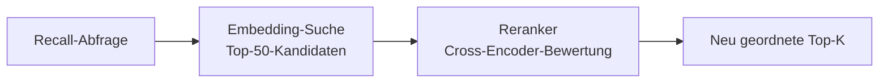

# Reranking-Engine

Reranking ist ein optionaler zweistufiger Retrieval-Schritt, der Kandidatenergebnisse mit einem dedizierten Cross-Encoder-Modell neu ordnet. Während Embedding-basiertes Retrieval schnell ist, arbeitet es mit vorberechneten Vektoren, die möglicherweise keine feinkörnige Relevanz erfassen. Reranking wendet ein leistungsfähigeres Modell auf einen kleineren Kandidatensatz an und verbessert die Präzision erheblich.

## Funktionsweise

1. **Erste Stufe (Retrieval):** Vektorähnlichkeitssuche gibt einen breiten Satz von Kandidaten zurück (z.B. Top 50).
2. **Zweite Stufe (Reranking):** Ein Cross-Encoder-Modell bewertet jeden Kandidaten gegen die Abfrage und erzeugt ein verfeinerte Ranking.
3. **Endergebnis:** Die Top-k neu geordneten Ergebnisse werden an den Aufrufer zurückgegeben.



## Warum Reranking wichtig ist

| Metrik | Ohne Reranking | Mit Reranking |
|--------|----------------|--------------|
| Recall-Abdeckung | Hoch (breites Retrieval) | Gleich (unverändert) |
| Präzision bei Top-5 | Moderat | Erheblich verbessert |
| Latenz | Niedriger (~50ms) | Höher (~150ms zusätzlich) |
| API-Kosten | Nur Embedding | Embedding + Reranking |

Reranking ist am wertvollsten wenn:

- Die Speicherdatenbank groß ist (1000+ Einträge).
- Abfragen mehrdeutig oder in natürlicher Sprache sind.
- Präzision am Anfang der Ergebnisliste wichtiger als Latenz ist.

## Unterstützte Provider

| Provider | Konfigurationswert | Beschreibung |
|----------|-------------------|-------------|
| Jina | `PRX_RERANK_PROVIDER=jina` | Jina-AI-Reranker-Modelle |
| Cohere | `PRX_RERANK_PROVIDER=cohere` | Cohere-Rerank-API |
| Pinecone | `PRX_RERANK_PROVIDER=pinecone` | Pinecone-Rerank-Dienst |
| Pinecone-kompatibel | `PRX_RERANK_PROVIDER=pinecone-compatible` | Benutzerdefinierte Pinecone-kompatible Endpunkte |
| Keiner | `PRX_RERANK_PROVIDER=none` | Reranking deaktivieren |

## Konfiguration

```bash
PRX_RERANK_PROVIDER=cohere
PRX_RERANK_API_KEY=your_cohere_key
PRX_RERANK_MODEL=rerank-v3.5
```

::: tip Provider-Fallback-Schlüssel
Wenn `PRX_RERANK_API_KEY` nicht gesetzt ist, greift das System auf provider-spezifische Schlüssel zurück:
- Jina: `JINA_API_KEY`
- Cohere: `COHERE_API_KEY`
- Pinecone: `PINECONE_API_KEY`
:::

## Reranking deaktivieren

Um ohne Reranking zu betreiben, entweder die Variable `PRX_RERANK_PROVIDER` weglassen oder explizit setzen:

```bash
PRX_RERANK_PROVIDER=none
```

Recall funktioniert weiterhin mit lexikalischem Matching und Vektorähnlichkeit ohne die Reranking-Stufe.

## Nächste Schritte

- [Reranking-Modelle](./models) -- Detaillierter Modellvergleich
- [Embedding-Engine](../embedding/) -- Erste-Stufe-Retrieval
- [Konfigurationsreferenz](../configuration/) -- Alle Umgebungsvariablen
