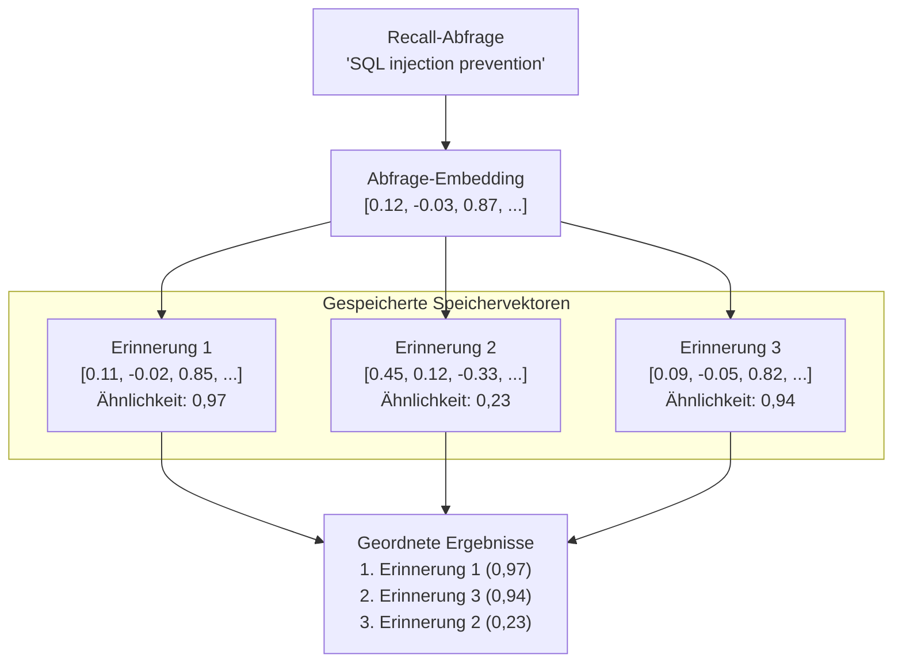

# Vektorsuche

Vektorsuche ist der Kernmechanismus, der semantisches Speicher-Retrieval in PRX-Memory ermöglicht. Anstatt Schlüsselwörter abzugleichen, vergleicht die Vektorsuche die mathematische Ähnlichkeit zwischen Abfrage- und Speicher-Embeddings, um konzeptuell verwandte Ergebnisse zu finden.

## Funktionsweise

1. **Abfrage-Embedding:** Die Recall-Abfrage wird an den konfigurierten Embedding-Provider gesendet und erzeugt einen Vektor.
2. **Ähnlichkeitsberechnung:** Der Abfragevektor wird mit allen gespeicherten Speichervektoren unter Verwendung von Kosinus-Ähnlichkeit verglichen.
3. **Bewertung:** Jede Erinnerung erhält einen Ähnlichkeitsscore zwischen -1,0 und 1,0 (höher ist ähnlicher).
4. **Ranking:** Ergebnisse werden nach Score sortiert und mit anderen Signalen kombiniert (lexikalisches Matching, Wichtigkeit, Aktualität).



## Kosinus-Ähnlichkeit

PRX-Memory verwendet Kosinus-Ähnlichkeit als Distanzmetrik. Kosinus-Ähnlichkeit misst den Winkel zwischen zwei Vektoren, unabhängig von der Magnitude:

```
similarity(A, B) = (A . B) / (|A| * |B|)
```

| Score | Bedeutung |
|-------|-----------|
| 0,95--1,0 | Fast identische Bedeutung |
| 0,80--0,95 | Stark verwandt |
| 0,60--0,80 | Etwas verwandt |
| < 0,60 | Wahrscheinlich nicht verwandt |

## Kombiniertes Ranking

Vektorähnlichkeit ist ein Signal in PRX-Memorys Multi-Signal-Ranking. Der finale Score kombiniert:

| Signal | Gewichtung | Beschreibung |
|--------|-----------|-------------|
| Vektorähnlichkeit | Hoch | Semantische Relevanz aus Embedding-Vergleich |
| Lexikalisches Matching | Mittel | Keyword-Überlappung zwischen Abfrage und Erinnerungstext |
| Wichtigkeitsscore | Mittel | Benutzer-zugewiesene oder systemberechnete Wichtigkeit |
| Aktualität | Niedrig | Neuere Erinnerungen erhalten einen kleinen Bonus |

Die genaue Gewichtung hängt von der Recall-Konfiguration und davon ab, ob Embeddings und Reranking aktiviert sind.

## Leistung

Der 100k-Eintrags-Benchmark zeigt:

| Metrik | Wert |
|--------|------|
| Datensatzgröße | 100.000 Einträge |
| p95-Latenz | 122,683ms |
| Schwellenwert | < 300ms |
| Methode | Lexikalisch + Wichtigkeit + Aktualität (ohne Netzwerkaufrufe) |

::: info
Dieser Benchmark misst nur den Retrieval-Ranking-Pfad, ohne Netzwerk-Embedding- oder Rerank-Aufrufe. Die End-to-End-Latenz hängt von den Provider-Antwortzeiten ab.
:::

## Skalierungsüberlegungen

| Datensatzgröße | Empfohlener Ansatz |
|---------------|-------------------|
| < 10.000 | Brute-Force-Kosinus-Ähnlichkeit (JSON- oder SQLite-Backend) |
| 10.000--100.000 | SQLite mit In-Memory-Vektorscan |
| > 100.000 | LanceDB mit ANN-Indizierung |

Für Datensätze über 100.000 Einträge das LanceDB-Backend für Approximate-Nearest-Neighbor (ANN)-Suche aktivieren, das sub-lineare Abfragezeit bietet.

## Nächste Schritte

- [Embedding-Engine](../embedding/) -- Wie Vektoren generiert werden
- [Reranking](../reranking/) -- Zweistufige Präzisionsverbesserung
- [Speicher-Backends](./index) -- Das richtige Speicher-Backend wählen
