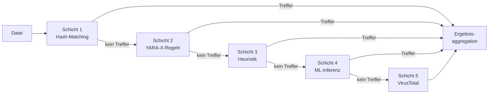

# Erkennungsengine

PRX-SD verwendet eine mehrschichtige Erkennungspipeline zur Identifikation von Malware. Jede Schicht verwendet eine andere Technik, und sie werden der Reihe nach von der schnellsten bis zur gründlichsten ausgeführt. Dieser Defense-in-Depth-Ansatz stellt sicher, dass nachfolgende Schichten eine Bedrohung erkennen können, selbst wenn eine Schicht sie übersieht.

## Pipeline-Übersicht

Die Erkennungspipeline verarbeitet jede Datei durch bis zu fünf Schichten:



## Schichten-Zusammenfassung

| Schicht | Engine | Geschwindigkeit | Abdeckung | Erforderlich |
|---------|--------|-----------------|-----------|--------------|
| **Schicht 1** | LMDB Hash-Matching | ~1 Mikrosekunde/Datei | Bekannte Malware (exakter Treffer) | Ja (Standard) |
| **Schicht 2** | YARA-X-Regel-Scan | ~0,3 ms/Datei | Musterbasiert (38.800+ Regeln) | Ja (Standard) |
| **Schicht 3** | Heuristische Analyse | ~1-5 ms/Datei | Verhaltens-Indikatoren nach Dateityp | Ja (Standard) |
| **Schicht 4** | ONNX ML-Inferenz | ~10-50 ms/Datei | Neuartige/polymorphe Malware | Optional (`--features ml`) |
| **Schicht 5** | VirusTotal API | ~200-500 ms/Datei | 70+ Anbieter-Konsens | Optional (`--features virustotal`) |

## Schicht 1: Hash-Matching

Die schnellste Schicht. PRX-SD berechnet den SHA-256-Hash jeder Datei und sucht ihn in einer LMDB-Datenbank mit bekannten Malware-Hashes. LMDB bietet O(1)-Lookup-Zeit mit speichergemapptem I/O, was diese Schicht hinsichtlich Performance praktisch kostenlos macht.

**Datenquellen:**
- abuse.ch MalwareBazaar (letzte 48 Stunden, alle 5 Minuten aktualisiert)
- abuse.ch URLhaus (stündliche Updates)
- abuse.ch Feodo Tracker (Emotet/Dridex/TrickBot, alle 5 Minuten)
- abuse.ch ThreatFox (IOC-Sharing-Plattform)
- VirusShare (20M+ MD5-Hashes, optionales `--full`-Update)
- Eingebaute Blocklist (EICAR, WannaCry, NotPetya, Emotet und mehr)

Ein Hash-Treffer ergibt sofort ein `MALICIOUS`-Urteil. Die restlichen Schichten werden für diese Datei übersprungen.

Weitere Informationen finden Sie unter [Hash-Matching](./hash-matching).

## Schicht 2: YARA-X-Regeln

Wenn kein Hash-Treffer gefunden wird, wird die Datei gegen 38.800+ YARA-Regeln mit der YARA-X-Engine gescannt (der nächsten Generation Rust-Neuentwicklung von YARA). Regeln erkennen Malware durch Abgleich von Byte-Mustern, Strings und strukturellen Bedingungen innerhalb des Dateiinhalts.

**Regelquellen:**
- 64 eingebaute Regeln (Ransomware, Trojaner, Backdoors, Rootkits, Miner, Webshells)
- Yara-Rules/rules (Community-gepflegt, GitHub)
- Neo23x0/signature-base (hochwertige APT- und Commodity-Malware-Regeln)
- ReversingLabs YARA (kommerziell-grade Open-Source-Regeln)
- ESET IOC (Tracking fortgeschrittener anhaltender Bedrohungen)
- InQuest (Dokument-Malware: OLE, DDE, bösartige Makros)

Ein YARA-Regel-Treffer ergibt ein `MALICIOUS`-Urteil mit dem Regelnamen im Bericht.

Weitere Informationen finden Sie unter [YARA-Regeln](./yara-rules).

## Schicht 3: Heuristische Analyse

Dateien, die Hash- und YARA-Prüfungen bestehen, werden mit dateityp-bewussten Heuristiken analysiert. PRX-SD identifiziert den Dateityp über Magic-Number-Erkennung und wendet zielgerichtete Prüfungen an:

| Dateityp | Heuristische Prüfungen |
|----------|----------------------|
| PE (Windows) | Abschnitts-Entropie, verdächtige API-Imports, Packer-Erkennung, Zeitstempel-Anomalien |
| ELF (Linux) | Abschnitts-Entropie, LD_PRELOAD-Referenzen, Cron/Systemd-Persistenz, SSH-Backdoor-Muster |
| Mach-O (macOS) | Abschnitts-Entropie, Dylib-Injektion, LaunchAgent-Persistenz, Keychain-Zugriff |
| Office (docx/xlsx) | VBA-Makros, DDE-Felder, externe Template-Links, Auto-Execute-Trigger |
| PDF | Eingebettetes JavaScript, Launch-Aktionen, URI-Aktionen, verschleierte Streams |

Jede Prüfung trägt zu einem kumulativen Score bei:

| Score | Urteil |
|-------|--------|
| 0 - 29 | **Sauber** |
| 30 - 59 | **Verdächtig** -- manuelle Überprüfung empfohlen |
| 60 - 100 | **Bösartig** -- hochwahrscheinliche Bedrohung |

Weitere Informationen finden Sie unter [Heuristische Analyse](./heuristics).

## Schicht 4: ML-Inferenz (Optional)

Wenn mit der `ml`-Funktion kompiliert, kann PRX-SD Dateien durch ein ONNX-Machine-Learning-Modell führen, das auf Millionen von Malware-Samples trainiert wurde. Diese Schicht ist besonders effektiv bei der Erkennung neuartiger und polymorpher Malware, die signaturbasierte Erkennung umgeht.

```bash
# Mit ML-Unterstützung erstellen
cargo build --release --features ml
```

Das ML-Modell läuft lokal mit ONNX Runtime. Keine Cloud-Verbindung erforderlich.

::: tip Wann ML verwenden
ML-Inferenz fügt Latenz hinzu (~10-50 ms pro Datei). Aktivieren Sie es für gezielte Scans verdächtiger Dateien oder Verzeichnisse, nicht für vollständige Datenträger-Scans, bei denen die ersten drei Schichten ausreichende Abdeckung bieten.
:::

## Schicht 5: VirusTotal (Optional)

Wenn mit der `virustotal`-Funktion kompiliert und mit einem API-Schlüssel konfiguriert, kann PRX-SD Datei-Hashes an VirusTotal für Konsens von 70+ Antivirus-Anbietern übermitteln.

```bash
# Mit VirusTotal-Unterstützung erstellen
cargo build --release --features virustotal

# API-Schlüssel konfigurieren
sd config set virustotal.api_key "YOUR_API_KEY"
```

::: warning Ratenbeschränkungen
Die kostenlose VirusTotal-API erlaubt 4 Anfragen pro Minute und 500 pro Tag. PRX-SD respektiert diese Limits automatisch. Diese Schicht wird am besten als abschließender Bestätigungsschritt verwendet, nicht für Massen-Scans.
:::

## Ergebnisaggregation

Wenn eine Datei durch mehrere Schichten gescannt wird, wird das endgültige Urteil durch den **höchsten Schweregrad** bestimmt, der über alle Schichten gefunden wurde:

```
BÖSARTIG > VERDÄCHTIG > SAUBER
```

Wenn Schicht 1 `MALICIOUS` zurückgibt, wird die Datei als bösartig gemeldet, unabhängig davon, was andere Schichten möglicherweise sagen. Wenn Schicht 3 `SUSPICIOUS` zurückgibt und keine andere Schicht `MALICIOUS` zurückgibt, wird die Datei als verdächtig gemeldet.

Der Scan-Bericht enthält Details aus jeder Schicht, die einen Befund erzeugt hat, und gibt dem Analysten vollständigen Kontext.

## Schichten deaktivieren

Für spezielle Anwendungsfälle können einzelne Schichten deaktiviert werden:

```bash
# Nur Hash-Scan (schnellste, nur bekannte Bedrohungen)
sd scan /path --no-yara --no-heuristics

# Heuristik überspringen (nur Hash + YARA)
sd scan /path --no-heuristics
```

## Nächste Schritte

- [Hash-Matching](./hash-matching) -- Tiefgreifende Untersuchung der LMDB-Hash-Datenbank
- [YARA-Regeln](./yara-rules) -- Regelquellen und benutzerdefinierte Regelverwaltung
- [Heuristische Analyse](./heuristics) -- Dateityp-bewusste Verhaltens-Prüfungen
- [Unterstützte Dateitypen](./file-types) -- Dateiformat-Matrix und Magic-Erkennung
