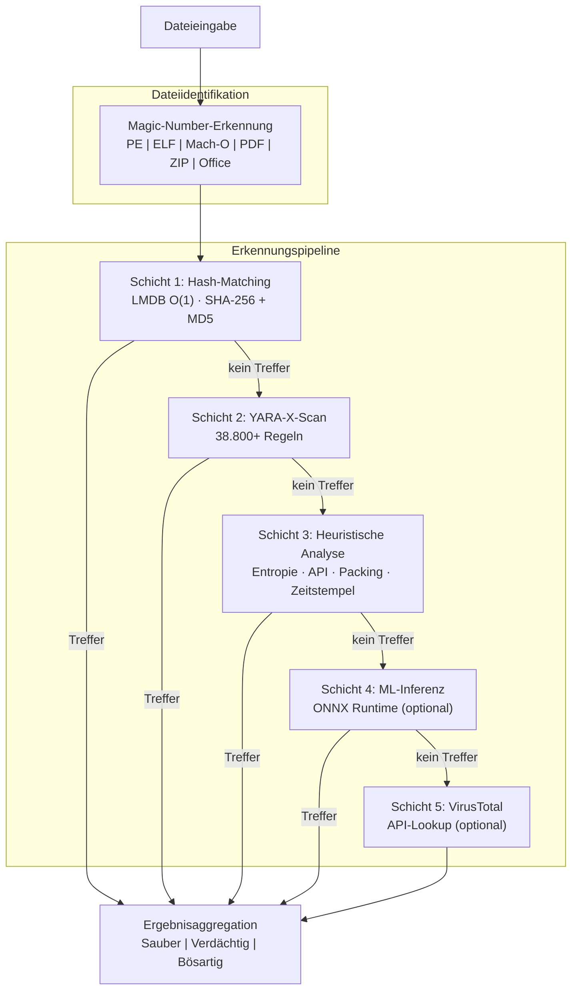

# PRX-SD

**PRX-SD** ist eine leistungsstarke, quelloffene Antivirus-Engine, geschrieben in Rust. Sie kombiniert hash-basiertes Signatur-Matching, 38.800+ YARA-Regeln, dateityp-bewusste heuristische Analyse und optionale ML-Inferenz zu einer einzigen mehrschichtigen Erkennungspipeline. PRX-SD wird als Kommandozeilen-Tool (`sd`), als System-Daemon für Echtzeitschutz und als Tauri + Vue 3 Desktop-GUI geliefert.

PRX-SD ist für Sicherheitsingenieure, Systemadministratoren und Incident-Responder konzipiert, die eine schnelle, transparente und erweiterbare Malware-Erkennungsengine benötigen -- eine, die Millionen von Dateien scannen, Verzeichnisse in Echtzeit überwachen, Rootkits erkennen und sich mit externen Bedrohungsgeheimdienst-Feeds integrieren kann -- alles ohne auf undurchsichtige kommerzielle Blackboxen angewiesen zu sein.

## Warum PRX-SD?

Herkömmliche Antivirenprodukte sind proprietär, ressourcenintensiv und schwer anzupassen. PRX-SD verfolgt einen anderen Ansatz:

- **Offen und prüfbar.** Jede Erkennungsregel, jede heuristische Prüfung und jeder Scoring-Schwellenwert ist im Quellcode sichtbar. Keine versteckte Telemetrie, keine Cloud-Abhängigkeit erforderlich.
- **Mehrschichtige Abwehr.** Fünf unabhängige Erkennungsschichten stellen sicher, dass wenn eine Methode eine Bedrohung übersieht, die nächste sie abfängt.
- **Rust-zuerst-Performance.** Zero-Copy-I/O, LMDB-O(1)-Hash-Lookups und paralleles Scannen liefern einen Durchsatz, der kommerzielle Engines auf handelsüblicher Hardware übertrifft.
- **Von Grund auf erweiterbar.** WASM-Plugins, benutzerdefinierte YARA-Regeln und eine modulare Architektur machen PRX-SD leicht an spezialisierte Umgebungen anpassbar.

## Hauptfunktionen

<div class="vp-features">

- **Mehrschichtige Erkennungspipeline** -- Hash-Matching, YARA-X-Regeln, heuristische Analyse, optionale ML-Inferenz und optionale VirusTotal-Integration arbeiten sequenziell, um die Erkennungsraten zu maximieren.

- **Echtzeitschutz** -- Der `sd monitor`-Daemon überwacht Verzeichnisse mit inotify (Linux) / FSEvents (macOS) und scannt neue oder geänderte Dateien sofort.

- **Ransomware-Abwehr** -- Dedizierte YARA-Regeln und Heuristiken erkennen Ransomware-Familien wie WannaCry, LockBit, Conti, REvil, BlackCat und mehr.

- **38.800+ YARA-Regeln** -- Aggregiert aus 8 Community- und kommerziellen Quellen: Yara-Rules, Neo23x0 signature-base, ReversingLabs, ESET IOC, InQuest und 64 eingebaute Regeln.

- **LMDB-Hash-Datenbank** -- SHA-256- und MD5-Hashes von abuse.ch MalwareBazaar, URLhaus, Feodo Tracker, ThreatFox, VirusShare (20M+) und einer eingebauten Blocklist werden in LMDB für O(1)-Lookups gespeichert.

- **Plattformübergreifend** -- Linux (x86_64, aarch64), macOS (Apple Silicon, Intel) und Windows (WSL2). Native Dateityp-Erkennung für PE, ELF, Mach-O, PDF, Office und Archivformate.

- **WASM-Plugin-System** -- Erweitern Sie die Erkennungslogik, fügen Sie benutzerdefinierte Scanner hinzu oder integrieren Sie proprietäre Bedrohungsfeeds über WebAssembly-Plugins.

</div>

## Architektur



## Schnellinstallation

```bash
curl -fsSL https://openprx.dev/install-sd.sh | bash
```

Oder über Cargo installieren:

```bash
cargo install prx-sd
```

Dann die Signaturdatenbank aktualisieren:

```bash
sd update
```

Weitere Installationsmethoden einschließlich Docker und Build aus dem Quellcode finden Sie in der [Installationsanleitung](./getting-started/installation).

## Dokumentationsabschnitte

| Abschnitt | Beschreibung |
|-----------|--------------|
| [Installation](./getting-started/installation) | PRX-SD auf Linux, macOS oder Windows WSL2 installieren |
| [Schnellstart](./getting-started/quickstart) | PRX-SD in 5 Minuten zum Scannen bringen |
| [Datei- und Verzeichnisscan](./scanning/file-scan) | Vollständige Referenz für den Befehl `sd scan` |
| [Arbeitsspeicher-Scan](./scanning/memory-scan) | Laufenden Prozessarbeitsspeicher auf Bedrohungen scannen |
| [Rootkit-Erkennung](./scanning/rootkit) | Kernel- und Userspace-Rootkits erkennen |
| [USB-Scan](./scanning/usb-scan) | Wechselmedien automatisch scannen |
| [Erkennungsengine](./detection/) | Funktionsweise der mehrschichtigen Pipeline |
| [Hash-Matching](./detection/hash-matching) | LMDB-Hash-Datenbank und Datenquellen |
| [YARA-Regeln](./detection/yara-rules) | 38.800+ Regeln aus 8 Quellen |
| [Heuristische Analyse](./detection/heuristics) | Dateityp-bewusste Verhaltensanalyse |
| [Unterstützte Dateitypen](./detection/file-types) | Dateiformat-Matrix und Magic-Erkennung |

## Projektinformationen

- **Lizenz:** MIT OR Apache-2.0
- **Sprache:** Rust (Edition 2024)
- **Repository:** [github.com/openprx/prx-sd](https://github.com/openprx/prx-sd)
- **Mindest-Rust:** 1.85.0
- **GUI:** Tauri 2 + Vue 3
