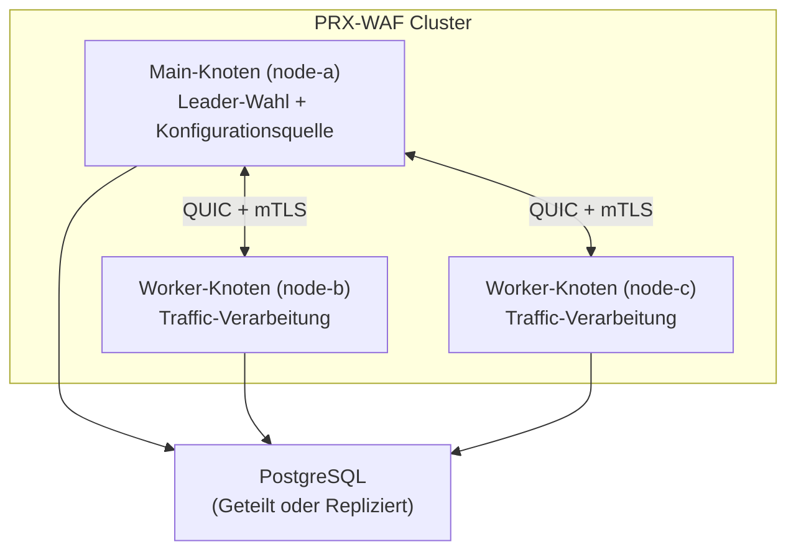

# Cluster-Modus

PRX-WAF unterstützt Multi-Knoten-Cluster-Bereitstellungen für horizontale Skalierung und Hochverfügbarkeit. Der Cluster-Modus verwendet QUIC-basierte Inter-Knoten-Kommunikation, Raft-inspirierte Leader-Wahl und automatische Synchronisierung von Regeln, Konfiguration und Sicherheitsereignissen auf allen Knoten.

::: info
Der Cluster-Modus ist vollständig optional. Standardmäßig läuft PRX-WAF im Standalone-Modus ohne Cluster-Overhead. Durch Hinzufügen eines `[cluster]`-Abschnitts zur Konfiguration aktivieren.
:::

## Architektur

Ein PRX-WAF-Cluster besteht aus einem **Main**-Knoten und einem oder mehreren **Worker**-Knoten:



### Knoten-Rollen

| Rolle | Beschreibung |
|-------|-------------|
| `main` | Hält die maßgebliche Konfiguration und den Regelsatz. Überträgt Updates an Worker. Nimmt an Leader-Wahl teil. |
| `worker` | Verarbeitet Traffic und wendet die WAF-Pipeline an. Empfängt Konfigurations- und Regelupdates vom Main-Knoten. Überträgt Sicherheitsereignisse zurück an Main. |
| `auto` | Nimmt an der Raft-inspirierten Leader-Wahl teil. Jeder Knoten kann zum Main werden. |

## Was wird synchronisiert

| Daten | Richtung | Intervall |
|-------|----------|----------|
| Regeln | Main zu Workern | Alle 10s (konfigurierbar) |
| Konfiguration | Main zu Workern | Alle 30s (konfigurierbar) |
| Sicherheitsereignisse | Worker zu Main | Alle 5s oder 100 Ereignisse (was zuerst eintritt) |
| Statistiken | Worker zu Main | Alle 10s |

## Inter-Knoten-Kommunikation

Die gesamte Cluster-Kommunikation verwendet QUIC (via Quinn) über UDP mit gegenseitigem TLS (mTLS):

- **Port:** `16851` (Standard)
- **Verschlüsselung:** mTLS mit automatisch generierten oder vorab bereitgestellten Zertifikaten
- **Protokoll:** Benutzerdefiniertes Binärprotokoll über QUIC-Streams
- **Verbindung:** Dauerhaft mit automatischer Wiederverbindung

## Leader-Wahl

Wenn `role = "auto"` konfiguriert ist, verwenden Knoten ein Raft-inspiriertes Wahlprotokoll:

| Parameter | Standard | Beschreibung |
|-----------|---------|-------------|
| `timeout_min_ms` | `150` | Minimaler Wahltimeout (zufälliger Bereich) |
| `timeout_max_ms` | `300` | Maximaler Wahltimeout (zufälliger Bereich) |
| `heartbeat_interval_ms` | `50` | Main-zu-Worker-Heartbeat-Intervall |
| `phi_suspect` | `8.0` | Phi-Accrual-Failure-Detector Verdacht-Schwellenwert |
| `phi_dead` | `12.0` | Phi-Accrual-Failure-Detector Tot-Schwellenwert |

Wenn der Main-Knoten nicht erreichbar wird, warten Worker auf einen zufälligen Timeout im konfigurierten Bereich, bevor sie eine Wahl einleiten. Der erste Knoten, der eine Mehrheit der Stimmen erhält, wird der neue Main.

## Gesundheitsüberwachung

Der Cluster-Health-Checker läuft auf jedem Knoten und überwacht die Peer-Konnektivität:

```toml
[cluster.health]
check_interval_secs   = 5    # Health-Check-Häufigkeit
max_missed_heartbeats = 3    # Peer nach N verpassten Heartbeats als ungesund markieren
```

Ungesunde Knoten werden vom Cluster ausgeschlossen, bis sie sich erholen und neu synchronisieren.

## Zertifikatsverwaltung

Cluster-Knoten authentifizieren sich gegenseitig mit mTLS-Zertifikaten:

- **Auto-Generierungsmodus:** Der Main-Knoten generiert ein CA-Zertifikat und signiert Knotenzertifikate automatisch beim ersten Start. Worker-Knoten erhalten ihre Zertifikate während des Beitrittsprozesses.
- **Vorab bereitgestellter Modus:** Zertifikate werden offline generiert und vor dem Start auf jeden Knoten verteilt.

```toml
[cluster.crypto]
ca_cert        = "/certs/cluster-ca.pem"
node_cert      = "/certs/node-a.pem"
node_key       = "/certs/node-a.key"
auto_generate  = true
ca_validity_days    = 3650   # 10 Jahre
node_validity_days  = 365    # 1 Jahr
renewal_before_days = 7      # 7 Tage vor Ablauf automatisch erneuern
```

## Nächste Schritte

- [Cluster-Bereitstellung](./deployment) -- Schritt-für-Schritt-Multi-Knoten-Einrichtungsanleitung
- [Konfigurationsreferenz](../configuration/reference) -- Alle Cluster-Konfigurationsschlüssel
- [Fehlerbehebung](../troubleshooting/) -- Häufige Cluster-Probleme
