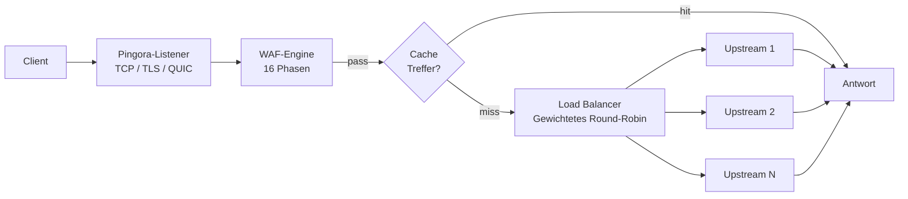

# Gateway

PRX-WAF basiert auf [Pingora](https://github.com/cloudflare/pingora), Cloudflares Rust-HTTP-Proxy-Bibliothek. Das Gateway verarbeitet den gesamten eingehenden Traffic, leitet Anfragen an Upstream-Backends weiter und wendet die WAF-Erkennungspipeline vor der Weiterleitung an.

## Protokollunterstützung

| Protokoll | Status | Hinweise |
|-----------|--------|---------|
| HTTP/1.1 | Unterstützt | Standard |
| HTTP/2 | Unterstützt | Automatisches Upgrade via ALPN |
| HTTP/3 (QUIC) | Optional | Via Quinn-Bibliothek, erfordert `[http3]`-Konfiguration |
| WebSocket | Unterstützt | Vollduplex-Proxying |

## Hauptfunktionen

### Load-Balancing

PRX-WAF verteilt Traffic auf Upstream-Backends mit gewichtetem Round-Robin-Load-Balancing. Jeder Host-Eintrag kann mehrere Upstream-Server mit relativen Gewichtungen angeben:

```toml
[[hosts]]
host        = "example.com"
port        = 80
remote_host = "10.0.0.1"
remote_port = 8080
guard_status = true
```

Hosts können auch über die Admin-UI oder die REST-API unter `/api/hosts` verwaltet werden.

### Antwort-Caching

Das Gateway enthält einen moka-basierten LRU-In-Memory-Cache, um die Last auf Upstream-Servern zu reduzieren:

```toml
[cache]
enabled          = true
max_size_mb      = 256       # Maximale Cache-Größe
default_ttl_secs = 60        # Standard-TTL für gecachte Antworten
max_ttl_secs     = 3600      # Maximale TTL-Begrenzung
```

Der Cache respektiert Standard-HTTP-Cache-Header (`Cache-Control`, `Expires`, `ETag`, `Last-Modified`) und unterstützt Cache-Invalidierung via Admin-API.

### Reverse-Tunnel

PRX-WAF kann WebSocket-basierte Reverse-Tunnel erstellen (ähnlich Cloudflare Tunnels), um interne Dienste ohne offene eingehende Firewall-Ports bereitzustellen:

```bash
# Aktive Tunnel auflisten
curl -H "Authorization: Bearer $TOKEN" http://localhost:9527/api/tunnels

# Einen Tunnel erstellen
curl -X POST -H "Authorization: Bearer $TOKEN" \
  -H "Content-Type: application/json" \
  -d '{"name":"internal-api","target":"http://192.168.1.10:3000"}' \
  http://localhost:9527/api/tunnels
```

### Anti-Hotlinking

Das Gateway unterstützt Referer-basierter Hotlink-Schutz pro Host. Wenn aktiviert, werden Anfragen ohne einen gültigen Referer-Header von der konfigurierten Domain blockiert. Dies wird pro Host in der Admin-UI oder via API konfiguriert.

## Architektur



## Nächste Schritte

- [Reverse-Proxy](./reverse-proxy) -- Detaillierte Backend-Routing- und Load-Balancing-Konfiguration
- [SSL/TLS](./ssl-tls) -- HTTPS, Let's Encrypt und HTTP/3-Einrichtung
- [Konfigurationsreferenz](../configuration/reference) -- Alle Gateway-Konfigurationsschlüssel
